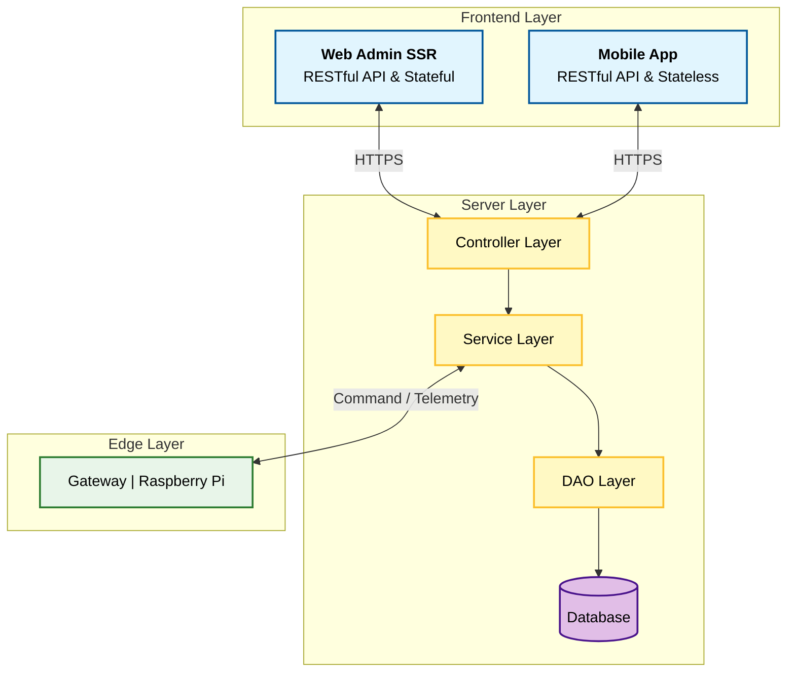

# SMART ROOM IoT SERVER

**An Advanced Orchestrator for Building & Device Management**

---

### _"The brain behind your building's infrastructure"_

_A high-performance stateless orchestrator designed to bridge the gap between human management and sensor-driven automation._

---

## 1. Project Overview (Tổng quan dự án)

**Smart Room IoT Server** là ứng dụng web Spring MVC (WAR) cung cấp giao diện quản lý trung tâm cho hệ thống điều khiển thông minh.

Hệ thống được thiết kế theo nguyên tắc **"Quản lý tập trung - Thực thi phân tán"**, đóng vai trò là "Bộ não trung tâm" điều phối và lưu trữ, nhưng không can thiệp vào từng mili-giây vận hành tại thiết bị biên (Edge Devices).

Hệ thống quản lý thực thể trực tiếp từ cấp độ **Floor** (tầng) và **Room** (phòng), đại diện cho toàn bộ hạ tầng của một **Building** (tòa nhà).

### System Architecture (Kiến trúc hệ thống)

Hệ thống IoT Smart Room hoạt động theo mô hình 3 lớp điển hình, trong đó Server đứng giữa để kết nối nhu cầu người dùng (Web/Mobile) và khả năng thực thi của thiết bị (Gateway).

## 2. Architecture Principles (Nguyên lý kiến trúc)

### Stateless Orchestrator

Hệ thống sử dụng cơ chế **Stateless** thay vì duy trì kết nối liên tục để tối ưu tài nguyên:

-   **Độc lập:** Mỗi request được xử lý riêng biệt, không phụ thuộc vào request trước đó.
-   **Ủy quyền:** Server chỉ nắm giữ "Luật & Cấu hình", việc thực thi logic thời gian thực được giao toàn quyền cho Gateway tại phòng.

### Hardware Agnostic Design

-   **Tách biệt Logic & Vật lý:** Server "mù" về phần cứng (dump server), chỉ quản lý các khái niệm nghiệp vụ (Logic).
-   **Cơ chế Mapping:** Việc thiết bị nối GPIO hay Bluetooth được định nghĩa qua bản đồ cấu hình, tách biệt hoàn toàn khỏi code xử lý logic.

### Data Normalization

-   **Đồng nhất:** Dữ liệu từ nhiều loại cảm biến khác nhau (Temperature, Power, Light) đều được chuẩn hóa về cùng cấu trúc khi lưu trữ.
-   **Bền vững:** Đảm bảo báo cáo và thống kê chính xác ngay cả khi thay đổi loại thiết bị phần cứng.

## 3. Tech Stack (Công nghệ sử dụng)

### Backend & Core

-   **Java 21 LTS:** Hiệu năng tối ưu và cú pháp hiện đại.
-   **Spring Framework 6.1.x:** Hệ sinh thái toàn diện (MVC, Data JPA, Security).
-   **Spring Security + JWT:** Cơ chế xác thực mạnh mẽ và phân quyền chi tiết.
-   **Hibernate 6.4.x:** ORM Framework mạnh mẽ cho thao tác database.

### Frontend (Server Side Rendering)

-   **AdminLTE 3:** Dashboard quản trị responsive, chuyên nghiệp.
-   **Thymeleaf:** Template engine mạnh mẽ tích hợp sâu với Spring.
-   **Bootstrap & jQuery:** Tương tác UI nhanh chóng và tương thích cao.

### Database

-   **MySQL:** RDBMS lưu trữ dữ liệu quan hệ chặt chẽ (Building → Floor → Room → Device).

## 4. System Capabilities (Chức năng hệ thống)

### Security & Authentication

-   **JWT-based Auth:** Xác minh danh tính bảo mật cho cả User và Gateway.
-   **RBAC & Function-level:** Phân quyền chi tiết đến từng chức năng và tài nguyên.

### Infrastructure Management

-   **Hierarchical:** Quản lý cấu trúc cây: Building → Floor → Room.
-   **Device Lifecycle:** Đăng ký, quản lý, và theo dõi vòng đời thiết bị.
-   **Multi-protocol:** Hỗ trợ cấu hình GPIO, BLE, và Web API Integration.

### Data Collection & Monitoring

-   **Real-time Dashboard:** Theo dõi trạng thái thiết bị tức thời.
-   **Sensor Data:** Thu thập nhiệt độ, điện năng tiêu thụ.
-   **Trust the Edge:** Tôn trọng timestamp từ Gateway để đảm bảo tính toàn vẹn dữ liệu mạng lag.

### Remote Control

-   **Command Execution:** Điều khiển Bật/Tắt, Dimming từ xa qua Web/Mobile.
-   **State Confirmation:** Cơ chế xác nhận trạng thái thực thi (Ack) từ Gateway.

### Internationalization (i18n)

-   Hỗ trợ đa ngôn ngữ (Tiếng Việt / Tiếng Anh) từ cấu trúc dữ liệu đến giao diện hiển thị.

## 5. Package Structure (Cấu trúc dự án)

| Package      | Mô tả & Chức năng                                                             |
| ------------ | ----------------------------------------------------------------------------- |
| `config`     | **Configuration Hub** - Cấu hình Bean, Security, Database, CORS, Cache, i18n. |
| `jwt`        | **Authentication Security** - Xử lý JWT Lifecycle và Security Filters.        |
| `aop`        | **Cross-cutting Concerns** - Logging, Performance monitoring.                 |
| `controller` | **Request Handler** - API Endpoints (JSON) và View Controllers (HTML).        |
| `service`    | **Business Logic** - Xử lý nghiệp vụ, validation, transaction.                |
| `dao`        | **Data Access** - Lớp giao tiếp trực tiếp với Database.                       |
| `entities`   | **Persistent Model** - POJO ánh xạ bảng Database.                             |
| `dto`        | **Data Transfer** - Object vận chuyển dữ liệu giữa các lớp.                   |
| `util`       | **Utilities** - Các hàm hỗ trợ chung (Date, String, Encryption).              |

## 6. Database Organization (Cấu trúc dữ liệu)

| Nhóm dữ liệu            | Bảng chính                                                     | Đặc điểm kỹ thuật                                                       |
| ----------------------- | -------------------------------------------------------------- | ----------------------------------------------------------------------- |
| **Hạ tầng & Vị trí**    | `floor`, `room`                                                | **Static** - Ít thay đổi, định nghĩa khung xương tòa nhà.               |
| **Thiết bị & Cấu hình** | `client` (Gateway), `device_control`, `light`, `temp`, `power` | **Configuration** - Ánh xạ thiết bị logic tới cổng vật lý.              |
| **Dữ liệu cảm biến**    | `temperature_value`, `power_consumption_value`                 | **Append-only** - Dữ liệu chuỗi thời gian, chỉ thêm mới, không sửa/xóa. |
| **Phân quyền**          | `client` (User), `sys_group`, `sys_role`, `sys_function`       | **Administrative** - Quản lý RBAC và Access Control.                    |

---

Designed & Developed with ❤️ by <b>[Your Name/Team Name]</b>

