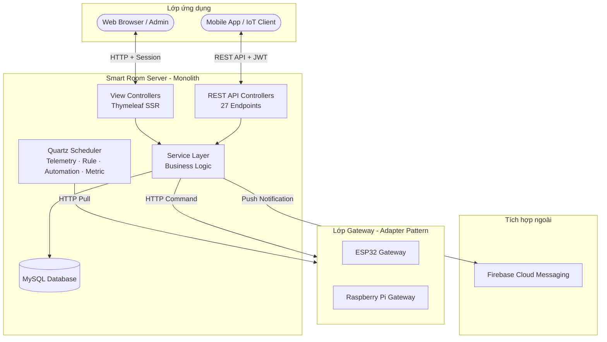

---

# SMART ROOM IoT SERVER

**Nền tảng Điều phối Quản trị Tòa nhà & Thiết bị IoT Tiên tiến**

---

### _"Nền tảng IoT Plug-and-Play Đích thực"_

_Tối ưu, Sạch và Được thiết kế để Mở rộng Dễ dàng._

---

## 1. Project Overview (Tổng quan dự án)

**Smart Room IoT Server** là hệ thống Web nguyên khối (Monolith) chạy trên Spring Framework (Custom Spring 6 — Non Boot). Nền tảng đóng vai trò cung cấp giao diện quản trị trung tâm và điều phối dữ liệu với phần cứng qua bộ API REST chuẩn hóa.

**Đặc điểm kiến trúc Monolith:** Hệ thống được xây dựng trên kiến trúc nguyên khối, trong đó khối Frontend (Web Admin) và Backend (Logic, API) được đóng gói chung trên cùng một cấu trúc mã nguồn và hoạt động tại một tiến trình Tomcat Server duy nhất. Toàn bộ giao tiếp từ ứng dụng Client và phần cứng IoT Gateway đều định tuyến trực tiếp qua Server để xử lý logic đồng bộ hai chiều.

Hệ thống được thiết kế theo nguyên tắc **"Quản lý tập trung — Thực thi phân tán"**, đóng vai trò là "Bộ não trung tâm" chỉ đạo, nhưng không can thiệp sâu vào các tác vụ đòi hỏi thời gian thực (Real-time Mils) tại cấp độ thiết bị biên (Edge Devices). Toàn bộ hạ tầng có thể quản lý sâu theo cấu trúc: **Building (Tòa nhà) → Floor (Tầng) → Room (Phòng)**.

Hệ thống hỗ trợ đa dạng giao thức Gateway qua mô hình **Adapter Pattern**, hiện tại đã tích hợp **ESP32 Gateway Adapter** và **Raspberry Pi Gateway Adapter**, cho phép mở rộng dễ dàng sang các nền tảng phần cứng khác.

### Công nghệ cốt lõi (Core Tech Stack):

| Phân hệ | Công nghệ sử dụng |
| :--- | :--- |
| **Backend Runtime** |      |
| **API & Serialization** |     |
| **Frontend** |       |
| **Build & Server** |      |
| **Integration** |    |
| **Hạ tầng** |  |

---

## 2. Architecture Overview (Tổng quan kiến trúc)

Hệ thống được tổ chức theo mô hình Monolith với các khối xử lý chính:

```mermaid
graph TD
    subgraph Clients [Lớp ứng dụng]
        Mobile([Mobile App / IoT Client])
        Web([Web Browser / Admin])
    end

    subgraph Server [Smart Room Server - Monolith]
        direction TB
        View[View Controllers<br/>Thymeleaf SSR]
        API[REST API Controllers<br/>27 Endpoints]
        Core[Service Layer<br/>Business Logic]
        Sch[Quartz Scheduler<br/>Telemetry · Rule · Automation · Metric]
        View --> Core
        API --> Core
        Core --> DAO[(MySQL Database)]
    end

    subgraph Gateway [Lớp Gateway - Adapter Pattern]
        ESP32[ESP32 Gateway]
        RPi[Raspberry Pi Gateway]
    end

    subgraph External [Tích hợp ngoài]
        FCM[Firebase Cloud Messaging]
    end

    Mobile <-->|REST API + JWT| API
    Web <-->|HTTP + Session| View
    Sch -->|HTTP Pull| Gateway
    Core -->|HTTP Command| Gateway
    Core -->|Push Notification| FCM
```

---

## 3. Core Capabilities (Chức năng cốt lõi)

Hệ thống cung cấp nền tảng vận hành IoT ổn định và dễ mở rộng với các nghiệp vụ chính:

### Quản lý Hạ tầng & Thiết bị (Infrastructure Management)
- **Quản lý phân cấp**: Tổ chức hạ tầng theo cấu trúc **Tòa nhà → Tầng → Phòng**.
- **Định nghĩa thiết bị linh hoạt**: Hỗ trợ đa dạng chủng loại (Đèn, Quạt, Điều hòa, Cảm biến nhiệt độ, Cảm biến điện năng) với cơ chế cấu hình qua **Device Metadata**.
- **Đa dạng Gateway**: Tích hợp sẵn **ESP32** và **Raspberry Pi** qua mô hình Adapter Pattern, dễ dàng mở rộng thêm nền tảng phần cứng mới.
- **Device Setup**: Cơ chế tự động thiết lập thiết bị mới qua **Orchestrator + Strategy Pattern** (Temperature, PowerConsumption, Light, Fan, AirCondition).

### Giám sát & Thu thập dữ liệu (Telemetry & Monitoring)
- **Thu thập tự động**: Quartz Job Scheduler tự động quét và thu thập dữ liệu từ các Gateway định kỳ.
- **Biểu đồ thời gian thực**: Theo dõi biến động nhiệt độ, độ ẩm và điện năng tiêu thụ qua biểu đồ **ApexCharts**.
- **Energy Metric**: Hệ thống thu thập và tính toán điện năng tiêu thụ theo ngày, tự động reset chỉ số.

### Điều khiển & Tự động hóa (Control & Automation)
- **Điều khiển từ xa**: Gửi lệnh bật/tắt và điều chỉnh thông số thiết bị tức thì qua REST API với **Strategy Pattern** (FanControl, LightControl, AirConditionControl).
- **Rule Engine**: Hệ thống Rule với kiến trúc **Condition → Action**, hỗ trợ so sánh đa dạng (>, <, =, >=, <=, !=) và kết hợp AND/OR, kích hoạt điều khiển thiết bị hoặc tạo cảnh báo.
- **Automation Engine**: Tự động hóa tác vụ định kỳ qua Quartz Cron, với **AutomationActionStrategy** (Light, Fan, AirCondition).

### Alert & Notification (Cảnh báo & Thông báo)
- **Hệ thống Alert đa tầng**: Alert Config → Alert Instance → Alert Instance Log, hỗ trợ đa nguồn (Rule, System, Gateway).
- **Đa kênh thông báo**: Tích hợp **Firebase Cloud Messaging (FCM)**, Email, SMS qua **Notification Strategy Pattern**.
- **Alert Trigger**: Cơ chế trigger cảnh báo linh hoạt kèm template data.

### Bảo mật & Phân quyền (Security & RBAC)
- **Bảo mật đa luồng**: API sử dụng **JWT Token** (Stateless), Web Admin sử dụng **Session-based** (Stateful) với Remember-Me.
- **Rate Limiting**: Bảo vệ API qua **Bucket4j Rate Limiting Filter**.
- **Request Tracing**: Mỗi request được gắn **Trace ID** để debug và logging.
- **Kiểm soát truy cập (RBAC)**: Hệ thống phân quyền dựa trên **Group → Function → Role**.

---

## 4. Tài liệu liên quan (Reference Files)

- **Chi tiết kỹ thuật:** [SYSTEM.md](./SYSTEM.md) — Phân tích đặc tả kiến trúc, sơ đồ thực thể và quy trình nghiệp vụ.
- **Hướng dẫn vận hành:** [setup_guideline](./doc/setup_guideline) — Quy trình triển khai, cấu hình môi trường và quản lý thư viện server.
- **Cấu trúc Database:** [infra/database/](./infra/database/) — Script SQL khởi tạo, migration và seed data.
