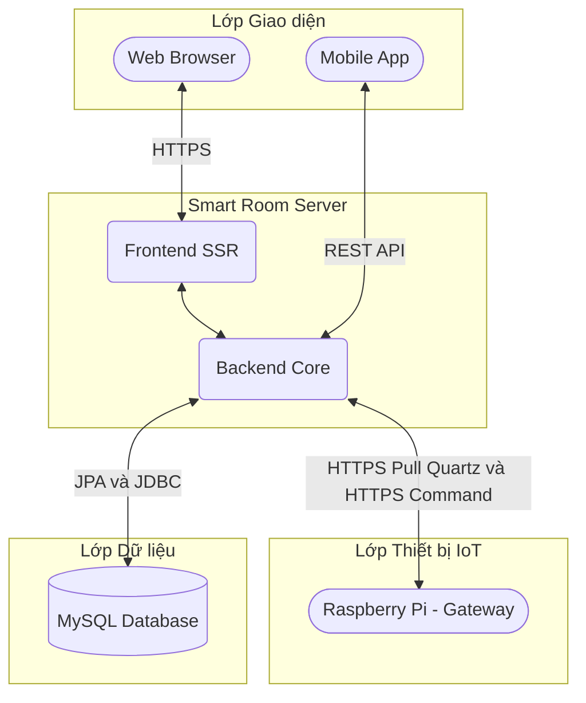
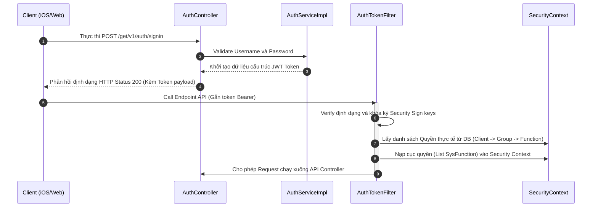
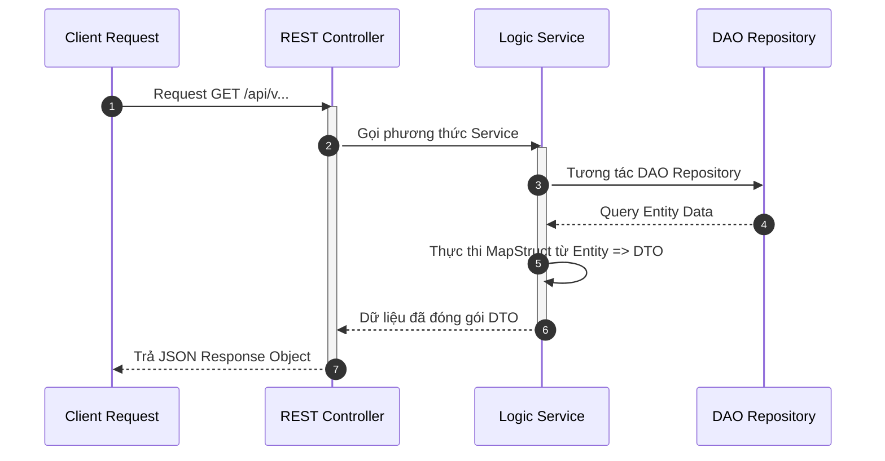
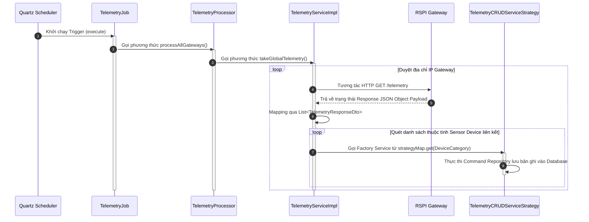
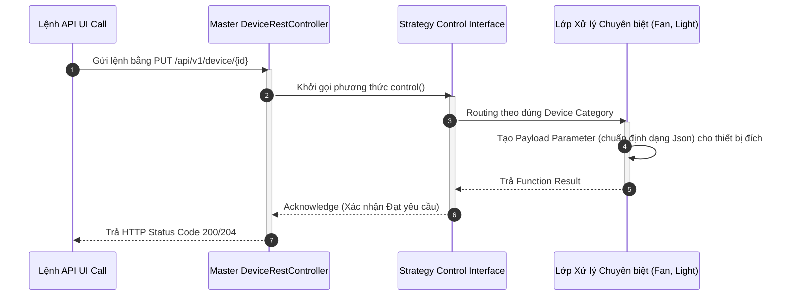
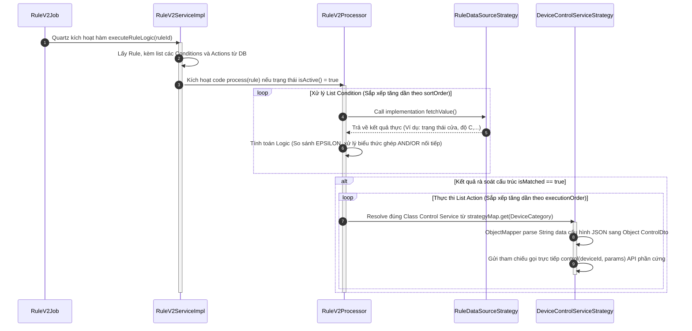

## Mục lục

1. [Tổng quan hệ thống](#1-tổng-quan-hệ-thống)

2. 

<b><a href="#2-kiến-trúc-backend">2. Kiến trúc Backend</a></b>

   - [2.1 Danh sách package](#21-danh-sách-package)
   - [2.2 Luồng kiến trúc lõi](#22-luồng-kiến-trúc-lõi)
   - [2.3 Cấu hình hệ thống](#23-cấu-hình-hệ-thống)

3. 

<b><a href="#3-kiến-trúc-frontend">3. Kiến trúc Frontend</a></b>

   - [3.1 Công nghệ sử dụng](#31-công-nghệ-sử-dụng)
   - [3.2 Cơ chế render (SSR + CSR)](#32-cơ-chế-render-ssr--csr)

4. 

<b><a href="#4-các-luồng-nghiệp-vụ">4. Các luồng nghiệp vụ</a></b>

   - [4.1 Luồng xác thực và Phân quyền (Security & RBAC)](#41-luồng-xác-thực-và-phân-quyền-security--rbac)
   - [4.2 Luồng xử lý API tiêu chuẩn](#42-luồng-xử-lý-api-tiêu-chuẩn)
   - [4.3 So sánh API và View Controller](#43-so-sánh-api-và-view-controller)
   - [4.4 Luồng telemetry (thu thập dữ liệu)](#44-luồng-telemetry-thu-thập-dữ-liệu)
   - [4.5 Luồng điều khiển thiết bị (Strategy Pattern)](#45-luồng-điều-khiển-thiết-bị-strategy-pattern)
   - [4.6 Luồng Rule Engine](#46-luồng-rule-engine)

5. 

<b><a href="#5-cấu-trúc-database">5. Cấu trúc Database</a></b>

   - [5.1 Chi tiết thực thể (ERD Specification)](#51-chi-tiết-thực-thể-erd-specification)
   - [5.2 Phân nhóm dữ liệu nghiệp vụ (Business Grouping)](#52-phân-nhóm-dữ-liệu-nghiệp-vụ-business-grouping)

---

---

## 1. Tổng quan hệ thống

**Đặc điểm kiến trúc Monolith:** Smart Room Server được xây dựng dựa trên kiến trúc nguyên khối (Monolithic Application). Khối Frontend (giao diện Web Admin) và Khối Backend (xử lý logic, API) **KHÔNG** phải là hai dự án tách rời. Cả hai khối này được đóng gói chung trên cùng một cấu trúc mã nguồn (Codebase) và hoạt động tại một tiến trình Tomcat Server duy nhất.

Toàn bộ các giao tiếp từ ứng dụng Client (Mobile App, Web Browser) và phần cứng IoT (Raspberry Pi Gateway) đều định tuyến trực tiếp qua Server. Server đảm nhận vai trò trung tâm xử lý logic đồng bộ dữ liệu hai chiều.

---

## 2. Kiến trúc Backend

Hệ thống sử dụng **Spring Framework 6.1.4 (Không cấu hình qua Spring Boot)** để đảm bảo quyền kiểm soát chi tiết vòng đời khởi tạo của các component.

### 2.1 Danh sách package

| Package | Vai trò |
|--------|--------|
| `aop` | Định nghĩa các cấu hình Aspect-Oriented Programming (AOP), dùng cho API Request Logging. |
| `component` | Định nghĩa các component hỗ trợ logic chung (ví dụ: Event Listener). |
| `config` | Cấu hình hệ thống (Security, MVC, Scheduler, Database). |
| `constant` | Khai báo các hằng số (static final) sử dụng xuyên suốt toàn hệ thống. |
| `controller` | Định nghĩa các endpoint HTTP/HTTPS, bao gồm REST API và View Controller. |
| `converter` | Thiết lập cấu trúc chuyển đổi kiểu dữ liệu (Sử dụng AttributeConverter tích hợp Entity). |
| `dao` | Tương tác với database thông qua Data JPA / Hibernate. |
| `dto` | Đối tượng trung gian (Data Transfer Object) dùng để trao đổi dữ liệu giữa các tầng. |
| `entities` | Định nghĩa cấu trúc bảng trong database (ORM). |
| `enumeration`| Khai báo các lớp Enum. |
| `exception` | Lưu trữ custom exception và `ControllerAdvice` để vận hành Global Exception Handling. |
| `jwt` | Quản lý định dạng cấu trúc, giải mã và filter xác thực chuỗi token bảo mật ở Security FilterChain. |
| `mapper` | Định nghĩa MapStruct Interface thực thi map dữ liệu 1-1 giữa Entity và DTO. |
| `schedule` | Định nghĩa các tác vụ định kỳ của Quartz Scheduler (quét telemetry, chạy cron check trigger). |
| `service` | Xử lý logic nghiệp vụ và điều phối luồng xử lý. |
| `startup` | Khởi tạo dữ liệu ban đầu (seed data) và nạp Job vào lịch trình khi Servlet khởi động. |
| `util` | Cung cấp các tiện ích xử lý đa dụng tĩnh dạng Helpers. |

### 2.2 Luồng kiến trúc lõi

Hệ thống tuân thủ nghiêm ngặt kiến trúc phân tầng (Layered Architecture). Controller không được truy cập trực tiếp tới tầng DAO.

### 2.3 Cấu hình hệ thống

Các file định nghĩa cấu trúc nền tảng chính:
- **`SecurityConfig.java`**: Khai báo SecurityFilterChain chia hai luồng filter độc lập. Chuỗi `apiFilterChain` chuyên dùng xét duyệt cơ chế JWT Token phía REST API. Luồng `webFilterChain` quản lý duy trì Session cho người dùng View UI.
- **`QuartzConfig.java`**: Thiết lập đối tượng `SchedulerFactoryBean` cung cấp tiến trình quản lý task theo thiết kế của định tuyến nội bộ Quartz.
- **`WebConfig.java` / `MvcWebApplicationInitializer.java`**: Cấu hình `ViewResolver` để Spring khởi tạo và render template view tương thích với Dialect của hệ sinh thái Thymeleaf.

---

## 3. Kiến trúc Frontend

Mã nguồn Frontend (HTML, JS, CSS) được tích hợp trong cùng môi trường ứng dụng của Server gốc tại `./src/main/webapp/WEB-INF`.

### 3.1 Công nghệ sử dụng
- **Ngôn ngữ**: Java 21
- **Framework Core**: Spring 6.1.4
- **Template Engine**: Thymeleaf 3.1.2.RELEASE (Kết hợp Layout Dialect 3.2.0, Spring Security Support 3.1.1).
- **Web UI & CSS Libraries**: WebJars (Bootstrap 4.6.2, AdminLTE 3.2.0, Chart.js 4.4.3, Datatables 1.13.4).

### 3.2 Cơ chế render (SSR + CSR)
Quá trình phân giải UI được kết hợp từ hai cơ chế:
- **Server-Side Rendering (SSR)**: Controller gọi render file HTML. Mã nguồn xử lý ghép View với Layout Dialect hỗ trợ thiết lập template lặp lại dễ dàng như Header, Sidebar. Phản hồi hoàn thiện từ Backend gửi kèm Model Attribute.
- **Client-Side Rendering (CSR)**: Script JS khởi chạy Dynamic DOM. Khi gọi module Charts hoặc Datatable, JS gọi HTTP Request đến REST API lấy dữ liệu JSON (`/api/*`) để repaint components không cần nạp tải lại (reload) View chính.

---

## 4. Các luồng nghiệp vụ

### 4.1 Luồng xác thực và Phân quyền (Security & RBAC)

Hệ thống cung cấp cơ chế bảo mật khép kín thông qua mô hình phân tầng: Auth Filter (xác thực danh tính) và RBAC (kiểm soát quyền truy cập).

**A. Cơ cấu Security FilterChains**  
Hệ thống cấu hình hai luồng Security FilterChain độc lập:
- **RESTful API (`apiFilterChain`):** Định tuyến các Request có tiền tố `/api/**`. Middleware `AuthTokenFilter` sẽ bóc tách JSON Web Token thông qua Header `Authorization`. Đặc tính Stateless, vô hiệu hóa module bảo vệ CSRF nhằm tương thích các ứng dụng gọi thẳng từ bên ngoài (như Mobile App).
- **SSR Web (`webFilterChain`):** Áp dụng mô hình bảo mật Stateful cho phân hệ Web Admin Dashboard. Quá trình xác thực dựa vào Spring Form Login, quản lý định danh người truy cập qua Cookie `JSESSIONID`. Dữ liệu cấu hình hỗ trợ "Remember Me" với Token Entity `JdbcTokenRepositoryImpl` đính luồng trạng thái session bền vững dưới tầng Database.

**B. Mô hình phân quyền RBAC (Role-Based Access Control)**  
Hệ thống quản lý quyền truy cập đơn giản và rõ ràng qua 3 cấu trúc cốt lõi:

- **Group (Nhóm người dùng - `SysGroup`):** Định nghĩa User đó thuộc nhóm nào (Ví dụ: Admin `G_ADMIN`, Người dùng thường `G_USER`). Khai báo cứng trong `SysGroupEnum`.
- **Function (Quyền thao tác - `SysFunction`):** Định nghĩa các hành động được phép làm trong hệ thống (Ví dụ: Quyền sửa thiết bị `F_MANAGE_DEVICE`, Xem phòng `F_ACCESS_ROOM_ALL`). Khai báo trong `SysFunctionEnum`.
- **Role (Bảng trung gian - `SysRole`):** Là bảng nối map quan hệ giữa Group và Function. Một Group Admin có thể chứa toàn bộ Function, trong khi Group User chỉ chứa vài Function cơ bản.

Bản chất quá trình phân quyền là: Khi Request tới Controller, Spring Security sẽ kiểm tra User thuộc **Group** nào, từ DB query ra danh sách **Function** tương ứng, nếu trùng khớp với yêu cầu của điểm API thì cho phép chạy lệnh.

### 4.2 Luồng xử lý API tiêu chuẩn

Cấu trúc luân chuyển dữ liệu dựa theo chuẩn 3 lớp của Spring Framework System.

### 4.3 So sánh API và View Controller

Hệ thống điều phối chia hai cấu trúc Endpoint độc lập:

| Đặc tả               | RESTful API Controller (`api.*`)                           | View Controller (`view.*`)                                  |
| ----------------------- | ---------------------------------------------------------- | ----------------------------------------------------------- |
| **Khai báo Interface**  | Sử dụng `@RestController`                                  | Sử dụng `@Controller`                                       |
| **Định dạng Payload**   | Trả dữ liệu kiểu raw JSON Object                           | Tên đối tượng Template tham chiếu File View tĩnh Thymeleaf  |
| **Cơ chế Input Data**   | Đọc Mapping JSON thông qua `@RequestBody`                  | Khởi tạo Context vào biến trung gian `Model` (Spring View)  |

### 4.4 Luồng telemetry (thu thập dữ liệu)

Hệ thống thiết lập cơ chế xử lý theo Quartz Job Schedule để tự động lấy data từ Gateway.

### 4.5 Luồng điều khiển thiết bị (Strategy Pattern)

Hỗ trợ mô hình Design Strategy Pattern nhằm giảm phụ thuộc logic xử lý Controller để thao tác dễ dàng xuống từng chuẩn Interface Implementation của Category. (ví dụ Quạt, Đèn, Cảm biến đa dạng).

### 4.6 Luồng Rule Engine

Hệ thống Rule Engine (được nâng cấp ở version V2) đóng vai trò nòng cốt để xử lý công việc tự động qua nguyên tắc quét Điều kiện (Condition) và gọi Hành động (Action) thay thế thao tác con người. Hệ thống tách bạch rõ tiến trình đánh giá từ thu thập số liệu đến xuất lệnh điều khiển:

- **Khối đối chiếu Condition:** Thuật toán tính toán nằm gọn trong `RuleV2Processor`. Dữ liệu nguồn để so sánh được query từ `RuleDataSourceStrategy.fetchValue()` (Ví dụ lấy số đo nhiệt độ hoặc giờ hệ thống). Quá trình Compare (<, >, ==) dùng hằng số dung sai `EPSILON` để bắt lỗi lệch khung số thập phân.
- **Khối kết xuất Action:** Khi thỏa mãn, `DeviceControlServiceStrategy` sẽ chịu trách nhiệm biến đổi Param tĩnh thành Object payload động để kích gọi lệnh thao tác phần cứng `control(deviceId, params)`.

---

## 5. Cấu trúc Database

Thay vì tổ chức theo khóa ngoại RDBMS truyền thống, hệ thống được quy hoạch theo cụm Logic Nghiệp vụ. Thiết kế này giúp mở rộng ứng dụng không giới hạn vào quy mô tòa nhà từ một phòng đơn lẻ cho đến kiến trúc đa tầng.

### 5.1 Chi tiết thực thể (ERD Specification)

Sơ đồ quan hệ thực thể (ERD) chi tiết của hệ thống đã được đặc tả hoàn chỉnh dưới dạng mã DBML. Người đọc có thể tham chiếu và kiểm tra cấu trúc bảng, kiểu dữ liệu cũng như các ràng buộc khóa ngoại tại file:

👉 **[infra/erd.dbml](./infra/erd.dbml)**

---

### 5.2 Phân nhóm dữ liệu nghiệp vụ (Business Grouping)

Dựa trên cấu trúc đặc tả tại `erd.dbml`, toàn bộ dữ liệu được chia thành 6 nhóm mục tiêu rõ rệt:

**1. Nhóm Địa điểm (Locations):**
- **Bảng chính:** `floor`, `room` và các bảng đa ngôn ngữ (`_lan`).
- **Nghiệp vụ:** Xây dựng sơ đồ cây không gian giúp quản lý thiết bị theo từng vị trí địa lý cụ thể (Tầng -> Phòng).

**2. Nhóm Thiết bị điều khiển (Devices):**
- **Bảng chính:** `device_control`, `light`, `fan`, `air_condition`.
- **Nghiệp vụ:** `device_control` đóng vai trò là "Cổng kết nối logic" duy nhất. Mọi lệnh điều khiển từ App đều gọi qua bảng này trước khi được phân phối xuống các thiết bị vật lý cụ thể.

**3. Nhóm Cảm biến & Dữ liệu (Sensors & Logs):**
- **Bảng chính:** `temperature`, `power_consumption` và các bảng nhật ký (`_value`).
- **Nghiệp vụ:** Tách biệt giữa "Trạng thái hiện tại" (Current Value) và "Lịch sử dữ liệu" (Time-series Logs). Dữ liệu lịch sử là dạng **Append-only** (chỉ thêm mới) để phục vụ báo cáo.

**4. Nhóm Tự động hóa (Rules & Automation):**
- **Bảng chính:** `rule_v2`, `rule_condition_v2`, `rule_action_v2`, `automation`.
- **Nghiệp vụ:** Thiết kế theo mô hình 3 thành phần: **Gốc Rule** (Priority/Status) -> **Điều kiện lọc** (Condition) -> **Hành động thực thi** (Action).

**5. Nhóm Người dùng & Bảo mật (Users & RBAC):**
- **Bảng chính:** `client`, `sys_group`, `sys_function`, `sys_role`.
- **Nghiệp vụ:** Sử dụng chung thực thể `client` cho cả tài khoản người dùng và định danh Gateway. Phân quyền dựa trên việc ánh xạ Nhóm (Group) vào danh sách Tính năng (Function).

**6. Nhóm Hệ thống hỗ trợ (Support & Infrastructure):**
- **Bảng chính:** `language`, `persistent_logins`, `QRTZ_*` (Quartz Scheduler).
- **Nghiệp vụ:** Quản lý đa ngôn ngữ UI, duy trì đăng nhập và lịch trình chạy các tác vụ ngầm của hệ thống.
