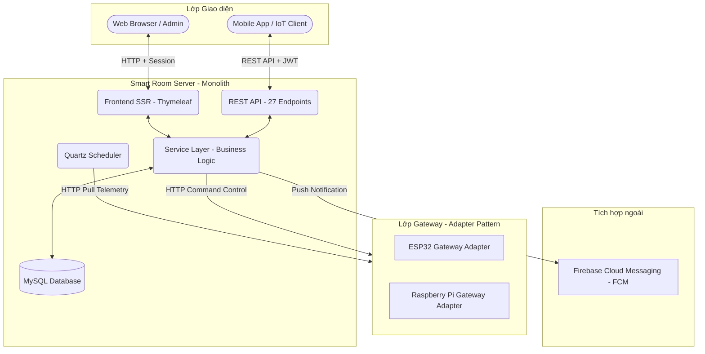
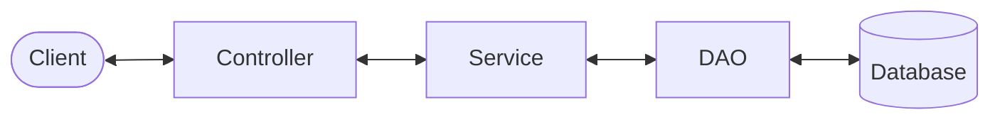
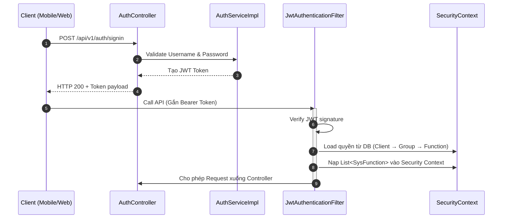
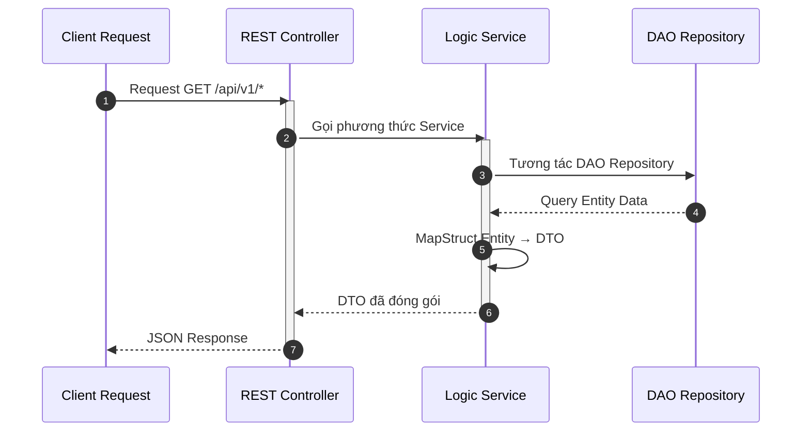
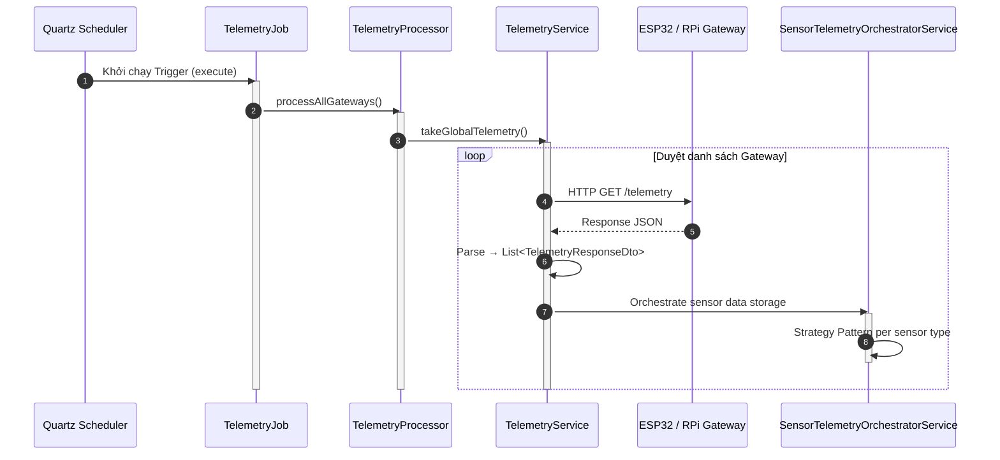
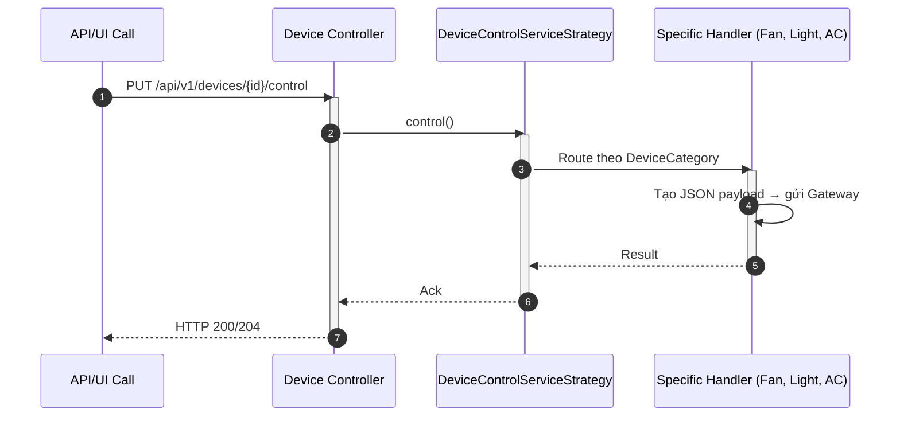
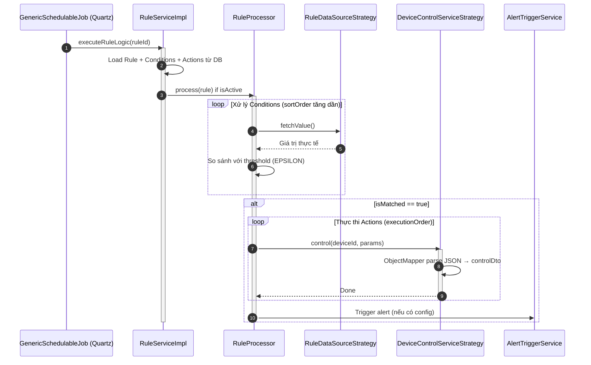
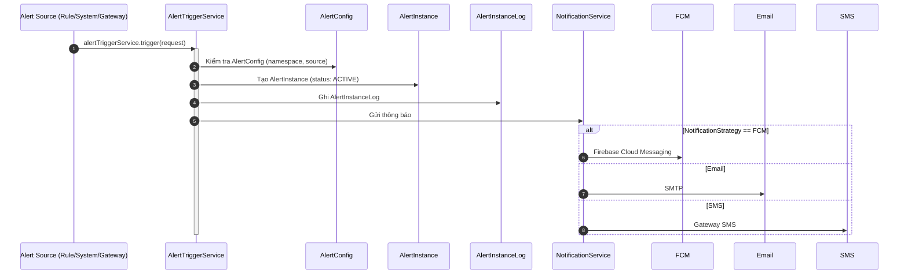
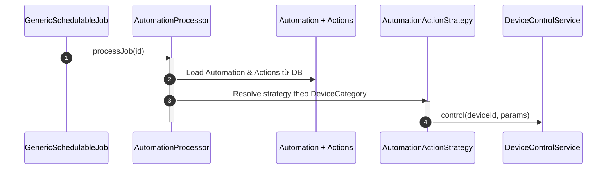
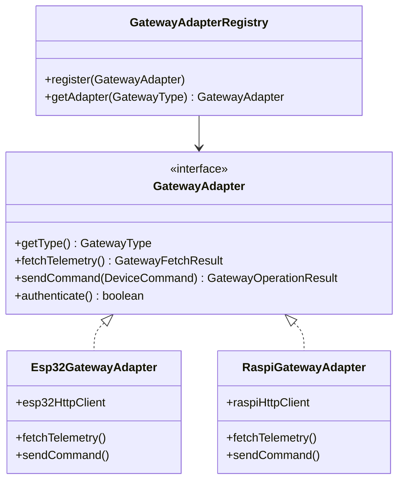

## Mục lục

1. [Tổng quan hệ thống](#1-tổng-quan-hệ-thống)

2. 

<b><a href="#2-kiến-trúc-backend">2. Kiến trúc Backend</a></b>

   - [2.1 Công nghệ sử dụng](#21-công-nghệ-sử-dụng)
   - [2.2 Danh sách package](#22-danh-sách-package)
   - [2.3 Luồng kiến trúc lõi](#23-luồng-kiến-trúc-lõi)
   - [2.4 Cấu hình hệ thống](#24-cấu-hình-hệ-thống)

3. 

<b><a href="#3-kiến-trúc-frontend">3. Kiến trúc Frontend</a></b>

   - [3.1 Công nghệ sử dụng](#31-công-nghệ-sử-dụng)
   - [3.2 Cơ chế render (SSR + CSR)](#32-cơ-chế-render-ssr--csr)

4. 

<b><a href="#4-các-luồng-nghiệp-vụ">4. Các luồng nghiệp vụ</a></b>

   - [4.1 Luồng xác thực và Phân quyền (Security & RBAC)](#41-luồng-xác-thực-và-phân-quyền-security--rbac)
   - [4.2 Luồng xử lý API tiêu chuẩn](#42-luồng-xử-lý-api-tiêu-chuẩn)
   - [4.3 So sánh API và View Controller](#43-so-sánh-api-và-view-controller)
   - [4.4 Luồng telemetry (thu thập dữ liệu)](#44-luồng-telemetry-thu-thập-dữ-liệu)
   - [4.5 Luồng điều khiển thiết bị (Strategy Pattern)](#45-luồng-điều-khiển-thiết-bị-strategy-pattern)
   - [4.6 Luồng Rule Engine](#46-luồng-rule-engine)
   - [4.7 Luồng Alert System](#47-luồng-alert-system)
   - [4.8 Luồng Automation Engine](#48-luồng-automation-engine)
   - [4.9 Luồng Energy Metric](#49-luồng-energy-metric)
   - [4.10 Luồng Gateway Integration (Adapter Pattern)](#410-luồng-gateway-integration-adapter-pattern)

5. 

<b><a href="#5-cấu-trúc-database">5. Cấu trúc Database</a></b>

   - [5.1 Danh sách thực thể (Entity List)](#51-danh-sách-thực-thể-entity-list)
   - [5.2 Phân nhóm dữ liệu nghiệp vụ (Business Grouping)](#52-phân-nhóm-dữ-liệu-nghiệp-vụ-business-grouping)

---

---

## 1. Tổng quan hệ thống

**Đặc điểm kiến trúc Monolith:** Smart Room Server được xây dựng dựa trên kiến trúc nguyên khối (Monolithic Application). Khối Frontend (giao diện Web Admin) và Khối Backend (xử lý logic, API) **KHÔNG** phải là hai dự án tách rời. Cả hai khối này được đóng gói chung trên cùng một cấu trúc mã nguồn (Codebase) và hoạt động tại một tiến trình Tomcat Server duy nhất.

Toàn bộ các giao tiếp từ ứng dụng Client (Mobile App, Web Browser) và phần cứng IoT (ESP32 Gateway, Raspberry Pi Gateway) đều định tuyến trực tiếp qua Server. Server đảm nhận vai trò trung tâm xử lý logic đồng bộ dữ liệu hai chiều.

### 1.1 Nền tảng công nghệ

| Thành phần | Công nghệ |
| :--- | :--- |
| **Runtime** |  |
| **Server** |  |
| **Database** |  |
| **Build Tool** |  |

### 1.2 Sơ đồ kiến trúc tổng thể

> **Lưu ý về kiến trúc:** `FESSR` (Frontend SSR - Thymeleaf) và `API` (REST API) chạy trong **hai `DispatcherServlet` riêng biệt** — Web Dispatcher (`webDispatcher`, mapping `/*`) và API Dispatcher (`apiDispatcher`, mapping `/api/*`). Mỗi DispatcherServlet có ApplicationContext riêng (child của Root Context), quản lý các bean Controller độc lập. Xem chi tiết tại [2.4 Cấu hình hệ thống](#24-cấu-hình-hệ-thống).

---

## 2. Kiến trúc Backend

Hệ thống sử dụng **Spring Framework 6.2.17 (Custom Spring — Non Boot)** để đảm bảo quyền kiểm soát chi tiết vòng đời khởi tạo của các component.

### 2.1 Công nghệ sử dụng

| Thành phần | Công nghệ |
| :--- | :--- |
| **Framework** |  |
| **ORM** |   |
| **Security** |  |
| **Scheduler** |  |
| **Serialization** |   |
| **Rate Limiting** |  |
| **HTTP Client** |  |
| **Cache** |  |
| **Push Notification** |  |
| **Logging** |   |
| **Utilities** |     |

### 2.2 Danh sách package

| Package | Vai trò |
|--------|--------|
| `core/config` | Cấu hình hệ thống: Application, DataSource, Security, MVC, Quartz, Async, Firebase, RestClient |
| `core/component` | Component hỗ trợ: AutowiringSpringBeanJobFactory, SpringSecurityAuditorAware |
| `core/properties` | Application properties binding: Database, Engine, Firebase, Gateway, HttpClient, Jwt, Security, Token |
| `core/startup` | Khởi tạo dữ liệu và scheduler khi Servlet khởi động |
| `controller/api/v1` | **27 REST Controller** (Auth, Rule, Room, Floor, Light, Fan, AirCondition, Temperature, PowerConsumption, Client, SysGroup, SysFunction, SysRole, Alert, Automation, Setup, Telemetry, SensorTelemetry, SensorMetadata, DeviceMetadata, HardwareConfig, Metric, Language, ClientDevice, HealthCheck,...) |
| `controller/view` | **6 View Controller** (Index, Login, Management, Room, SmartSystem, ViewJS) |
| `service/*` | Xử lý logic nghiệp vụ: aircondition, alert, auth, automation, base, client, clientdevice, control, fan, floor, hardwareconfig, language, light, metric, notification, permission, powerconsumption, role, room, rule, schedule, setup, system, telemetry, temperature, token |
| `dao` | 26 DAO interface tương tác database qua Spring Data JPA |
| `dao/base` | Base DAO hierarchy: BaseDao → BaseEntityDao → (BaseAuditEntityDao, BaseTranslatableEntityDao, BaseIoTEntityDao, BaseTelemetryDao) |
| `dao/setup` | Device Setup Strategy Pattern: AbstractDeviceSetupStrategy, DeviceSetupOrchestrator, + 5 implementations |
| `entities` | 37+ Entity classes, base classes, composite keys, JPA converters |
| `dto` | 80+ DTO classes: Request/Response, ViewModel, ApiResponse, PaginatedResponse |
| `mapper` | MapStruct interfaces: RuleMapper, RuleConditionMapper, RuleActionMapper, CreateMapper, UpdateMapper |
| `integration/gateway` | Gateway Adapter Pattern: GatewayAdapter interface, GatewayAdapterRegistry, GatewayCommand, GatewayFetchResult |
| `integration/gateway/impl/esp32` | ESP32 Gateway implementation: Esp32GatewayAdapter, Esp32AuthClient, Esp32LightControlClient, Esp32FanControlClient, Esp32AcControlClient, Esp32SystemClient |
| `integration/gateway/impl/raspi` | Raspberry Pi Gateway implementation: RaspiGatewayAdapter, RaspiAuthClient, RaspiTelemetryClient, RaspiDeviceControlClient, RaspiLightControlClient, RaspiFanControlClient, RaspiAcControlClient, RaspiSystemClient, RaspiMaintenanceClient |
| `integration/gateway/interceptor` | GatewayAuthInterceptor, TraceForwardingInterceptor |
| `scheduler/system/telemetry` | TelemetryJob, TelemetryProcessor — thu thập dữ liệu định kỳ |
| `scheduler/system/metric` | Metric system: EnergyMetricTelemetryJob, EnergyMetricResetJob, DeviceStatusMetricJob |
| `scheduler/dynamic/base` | Generic job framework: GenericSchedulableJob, SchedulableJobProcessor, JobProcessorFactory, JobProcessorType |
| `scheduler/dynamic/rule` | RuleProcessor — xử lý đánh giá Rule Condition → Action |
| `scheduler/dynamic/rule/strategy` | RuleDataSourceStrategy (9 implementations: Sensor, Device, Room, System, TemperatureSensor, PowerConsumptionSensor, Light, Fan, AirCondition state strategies) |
| `scheduler/dynamic/automation` | AutomationProcessor — xử lý tác vụ tự động hóa theo cron |
| `scheduler/dynamic/automation/strategy` | AutomationActionStrategy + 3 impl (Light, Fan, AirCondition) |
| `shared/constant` | Hằng số hệ thống: AppConstant, I18nMessageConstant |
| `shared/enumeration` | 25+ Enum classes: DeviceCategory, ConditionOperator, ConditionLogic, RuleDataSource, AlertActionType, AlertNamespace, AlertStatus, NotificationChannel, MetricDomain, TokenType, ClientType, Platform, Severity, GatewayCommand, ActuatorMode, ActuatorPower, ActuatorSwing, DeviceControlType, DeviceSpecificType, EnergyMetricCategory,... |
| `shared/exception` | 12+ Custom exceptions + Global exception handlers (API, Web, Integration, Persistence) |
| `shared/filter` | JwtAuthenticationFilter, RateLimitingFilter (Bucket4j), RequestTraceFilter |
| `shared/security` | AuthEntryPointJwt, AuthErrorHandler, AuthenticationSuccessListener, JwtUtils |
| `shared/logging` | RestRequestLoggingAspect, ViewRequestLoggingAspect, TraceLogger |
| `shared/util` | Utilities: CronExpressionUtil, DeviceCapabilityRegistry, FunctionCodeHelper, JsonUtil, LocalContextUtil, MdcTaskWrapper, RequestContextUtil, SecurityContextUtil |
| `shared/web` | GlobalModelAttributes — attributes gắn vào mọi View |

### 2.3 Luồng kiến trúc lõi

Hệ thống tuân thủ nghiêm ngặt kiến trúc phân tầng (Layered Architecture). Controller không được truy cập trực tiếp tới tầng DAO.

> **Ghi chú:** `Controller` trong sơ đồ trên thực tế được phân tách thành **hai tầng Controller riêng biệt**, mỗi tầng thuộc một `DispatcherServlet` context khác nhau: **API Controller** (`@RestController`, xử lý `/api/*`) thuộc API Dispatcher Context và **View Controller** (`@Controller`, xử lý `/*`) thuộc Web Dispatcher Context — xem chi tiết tại [2.4 Cấu hình hệ thống](#24-cấu-hình-hệ-thống).

### 2.4 Cấu hình hệ thống

Hệ thống sử dụng kiến trúc **Double DispatcherServlet Context** — hai `DispatcherServlet` độc lập chạy trong cùng một ứng dụng, chia sẻ `Root ApplicationContext` chung. Cấu trúc này được khai báo tại:

- **`SmrcApplication.java`**: Lớp khởi tạo ứng dụng, implements `WebApplicationInitializer`. Đây là entry point của toàn bộ ứng dụng, chịu trách nhiệm thiết lập hệ thống phân cấp (hierarchical) gồm 3 ApplicationContext:

  | Context | DispatcherServlet | Mapping | Config class | Vai trò |
  |---------|-------------------|---------|-------------|--------|
  | **Root Context** | — (không có servlet) | — | `ApplicationConfig`, `AsyncConfig`, `DataSourceConfig`, `WebSecurityConfig`, `QuartzSchedulerConfig`, `RestClientConfig`, `FirebaseSDKConfig` | Chứa các bean chung (Service, DAO, Security, Scheduler, RestClient, Firebase) — được kế thừa bởi cả hai child context |
  | **API Dispatcher Context** | `apiDispatcher` | `/api/*` | `WebMvcApiConfig` | Xử lý REST API (JSON), `@RestController`, Jackson serialization |
  | **Web Dispatcher Context** | `webDispatcher` | `/*` | `WebMvcViewConfig` | Xử lý View SSR (Thymeleaf), `@Controller`, multipart upload, resource handler |

  **Cơ chế hoạt động:**
  - Hai `DispatcherServlet` hoạt động như hai Spring context riêng biệt, mỗi context quản lý các bean Controller riêng.
  - Cả hai đều là **child context** của `Root Context` — có thể truy cập tất cả bean ở Root (Service, DAO, Security,…).
  - Bean khai báo trong API Context **không thể** truy cập từ Web Context và ngược lại — giúp cách ly hoàn toàn tầng Controller.
  - Filters được đăng ký ở cấp `ServletContext`: Encoding (UTF-8), RequestTrace, Spring Security Chain, Rate Limiting — hoạt động trên **mọi request** trước khi đến DispatcherServlet.

  ▸ **File:** `src/main/java/com/iviet/ivshs/SmrcApplication.java`

- **`ApplicationConfig.java`**: Cấu hình gốc của ứng dụng — `@EnableJpaAuditing`, `@EnableAspectJAutoProxy`, `ComponentScan` (loại trừ controller), `ObjectMapper` (UTC timezone, JavaTimeModule), `MessageSource` i18n, JNDI property source cho profile prod.
- **`WebSecurityConfig.java`**: Khai báo **hai SecurityFilterChain** với `@Order(1)` và `@Order(2)`:
  - `apiFilterChain` (`/api/**`): Stateless, JWT authentication, CORS enabled, CSRF disabled.
  - `webFilterChain` (catch-all): Stateful form login, Remember-Me với `JdbcTokenRepositoryImpl`.
- **`WebMvcViewConfig.java`**: Cấu hình Thymeleaf ViewResolver, resource handlers (`/css/**`, `/js/**`, `/imgs/**`, ...), error pages (`/error/401`, `/error/403`, `/error/404`, `/error/500`), MultipartResolver.
- **`WebMvcApiConfig.java`**: Cấu hình Jackson `MappingJackson2HttpMessageConverter`, `@ComponentScan` cho controller API và exception handlers.
- **`DataSourceConfig.java`**: DataSource (JNDI + JDBC fallback), EntityManagerFactory, JdbcTemplate, PlatformTransactionManager, Hibernate properties.
- **`QuartzSchedulerConfig.java`**: `SchedulerFactoryBean` với JDBC JobStore, virtual threads executor, `AutowiringSpringBeanJobFactory`, `TraceJobListener`.
- **`RestClientConfig.java`**: 4 `RestTemplate` beans riêng biệt (default, GatewayControl, GatewayTelemetry, GatewayApiClient) với Apache HC5 connection pooling và `TraceForwardingInterceptor`.
- **`FirebaseSDKConfig.java`**: Cấu hình `FirebaseApp` và `FirebaseMessaging` cho FCM push notifications.
- **`AsyncConfig.java`**: `@EnableAsync` với virtual threads `TaskExecutorAdapter`.

---

## 3. Kiến trúc Frontend

Mã nguồn Frontend (HTML, JS, CSS) được tích hợp trong cùng môi trường ứng dụng của Server tại `./src/main/webapp/WEB-INF`.

### 3.1 Công nghệ sử dụng

| Thành phần | Công nghệ |
| :--- | :--- |
| **Template Engine** |  |
| **Layout & UI** |     |
| **Interactivity** |   |
| **Visualization** |   |

**Lưu ý:** Hệ thống **KHÔNG** sử dụng jQuery, Chart.js hay DataTables như phiên bản tài liệu cũ. Toàn bộ JavaScript được viết bằng **Vanilla JS** với cú pháp **ES Module** (`import`/`export`).

### 3.2 Cơ chế render (SSR + CSR)
Quá trình phân giải UI được kết hợp từ hai cơ chế:
- **Server-Side Rendering (SSR)**: Controller gọi render file HTML. Mã nguồn xử lý ghép View với Layout Dialect (Thymeleaf Layout Dialect 4.0) hỗ trợ thiết lập template lặp lại như Header, Sidebar. Phản hồi hoàn thiện từ Backend gửi kèm Model Attribute.
- **Client-Side Rendering (CSR)**: Script JS khởi chạy Dynamic DOM. Khi gọi module Charts (ApexCharts) hoặc Table (Tabulator), JS gọi HTTP Request đến REST API lấy dữ liệu JSON (`/api/v1/*`) để render components mà không cần reload View chính.

---

## 4. Các luồng nghiệp vụ

### 4.1 Luồng xác thực và Phân quyền (Security & RBAC)

Hệ thống cung cấp cơ chế bảo mật khép kín thông qua mô hình phân tầng: Auth Filter (xác thực danh tính) và RBAC (kiểm soát quyền truy cập).

**A. Cơ cấu Security FilterChains**
Hệ thống cấu hình **hai luồng Security FilterChain độc lập** (đánh thứ tự bằng `@Order`):
- **RESTful API (`apiFilterChain`)** — `@Order(1)`: Định tuyến Request có tiền tố `/api/**`. Middleware `JwtAuthenticationFilter` bóc tách JSON Web Token qua Header `Authorization`. Đặc tính Stateless (`SessionCreationPolicy.IF_REQUIRED`), vô hiệu hóa CSRF, bật CORS. Các endpoint `/api/v1/auth/signin` và `/api/v1/auth/signup` được public. Ngoài ra còn có `RateLimitingFilter` (Bucket4j) và `RequestTraceFilter` hoạt động ở tầng filter.
- **SSR Web (`webFilterChain`)** — `@Order(2)`: Stateful cho Web Admin Dashboard. Xác thực qua Spring Form Login (`/login` → `/loginAction`), quản lý session qua Cookie `JSESSIONID`. Hỗ trợ Remember-Me với `JdbcTokenRepositoryImpl` lưu token dưới Database.

**B. Mô hình phân quyền RBAC (Role-Based Access Control)**
Hệ thống quản lý quyền truy cập qua 3 cấu trúc cốt lõi:

- **Group (Nhóm người dùng - `SysGroup`)**: Định nghĩa User thuộc nhóm nào (Admin `G_ADMIN`, User `G_USER`). Khai báo trong `SysGroupEnum`.
- **Function (Quyền thao tác - `SysFunction`)**: Định nghĩa hành động được phép (sửa thiết bị `F_MANAGE_DEVICE`, xem phòng `F_ACCESS_ROOM_ALL`). Khai báo trong `SysFunctionEnum`.
- **Role (Bảng trung gian - `SysRole`)**: Map quan hệ giữa Group và Function.

### 4.2 Luồng xử lý API tiêu chuẩn

Cấu trúc luân chuyển dữ liệu theo chuẩn 3 lớp Spring Framework.

### 4.3 So sánh API và View Controller

| Đặc tả | RESTful API Controller (`api.v1.*`) | View Controller (`view.*`) |
| ----------------------- | ---------------------------------------------------------- | ----------------------------------------------------------- |
| **Annotation** | `@RestController` | `@Controller` |
| **Payload** | JSON Object | Tên template Thymeleaf + Model |
| **Input Data** | `@RequestBody` JSON mapping | `Model` attribute (Spring View) |

### 4.4 Luồng telemetry (thu thập dữ liệu)

Hệ thống thiết lập cơ chế xử lý qua Quartz Job Schedule để tự động lấy data từ Gateway.

### 4.5 Luồng điều khiển thiết bị (Strategy Pattern)

Sử dụng Design Strategy Pattern để giảm phụ thuộc logic xử lý Controller, dễ dàng thao tác xuống từng chuẩn Interface Implementation của Category (Quạt, Đèn, Điều hòa).

### 4.6 Luồng Rule Engine

Hệ thống Rule Engine đóng vai trò nòng cốt xử lý công việc tự động qua nguyên tắc quét **Điều kiện (Condition)** và gọi **Hành động (Action)**.

- **Khối đối chiếu Condition:** `RuleProcessor` sử dụng `RuleDataSourceStrategy` để `fetchValue()` (nhiệt độ, độ ẩm, trạng thái thiết bị, giờ hệ thống...). So sánh dùng hằng số `EPSILON` cho số thập phân. Hỗ trợ kết hợp AND/OR.
- **Khối kết xuất Action:** Khi thỏa mãn, `DeviceControlServiceStrategy` biến đổi Param thành Object payload động để gọi lệnh điều khiển phần cứng. Ngoài ra còn có thể kích hoạt Alert qua `AlertTriggerService`.

### 4.7 Luồng Alert System

Hệ thống Alert quản lý vòng đời cảnh báo từ cấu hình → kích hoạt → ghi nhật ký → thông báo.

### 4.8 Luồng Automation Engine

Automation Engine cho phép lên lịch các tác vụ tự động theo cron, khác với Rule Engine ở chỗ nó hoạt động theo thời gian biểu thay vì đánh giá điều kiện.

### 4.9 Luồng Energy Metric

Hệ thống theo dõi điện năng tiêu thụ với hai tác vụ Quartz:

| Job | Mô tả | Cron |
|:---|:---|:---|
| `EnergyMetricTelemetryJob` | Thu thập chỉ số điện năng từ Gateway, tính toán consumption (kW/h) | Mỗi 5 phút |
| `EnergyMetricResetJob` | Reset chỉ số hàng ngày, lưu snapshot vào bảng `energy_metric` | 00:00 hàng ngày |
| `DeviceStatusMetricJob` | Thu thập trạng thái hoạt động của thiết bị (on/off time) | Mỗi 15 phút |

### 4.10 Luồng Gateway Integration (Adapter Pattern)

Hệ thống sử dụng **Adapter Pattern** để trừu tượng hóa giao tiếp với các nền tảng Gateway khác nhau.

Mỗi Gateway Adapter triển khai các client con riêng:
- **ESP32**: AuthClient, LightControlClient, FanControlClient, AcControlClient, SystemClient
- **Raspberry Pi**: AuthClient, TelemetryClient, DeviceControlClient, LightControlClient, FanControlClient, AcControlClient, MaintenanceClient, SystemClient

---

## 5. Cấu trúc Database

Hệ thống không sử dụng khóa ngoại RDBMS truyền thống mà tổ chức theo cụm Logic Nghiệp vụ, giúp mở rộng không giới hạn quy mô.

### 5.1 Danh sách thực thể (Entity List)

Toàn bộ entity được tổ chức theo nhóm nghiệp vụ:

### 5.2 Phân nhóm dữ liệu nghiệp vụ (Business Grouping)

**1. Nhóm Địa điểm (Locations):**
- **Bảng:** `floor`, `room` + bảng đa ngôn ngữ `_lan`
- **Nghiệp vụ:** Xây dựng sơ đồ cây không gian Tầng → Phòng

**2. Nhóm Thiết bị điều khiển (Devices):**
- **Bảng:** `device_metadata`, `light`, `fan`, `air_condition`, `temperature`, `power_consumption` + bảng `_lan`
- **Nghiệp vụ:** `device_metadata` đóng vai trò "Cổng kết nối logic". Mọi lệnh điều khiển đều qua bảng này.
- **Các thực thể thiết bị chuyên biệt:** `Light`, `Fan`, `AirCondition` kế thừa `BaseIoTDevice`

**3. Nhóm Cảm biến & Dữ liệu (Sensors & Logs):**
- **Bảng:** `temperature`, `power_consumption`, `temperature_value`, `energy_metric`
- **Nghiệp vụ:** Tách biệt "Trạng thái hiện tại" và "Lịch sử dữ liệu". Dữ liệu lịch sử dạng **Append-only**.

**4. Nhóm Tự động hóa (Rules & Automation):**
- **Bảng:** `rule`, `rule_condition`, `rule_action`, `automation`, `automation_action`
- **Nghiệp vụ:** Rule: Condition + Action (dựa trên sự kiện). Automation: cron-scheduled actions.

**5. Nhóm Alert & Notification:**
- **Bảng:** `alert_config`, `alert_config_group`, `alert_instance`, `alert_instance_group`, `alert_instance_log`
- **Nghiệp vụ:** Quản lý vòng đời cảnh báo: Config (ngưỡng) → Instance (sự kiện) → Log (nhật ký). Nhóm `_group` phục vụ phân quyền alert.

**6. Nhóm Metadata & Hardware:**
- **Bảng:** `sensor_metadata`, `device_metadata`, `hardware_config`, `client_device`
- **Nghiệp vụ:** Cấu hình chi tiết cho sensor, device, thông số phần cứng Gateway, thiết bị client đã đăng ký.

**7. Nhóm Người dùng & Bảo mật (Users & RBAC):**
- **Bảng:** `client`, `sys_group`, `sys_function`, `sys_role`, `persistent_logins`
- **Nghiệp vụ:** `client` dùng chung cho tài khoản người dùng và định danh Gateway. Phân quyền Group → Function → Role.

**8. Nhóm Hệ thống hỗ trợ (Support & Infrastructure):**
- **Bảng:** `language`, `persistent_logins`, `QRTZ_*` (Quartz Scheduler tables)
- **Nghiệp vụ:** Đa ngôn ngữ UI, duy trì đăng nhập (Remember-Me), lịch trình Quartz.

**Chi tiết cấu trúc bảng và migration:** Xem các file SQL tại [infra/database/](./infra/database/) bao gồm init, migration và seed scripts.
