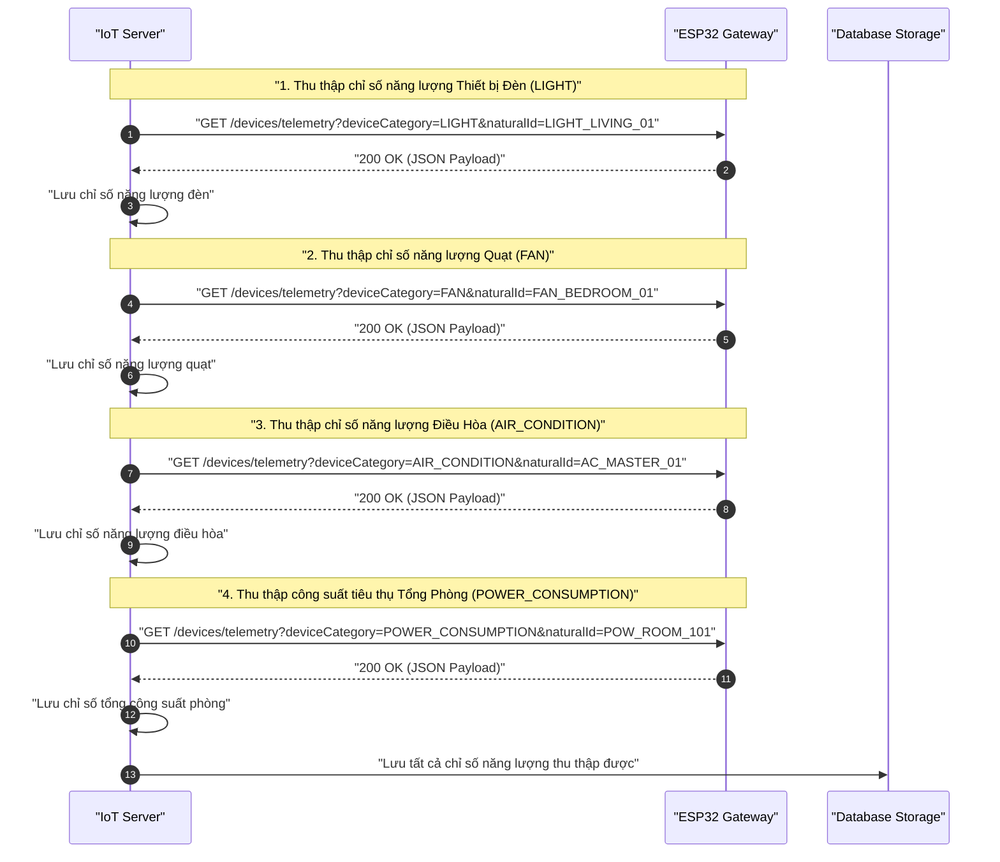
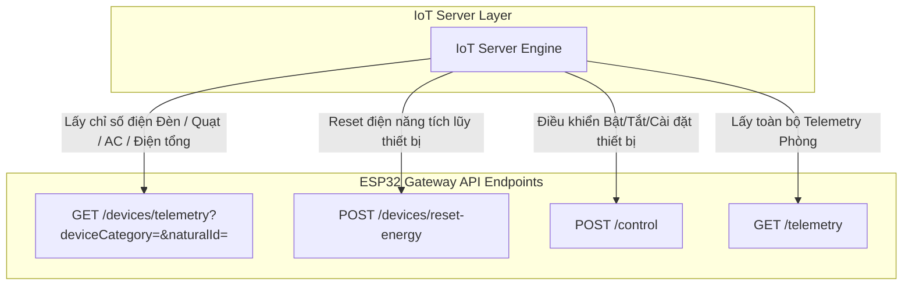

# Tài Liệu API Gateway ESP32 - Thu Thập & Quản Lý Chỉ Số Năng Lượng (Energy & Power Consumption)

Tài liệu tả kỹ thuật chi tiết về các đường dẫn API (Endpoints), tham số đầu vào (Request) và cấu trúc dữ liệu JSON phản hồi (Response Payload) dùng cho việc giao tiếp giữa **IoT Server** và **ESP32 Gateway**.

---

## 1. Biểu Đồ Minh Họa Luồng Xử Lý (Sequence & Flowchart)

### 1.1. Biểu Đồ Trình Tự Thu Thập Chỉ Số Năng Lượng (Sequence Diagram)



---

### 1.2. Biểu Đồ Phân Nhánh API Endpoints (Flowchart)



---

## 2. Mô Tả Cấu Trúc Dữ Liệu JSON (JSON Schema Specifications)

### 2.1. Cấu trúc Đối Tượng Năng Lượng (`Energy Object` trong `data`)

| Tên trường | Kiểu dữ liệu | Mô tả |
| :--- | :--- | :--- |
| `timestamp` | String (ISO-8601) | Thời gian ghi nhận chỉ số đo (VD: `"2026-08-07T15:30:00Z"`) |
| `voltage` | Number (Float/Double) | Điện áp đo được (đơn vị: V - Volts) |
| `current` | Number (Float/Double) | Cường độ dòng điện đo được (đơn vị: A - Amperes) |
| `power` | Number (Float/Double) | Công suất tiêu thụ tức thời (đơn vị: W - Watts) |
| `energy` | Number (Float/Double) | Tổng điện năng tiêu thụ tích lũy (đơn vị: kWh - KiloWatt-hours) |
| `frequency` | Number (Float/Double) | Tần số dòng điện (đơn vị: Hz - Hertz) |
| `powerFactor` | Number (Float/Double) | Hệ số công suất ($\cos \phi$, giá trị từ 0.00 đến 1.00) |

---

### 2.2. Cấu trúc Vỏ Bọc Phản Hồi Chuẩn (Standard Response Wrapper)

| Tên trường | Kiểu dữ liệu | Mô tả |
| :--- | :--- | :--- |
| `status` | Integer | Mã trạng thái HTTP (200 OK, 400 Bad Request, 500 Error...) |
| `message` | String | Thông điệp kết quả phản hồi từ Gateway |
| `data` | Object / String | Dữ liệu chính (chứa đối tượng năng lượng hoặc thông báo kết quả) |
| `timestamp` | String (ISO-8601) | Thời gian máy chủ Gateway xử lý phản hồi |
| `traceId` | String (Null/String) | Mã định danh vết log hệ thống (nếu có) |
| `scenarioId` | String (Null/String) | Mã kịch bản xử lý (nếu có) |

---

### 2.3. Cấu trúc Telemetry Tổng Hợp Phòng (`Global Telemetry Payload`)

| Tên trường | Kiểu dữ liệu | Mô tả |
| :--- | :--- | :--- |
| `roomCode` | String | Mã số đại diện cho phòng (VD: `"ROOM_101"`) |
| `devices` | Array (Object) | Danh sách các thiết bị có telemetry trong phòng |
| `devices[].naturalId` | String | ID phần cứng tự nhiên của thiết bị |
| `devices[].category` | String | Loại thiết bị (`LIGHT`, `FAN`, `AIR_CONDITION`, `POWER_CONSUMPTION`...) |
| `devices[].data` | Object | Dữ liệu trạng thái / năng lượng linh hoạt của thiết bị |

---

## 3. Quy Chuẩn API Endpoints Cho ESP32 Gateway (Chuẩn RESTful `/devices/telemetry`)

**Base URL**: `http://{esp32_ip}:{port}/`

---

### 3.1. Bảng Tra Cứu API Endpoints ESP32

| STT | Chức năng | Method | Endpoint Path | Query Parameters / Body | Response Payload Type |
| :--- | :--- | :--- | :--- | :--- | :--- |
| 1 | **Telemetry Theo Thiết Bị** | `GET` | `devices/telemetry` | `deviceCategory` *(Required)*<br/>`naturalId` *(Required)* | Standard Response Wrapper + Energy Object |
| 2 | **Reset Điện Tích Lũy** | `POST` | `devices/reset-energy` | Body: `{"deviceCategory": "...", "naturalId": "..."}` | Standard Response Wrapper + String Message |
| 3 | **Điều Khiển Thiết Bị** | `POST` | `control` | Body: `{"naturalId": "...", "category": "...", ...}` | Standard Response Wrapper + String Message |
| 4 | **Telemetry Tổng Cả Phòng**| `GET` | `telemetry` | None | Global Telemetry Payload |

*Ghi chú: Giá trị của `deviceCategory` phải thuộc danh sách Enum: `LIGHT`, `FAN`, `AIR_CONDITION`, `POWER_CONSUMPTION`, `TEMPERATURE`, `HUMIDITY`, `SENSOR_CO2`, `SENSOR_LUX`.*

---

### 3.2. Chi Tiết Request & Response JSON Payload Mẫu Cho ESP32

#### 1. Lấy Telemetry Năng Lượng Đèn (`deviceCategory=LIGHT`)
- **Method & Path**: `GET /devices/telemetry?deviceCategory=LIGHT&naturalId={naturalId}`
- **URL Sample**: `http://192.168.1.200:8080/devices/telemetry?deviceCategory=LIGHT&naturalId=LIGHT_LIVING_01`
- **Query Parameters**: 
  - `deviceCategory` = `"LIGHT"` *(Required)*
  - `naturalId` = `"LIGHT_LIVING_01"` *(Required)*
- **Response JSON Payload**:
  ```json
  {
    "status": 200,
    "message": "Success",
    "timestamp": "2026-08-07T15:30:00Z",
    "data": {
      "timestamp": "2026-08-07T15:30:00Z",
      "voltage": 220.5,
      "current": 0.15,
      "power": 33.0,
      "energy": 1.25,
      "frequency": 50.0,
      "powerFactor": 0.95
    }
  }
  ```

#### 2. Lấy Telemetry Năng Lượng Quạt (`deviceCategory=FAN`)
- **Method & Path**: `GET /devices/telemetry?deviceCategory=FAN&naturalId={naturalId}`
- **URL Sample**: `http://192.168.1.200:8080/devices/telemetry?deviceCategory=FAN&naturalId=FAN_BEDROOM_01`
- **Query Parameters**: 
  - `deviceCategory` = `"FAN"` *(Required)*
  - `naturalId` = `"FAN_BEDROOM_01"` *(Required)*
- **Response JSON Payload**:
  ```json
  {
    "status": 200,
    "message": "Success",
    "timestamp": "2026-08-07T15:30:00Z",
    "data": {
      "timestamp": "2026-08-07T15:30:00Z",
      "voltage": 220.0,
      "current": 0.25,
      "power": 55.0,
      "energy": 3.42,
      "frequency": 50.0,
      "powerFactor": 0.98
    }
  }
  ```

#### 3. Lấy Telemetry Năng Lượng Điều Hòa (`deviceCategory=AIR_CONDITION`)
- **Method & Path**: `GET /devices/telemetry?deviceCategory=AIR_CONDITION&naturalId={naturalId}`
- **URL Sample**: `http://192.168.1.200:8080/devices/telemetry?deviceCategory=AIR_CONDITION&naturalId=AC_MASTER_01`
- **Query Parameters**: 
  - `deviceCategory` = `"AIR_CONDITION"` *(Required)*
  - `naturalId` = `"AC_MASTER_01"` *(Required)*
- **Response JSON Payload**:
  ```json
  {
    "status": 200,
    "message": "Success",
    "timestamp": "2026-08-07T15:30:00Z",
    "data": {
      "timestamp": "2026-08-07T15:30:00Z",
      "voltage": 219.8,
      "current": 4.5,
      "power": 989.1,
      "energy": 24.85,
      "frequency": 50.0,
      "powerFactor": 0.92
    }
  }
  ```

#### 4. Lấy Telemetry Điện Tiêu Thụ Tổng (`deviceCategory=POWER_CONSUMPTION`)
- **Method & Path**: `GET /devices/telemetry?deviceCategory=POWER_CONSUMPTION&naturalId={naturalId}`
- **URL Sample**: `http://192.168.1.200:8080/devices/telemetry?deviceCategory=POWER_CONSUMPTION&naturalId=POW_ROOM_101`
- **Query Parameters**: 
  - `deviceCategory` = `"POWER_CONSUMPTION"` *(Required)*
  - `naturalId` = `"POW_ROOM_101"` *(Required)*
- **Response JSON Payload**:
  ```json
  {
    "status": 200,
    "message": "Success",
    "timestamp": "2026-08-07T15:30:00Z",
    "data": {
      "timestamp": "2026-08-07T15:30:00Z",
      "voltage": 221.2,
      "current": 6.8,
      "power": 1504.16,
      "energy": 120.45,
      "frequency": 50.0,
      "powerFactor": 0.96
    }
  }
  ```

#### 5. Reset Điện Năng Tích Lũy Thiết Bị (`/devices/reset-energy`)
- **Method & Path**: `POST /devices/reset-energy`
- **URL Sample**: `http://192.168.1.200:8080/devices/reset-energy`
- **Request JSON Body**:
  ```json
  {
    "deviceCategory": "POWER_CONSUMPTION",
    "naturalId": "POW_ROOM_101"
  }
  ```
- **Response JSON Payload**:
  ```json
  {
    "status": 200,
    "message": "Energy metric reset successfully",
    "data": "OK",
    "timestamp": "2026-08-07T15:35:00Z"
  }
  ```