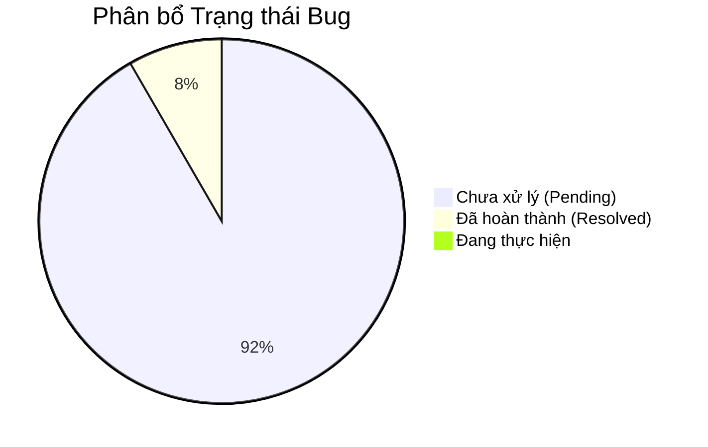

# HỆ THỐNG QUẢN LÝ VÀ THEO DÕI LỖI (BUG)
*Duy trì sự xuất sắc trong kỹ thuật thông qua quy trình theo dõi chặt chẽ*

---

## Thống kê Nhanh
> [!TIP]
> Biểu đồ trạng thái thời gian thực của các vấn đề đang tồn tại trong hệ thống.

---

## Quy ước Phân loại

| Chỉ số | Mức 1 | Mức 2 | Mức 3 |
| :--- | :--- | :--- | :--- |
| **Nghiêm trọng (Severity)** | **S1**: Lỗi hệ thống/Sập | **S2**: Lỗi chức năng | **S3**: Lỗi giao diện/UX |
| **Gấp (Urgency)** | **U1**: Ngay lập tức | **U2**: Trong tuần | **U3**: Khi có thể |
| **Độ ưu tiên (Priority)** | **P0**: Khẩn cấp (Cháy) | **P1**: Cao | **P2**: Trung bình |

---

## Danh sách Bug Chi tiết

 

| ID | Mô tả vấn đề | S | U | P | Trạng thái Hiện tại |
| :-- | :--- | :---: | :---: | :---: | :--- |
| `BUG-001` | **Lỗi tràn biểu đồ**: Sai lệch logic xử lý khoảng trống dữ liệu. | `S2` | `U2` | `P1` | <kbd>🟢 **ĐÃ XONG**</kbd> |
| `BUG-002` | **Sắp xếp Data Table**: Giao diện bị lệch khi nhấn sắp xếp. | `S2` | `U2` | `P1` | <kbd>🔴 **ĐANG CHỜ**</kbd> |
| `BUG-003` | **Tìm kiếm Toàn cục**: Hỗ trợ Unicode và tối ưu độ trễ. | `S2` | `U2` | `P1` | <kbd>🔴 **ĐANG CHỜ**</kbd> |
| `BUG-004` | **Automation "Thêm Hành động"**: Vị trí thanh tìm kiếm và bộ lọc. | `S2` | `U2` | `P1` | <kbd>🔴 **ĐANG CHỜ**</kbd> |
| `BUG-005` | **Hardcode Breadcrumb**: Đồng bộ tiêu đề theo Route thực tế. | `S2` | `U2` | `P1` | <kbd>🔴 **ĐANG CHỜ**</kbd> |
| `BUG-006` | **Bộ lọc Người dùng**: Sai lệch logic Category/Gateway. | `S2` | `U2` | `P1` | <kbd>🔴 **ĐANG CHỜ**</kbd> |
| `BUG-007` | **Toàn vẹn Audit Trail**: Thiếu vết hành động đặc thù. | `S2` | `U2` | `P1` | <kbd>🔴 **ĐANG CHỜ**</kbd> |
| `BUG-008` | **Điều hướng Nav**: Link bị hỏng hoặc dẫn sai trang. | `S2` | `U2` | `P1` | <kbd>🔴 **ĐANG CHỜ**</kbd> |
| `BUG-009` | **Ràng buộc Quyền hạn**: Thiếu validation khi tạo nhóm mới. | `S2` | `U2` | `P1` | <kbd>🔴 **ĐANG CHỜ**</kbd> |
| `BUG-010` | **Luồng Cập nhật Rule**: Mất tính phản ứng sau khi Lưu. | `S2` | `U1` | `P1` | <kbd>🔴 **ĐANG CHỜ**</kbd> |
| `BUG-011` | **Logic Điều khiển**: Thiếu bước kiểm tra trạng thái thiết bị. | `S2` | `U1` | `P1` | <kbd>🔴 **ĐANG CHỜ**</kbd> |
| `BUG-012` | **Giới hạn Độ ưu tiên**: Không cho phép nhập giá trị âm. | `S2` | `U2` | `P1` | <kbd>🔴 **ĐANG CHỜ**</kbd> |

 

---

## Đặc tả Vấn đề Chi tiết

<b>BUG-012: Giới hạn Thuộc tính Priority</b>

### Triệu chứng & Đặc tả
Hệ thống ngăn chặn hoặc tự động đặt lại các giá trị priority âm (ví dụ: -1, -5). Điều này tạo ra rào cản khi người dùng muốn thiết lập các quy tắc có độ ưu tiên thấp hơn mức mặc định, hạn chế khả năng sắp xếp rule tinh xảo trong các kịch bản vận hành phức tạp.

<b>Nhóm P1 (BUG-001 -> BUG-011)</b>

Bao gồm các lỗi về tính đúng đắn của dữ liệu biểu đồ, sự ổn định của UI table và tính toàn vẹn của dữ liệu Audit. Các lỗi này ảnh hưởng trực tiếp đến trải nghiệm quản trị và độ chính xác của báo cáo hệ thống.

---

<i>Được tạo bởi Antigravity AI Engine</i>

