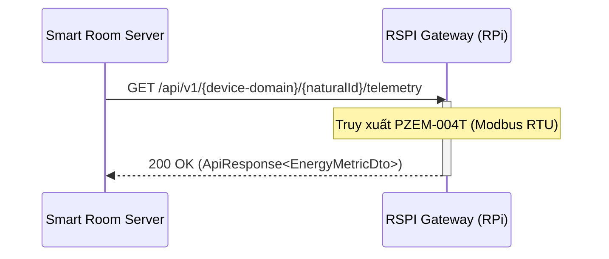
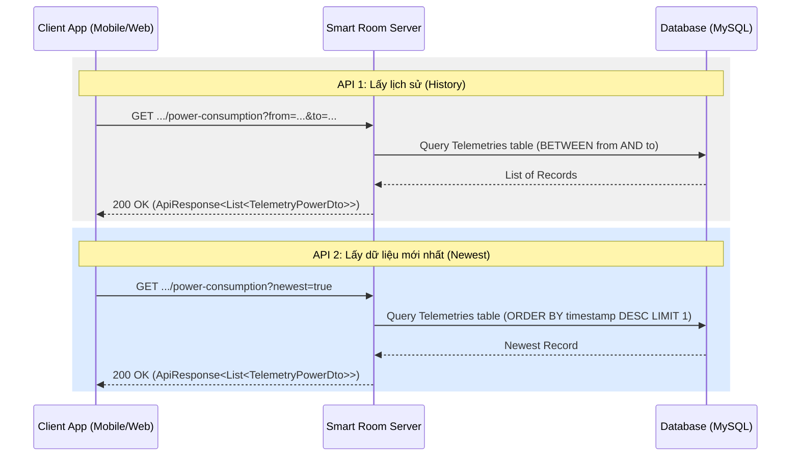

# Yêu cầu Module Power Consumption & Server

**Ngày tổng hợp:** 07/04/2026  
**Trọng tâm:** Module PZEM-004T đo tổng và từng thiết bị, kèm yêu cầu tài liệu Server.

---

## Mục lục

1. [Cấu trúc dữ liệu và Tần suất gửi](#1-cấu-trúc-dữ-liệu-và-tần-suất-gửi)
   - [1.1 Đặc tả ý nghĩa các thông số](#11-đặc-tả-ý-nghĩa-các-thông-số-metrics-specification)
   - [1.2 Tần suất gửi dữ liệu](#12-tần-suất-gửi-dữ-liệu)

2. [Logic xử lý số liệu Năng lượng](#2-logic-xử-lý-số-liệu-năng-lượng)

3. [Kiến trúc Dữ liệu: State, Telemetry & State History](#3-kiến-trúc-dữ-liệu-state-telemetry--state-history)
   - [3.1 Trạng thái hiện tại](#31-trạng-thái-hiện-tại-state)
   - [3.2 Dữ liệu vận hành quan trọng](#32-dữ-liệu-vận-hành-quan-trọng-energy-metrics)
   - [3.3 Lịch sử trạng thái](#33-lịch-sử-trạng-thái-state-history)

4. [Interfaces](#4-interfaces)
   - [4.1 Interface Server - Rspi](#41-interface-server---rspi)
   - [4.2 Interface Client - Server](#42-interface-client---server)

---

## 1. Cấu trúc dữ liệu và Tần suất gửi

### 1.1 Đặc tả ý nghĩa các thông số (Metrics Specification)
Hệ thống sử dụng module PZEM-004T để thu thập bộ 6 chỉ số đo điện năng tiêu chuẩn:

| Chỉ số | Đơn vị | Ý nghĩa |
| :--- | :--- | :--- |
| **Voltage** | V | Điện áp (Hiệu điện thế) |
| **Current** | A | Cường độ dòng điện |
| **Power** | W | Công suất tiêu thụ tức thời |
| **Energy** | Wh | Năng lượng tiêu thụ tích lũy (tăng dần, reset đầu ngày) |
| **Frequency** | Hz | Tần số dòng điện (Lưới điện VN thường là 50Hz) |
| **Power Factor** | - | Hệ số công suất (biến thiên từ 0.0 đến 1.0) |

### 1.2 Tần suất gửi dữ liệu
- **Thiết bị (Client/Gateway)**: Truy xuất từ cảm biến và gửi lên Server.
- **Tần suất**: Mặc định **5 phút/lần** (lưu 1 bản ghi).
- **Phòng & Máy lạnh**: Nhiệt độ phòng và setpoint cũng được lưu kèm timestamp với cùng tần suất.

### Dữ liệu mẫu (Java DTO)
```java
@Data
public class EnergyMetricDto {
    private Double voltage;      // V
    private Double current;      // A
    private Double power;        // W
    private Double energy;       // Wh
    private Double frequency;    // Hz
    private Double powerFactor;  // 0.0 - 1.0
}
```

---

## 2. Logic xử lý số liệu Năng lượng

### Tóm tắt yêu cầu
- **Power (Công suất)**: Là công suất tức thời (ví dụ: 300W tại 00:00, 150W tại 01:00).
- **Energy (Năng lượng tích lũy)**: Điện năng tiêu thụ tích lũy (tăng dần đến 9999.99).
- **Quy trình Reset**: Đúng **00:00 đầu ngày**, Server ra lệnh cho Client để reset thông số `Energy` về 0.

---

## 3. Kiến trúc Dữ liệu: State, Telemetry & State History

### 3.1 Trạng thái hiện tại (State)
Lưu trữ trạng thái điều khiển tức thời của Actuators tại bảng chính của thiết bị (`mode`, `temperature_set`, `fan_speed`, v.v.).

### 3.2 Dữ liệu vận hành quan trọng (Energy Metrics)
Đây là cấu trúc dữ liệu nòng cốt để lưu trữ thông số điện năng chi tiết cho toàn bộ hệ thống (từ thiết bị đơn lẻ đến tổng phòng).

**Bảng: `energy_metrics` (Entity: `EnergyMetrics`)**

Bảng này được thiết kế để lưu trữ dữ liệu Time-series cho nhiều loại đối tượng khác nhau thông qua cặp `category` và `targetId`.

| Trường | Kiểu dữ liệu | Mô tả |
| :--- | :--- | :--- |
| `id` | Long | Khóa chính (Primary Key) |
| `category` | Enum | Loại đối tượng: `LIGHT`, `AC`, `FAN`, `ROOM` |
| `targetId` | Long | ID của đối tượng tương ứng trong category (ví dụ: roomId, lightId, ...) |
| `timestamp` | Instant | Thời điểm ghi nhận dữ liệu (Theo `BaseTelemetryValue`) |
| `voltage` -> `powerFactor` | Double | 6 chỉ số đo điện năng (Chi tiết tại [mục 1.1](#11-đặc-tả-ý-nghĩa-các-thông-số-metrics-specification)) |

**Lưu ý:**
- Bảng này đánh dấu `@Immutable` (chỉ thêm, không sửa/xóa).
- Cần đánh index trên `(category, targetId, timestamp)` để tối ưu các truy vấn vẽ biểu đồ.

### 3.3 Lịch sử trạng thái (State History)
Chụp "snapshot" trạng thái điều khiển của Actuators mỗi 5 phút/lần phục vụ phân tích xu hướng.

---

## 4. Interfaces

### 4.1 Interface Server - Rspi

Mô tả luồng giao tiếp giữa Server và Raspberry Pi (Gateway) để lấy dữ liệu đo điện thực tế từ các thiết bị qua PZEM-004T.

- **Device Domains:** `air-conditions`, `lights`, `fans`, `power-consumptions`.
- **Nguyên tắc:** Toàn bộ dữ liệu được RSPI thu thập và tính toán sẵn (pre-calculated). Server chỉ đóng vai trò lấy dữ liệu (GET).

**1. API Lấy dữ liệu (Telemetry):**
- **Endpoint:** `GET /api/v1/{device-domain}/{naturalId}/telemetry`
- **Mô tả:** Lấy bộ 6 chỉ số điện năng hiện tại.

**2. API Reset chỉ số năng lượng (Energy Reset):**
- **Endpoint:** `POST /api/v1/power-consumption/reset`
- **Mô tả:** Server gọi API này vào đúng **00:00 đầu ngày** để RSPI thực hiện lệnh reset thanh ghi `Energy` trên module PZEM-004T về 0.

**Luồng xử lý (Sequence Diagram):**



**Cấu trúc dữ liệu Response (JSON Example):**

```json
{
  "status": 200,
  "message": "Success",
  "data": {
    "voltage": 220.5,
    "current": 0.45,
    "power": 99.2,
    "energy": 1234.56,
    "frequency": 50.0,
    "powerFactor": 0.98
  },
  "timestamp": "2026-04-11T13:19:38Z"
}
```

**Mô tả các trường trong EnergyMetricDto:**
- Tham khảo đặc tả ý nghĩa và đơn vị tại [mục 1.1](#11-đặc-tả-ý-nghĩa-các-thông-số-metrics-specification).

---

### 4.2 Interface Client - Server

Cung cấp các API công khai cho ứng dụng Client (Mobile/Web) để truy xuất dữ liệu lịch sử đo đạc của từng thiết bị cụ thể phục vụ việc vẽ sơ đồ (charts).

**Chi tiết Endpoint:**
- **URL:** `/api/v1/{device-domain}/{deviceId}/power-consumption`
- **Method:** `GET`
- **Query Parameters:**
    - **Mode 1 (History):** `from` & `to` (ISO 8601 - Instant) -> Trả về danh sách lịch sử.
        - **Ràng buộc:** Khoảng thời gian (`to - from`) tối đa là **1 năm**.
    - **Mode 2 (Newest):** `newest=true` (Boolean) -> Trả về bản ghi mới nhất hiện tại.
- **Device Domains:** `air-conditions`, `lights`, `fans`.

**Luồng xử lý (Sequence Diagram):**



**Cấu trúc dữ liệu Response (JSON Example):**
Mỗi bản ghi trả về đầy đủ 6 chỉ số đo đạc để Client linh hoạt trong việc hiển thị Table hoặc Chart.

```json
{
  "status": 200,
  "message": "Success",
  "data": [
    {
      "timestamp": "2026-04-11T13:40:00Z",
      "voltage": 220.5,
      "current": 0.45,
      "power": 99.2,
      "energy": 1234.56,
      "frequency": 50.0,
      "powerFactor": 0.98
    }
  ],
  "timestamp": "2026-04-11T13:47:19Z"
}
```

#### **UI Rendering Logic (Client)**

Để đảm bảo hiệu năng và tính trực quan trên ứng dụng Mobile/Web:

1. **Hiển thị Table:** Render toàn bộ danh sách bản ghi với đủ 6 cột thông số kỹ thuật.
2. **Hiển thị Chart:**
   - Trục X: Thời gian (`timestamp`).
   - Trục Y: Giá trị đo tương ứng với đơn vị của metric.
   - **Cơ chế chọn:** UI cung cấp các **Radio Button** tương ứng với 6 chỉ số. Tại một thời điểm, chỉ một chỉ số được chọn để vẽ lên biểu đồ.
   - **Đơn vị động:** Y-axis title sẽ tự động cập nhật theo metric (V, A, W, Wh, Hz, hoặc PF).

**Lưu ý:**
- Trường `power` trong `data` trả về công suất tiêu thụ tại thời điểm ghi nhận (đơn vị: **Watt**).
- Dữ liệu này được Server thu thập định kỳ từ RSPI thông qua Interface 4.1.
