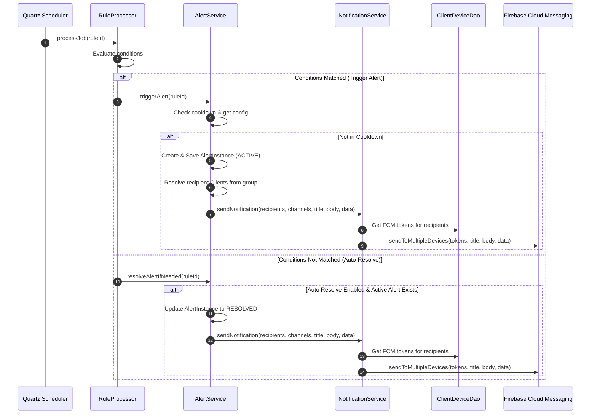
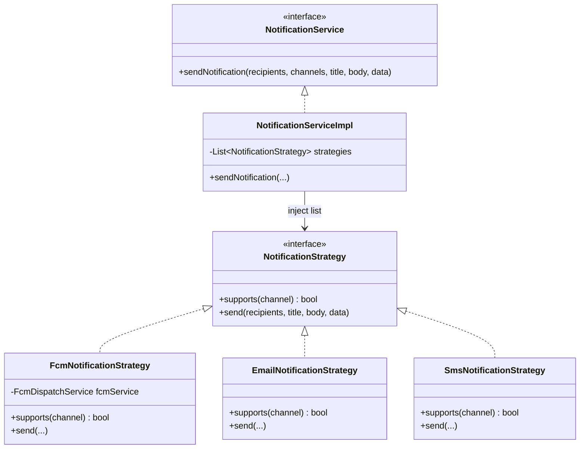

# Alert System Integration Design Specification

This document specifies the design for integrating the Alert System into the Smart Room IoT Server backend. It aligns with existing code patterns, ensures strict Role-Based Access Control (RBAC), adheres to SOLID principles using the Strategy Pattern for multi-channel dispatch, and integrates with the Quartz-based Rule Engine.

---

## 1. System Architecture & Flow



---

## 2. Database Design (Table Schemas)

Three new tables will be added to the `smart_room_iot` schema.

### 2.1. `rule_action_alert` (Alert Configurations)
Stores the notification settings linked to a specific rule.
```sql
CREATE TABLE `rule_action_alert` (
  `id` bigint NOT NULL AUTO_INCREMENT,
  `created_at` datetime(6) DEFAULT NULL,
  `created_by` varchar(256) DEFAULT NULL,
  `updated_at` datetime(6) DEFAULT NULL,
  `updated_by` varchar(256) DEFAULT NULL,
  `v` bigint NOT NULL,
  `rule_id` bigint NOT NULL,
  `alert_name` varchar(256) NOT NULL,
  `severity` varchar(50) NOT NULL COMMENT 'Enum: INFO, WARNING, CRITICAL',
  `recipient_groups` json DEFAULT NULL COMMENT 'JSON array of group codes, e.g. ["G_ADMIN", "G_MAINTENANCE"]',
  `channels` json DEFAULT NULL COMMENT 'JSON array of channels, e.g. ["PUSH", "EMAIL"]',
  `message_template` text NOT NULL,
  `cooldown_minutes` int NOT NULL DEFAULT 0,
  `auto_resolve` boolean NOT NULL DEFAULT 0,
  PRIMARY KEY (`id`),
  UNIQUE KEY `idx_rule_action_alert_rule_id` (`rule_id`),
  CONSTRAINT `fk_rule_action_alert_rule` FOREIGN KEY (`rule_id`) REFERENCES `rule` (`id`) ON DELETE CASCADE
) ENGINE=InnoDB DEFAULT CHARSET=utf8mb4 COLLATE=utf8mb4_unicode_ci;
```

### 2.2. `alert_instance` (Triggered Alert Incidents)
Stores the actual alert occurrences and manages their lifecycle states.
```sql
CREATE TABLE `alert_instance` (
  `id` bigint NOT NULL AUTO_INCREMENT,
  `created_at` datetime(6) DEFAULT NULL,
  `created_by` varchar(256) DEFAULT NULL,
  `updated_at` datetime(6) DEFAULT NULL,
  `updated_by` varchar(256) DEFAULT NULL,
  `v` bigint NOT NULL,
  `rule_id` bigint NOT NULL,
  `title` varchar(256) NOT NULL,
  `body` text NOT NULL,
  `severity` varchar(50) NOT NULL COMMENT 'Enum: INFO, WARNING, CRITICAL',
  `status` varchar(50) NOT NULL COMMENT 'Enum: ACTIVE, ACKNOWLEDGED, RESOLVED',
  `triggered_at` datetime(6) NOT NULL,
  `acknowledged_at` datetime(6) DEFAULT NULL,
  `acknowledged_by` bigint DEFAULT NULL COMMENT 'FK to client representing user who acknowledged',
  `resolved_at` datetime(6) DEFAULT NULL,
  `resolved_by` bigint DEFAULT NULL COMMENT 'FK to client representing user who resolved, null if system auto-resolved',
  PRIMARY KEY (`id`),
  KEY `idx_alert_instance_rule_id` (`rule_id`),
  KEY `idx_alert_instance_status` (`status`),
  CONSTRAINT `fk_alert_instance_rule` FOREIGN KEY (`rule_id`) REFERENCES `rule` (`id`) ON DELETE CASCADE,
  CONSTRAINT `fk_alert_instance_ack_by` FOREIGN KEY (`acknowledged_by`) REFERENCES `client` (`id`) ON DELETE SET NULL,
  CONSTRAINT `fk_alert_instance_res_by` FOREIGN KEY (`resolved_by`) REFERENCES `client` (`id`) ON DELETE SET NULL
) ENGINE=InnoDB DEFAULT CHARSET=utf8mb4 COLLATE=utf8mb4_unicode_ci;
```

### 2.3. `alert_recipient` (Alert Delivery Mapping)
Resolves delivery lists and supports RBAC checks for end users.
```sql
CREATE TABLE `alert_recipient` (
  `alert_id` bigint NOT NULL,
  `client_id` bigint NOT NULL,
  PRIMARY KEY (`alert_id`, `client_id`),
  KEY `idx_alert_recipient_client_id` (`client_id`),
  CONSTRAINT `fk_alert_recipient_alert` FOREIGN KEY (`alert_id`) REFERENCES `alert_instance` (`id`) ON DELETE CASCADE,
  CONSTRAINT `fk_alert_recipient_client` FOREIGN KEY (`client_id`) REFERENCES `client` (`id`) ON DELETE CASCADE
) ENGINE=InnoDB DEFAULT CHARSET=utf8mb4 COLLATE=utf8mb4_unicode_ci;
```

---

## 3. Java Entities & JPA Mapping

### 3.1. Enums (`Severity` & `AlertStatus`)
```java
package com.iviet.ivshs.shared.enumeration;

public enum Severity {
    INFO, WARNING, CRITICAL
}
```
```java
package com.iviet.ivshs.shared.enumeration;

public enum AlertStatus {
    ACTIVE, ACKNOWLEDGED, RESOLVED
}
```

### 3.2. `RuleActionAlert.java`
```java
package com.iviet.ivshs.entities;

import com.fasterxml.jackson.databind.JsonNode;
import com.iviet.ivshs.entities.base.BaseAuditEntity;
import com.iviet.ivshs.shared.enumeration.Severity;
import jakarta.persistence.*;
import lombok.*;

@Entity
@Getter
@Setter
@NoArgsConstructor
@AllArgsConstructor
@Table(name = "rule_action_alert")
public class RuleActionAlert extends BaseAuditEntity {

    @OneToOne(fetch = FetchType.LAZY)
    @JoinColumn(name = "rule_id", nullable = false, unique = true)
    private Rule rule;

    @Column(name = "alert_name", nullable = false, length = 256)
    private String alertName;

    @Enumerated(EnumType.STRING)
    @Column(name = "severity", nullable = false, length = 50)
    private Severity severity;

    // Standard auto-applied JsonNodeConverter maps JSON columns to JsonNode
    @Column(name = "recipient_groups")
    private JsonNode recipientGroups;

    @Column(name = "channels")
    private JsonNode channels;

    @Column(name = "message_template", nullable = false, columnDefinition = "TEXT")
    private String messageTemplate;

    @Column(name = "cooldown_minutes", nullable = false)
    private Integer cooldownMinutes = 0;

    @Column(name = "auto_resolve", nullable = false)
    private Boolean autoResolve = false;
}
```

### 3.3. `AlertInstance.java`
```java
package com.iviet.ivshs.entities;

import com.iviet.ivshs.entities.base.BaseAuditEntity;
import com.iviet.ivshs.shared.enumeration.AlertStatus;
import com.iviet.ivshs.shared.enumeration.Severity;
import jakarta.persistence.*;
import lombok.*;
import java.time.Instant;
import java.util.HashSet;
import java.util.Set;

@Entity
@Getter
@Setter
@Builder
@NoArgsConstructor
@AllArgsConstructor
@Table(name = "alert_instance")
public class AlertInstance extends BaseAuditEntity {

    @ManyToOne(fetch = FetchType.LAZY)
    @JoinColumn(name = "rule_id", nullable = false)
    private Rule rule;

    @Column(name = "title", nullable = false, length = 256)
    private String title;

    @Column(name = "body", nullable = false, columnDefinition = "TEXT")
    private String body;

    @Enumerated(EnumType.STRING)
    @Column(name = "severity", nullable = false, length = 50)
    private Severity severity;

    @Enumerated(EnumType.STRING)
    @Column(name = "status", nullable = false, length = 50)
    private AlertStatus status;

    @Column(name = "triggered_at", nullable = false)
    private Instant triggeredAt;

    @Column(name = "acknowledged_at")
    private Instant acknowledgedAt;

    @ManyToOne(fetch = FetchType.LAZY)
    @JoinColumn(name = "acknowledged_by")
    private Client acknowledgedBy;

    @Column(name = "resolved_at")
    private Instant resolvedAt;

    @ManyToOne(fetch = FetchType.LAZY)
    @JoinColumn(name = "resolved_by")
    private Client resolvedBy;

    @ManyToMany(fetch = FetchType.LAZY)
    @JoinTable(
        name = "alert_recipient",
        joinColumns = @JoinColumn(name = "alert_id"),
        inverseJoinColumns = @JoinColumn(name = "client_id")
    )
    @Builder.Default
    private Set<Client> recipients = new HashSet<>();
}
```

### 3.4. Update `Rule.java`
```java
    @OneToOne(mappedBy = "rule", cascade = CascadeType.ALL, orphanRemoval = true, fetch = FetchType.LAZY)
    private RuleActionAlert alertConfig;

    public void setAlertConfig(RuleActionAlert alertConfig) {
        this.alertConfig = alertConfig;
        if (alertConfig != null) {
            alertConfig.setRule(this);
        }
    }
```

---

## 4. REST API Definitions

All endpoints under `/api/v1/alerts` will be protected by security filters.

### 4.1. `GET /api/v1/alerts` (List Alerts)
*   **RBAC Filter Logic**:
    *   **`G_ADMIN`**: Can query all `AlertInstance` records.
    *   **`G_MAINTENANCE`**: Can query alerts matching `rule_action_alert.recipient_groups LIKE '%"G_MAINTENANCE"%'` OR where they are explicitly in the `alert_recipient` list.
    *   **`G_USER`**: Can only view alerts where their `client_id` is present in `alert_recipient`.
*   **Parameters**: `status`, `severity`, `page` (default 0), `size` (default 10).
*   **Response**: `ApiResponse<PaginatedResponse<AlertResponseDto>>`

### 4.2. `GET /api/v1/alerts/{id}` (View Alert Detail)
*   **RBAC Check**: Ensures the requesting user belongs to one of the authorized groups or is a listed recipient.
*   **Response**: `ApiResponse<AlertResponseDto>`

### 4.3. `POST /api/v1/alerts/{id}/acknowledge` (Acknowledge Alert)
*   **Action**: Updates status to `ACKNOWLEDGED`, sets `acknowledged_at` to now, and `acknowledged_by` to the current `client_id`.
*   **Response**: `ApiResponse<AlertResponseDto>`

### 4.4. `POST /api/v1/alerts/{id}/resolve` (Resolve Alert Manually)
*   **Action**: Updates status to `RESOLVED`, sets `resolved_at` to now, and `resolved_by` to current `client_id`. Dispatches `ALERT_RESOLVED` notification.
*   **Response**: `ApiResponse<AlertResponseDto>`

---

## 5. Notification Dispatch System (Strategy Pattern)

To comply with SOLID principles and prevent coupling with concrete notification providers (such as Firebase), a strategy-based notification dispatcher is implemented.



### 5.1. `NotificationStrategy.java`
```java
package com.iviet.ivshs.service.notification.strategy;

import com.iviet.ivshs.entities.Client;
import java.util.Map;
import java.util.Set;

public interface NotificationStrategy {
    boolean supports(String channel);
    void send(Set<Client> recipients, String title, String body, Map<String, String> data);
}
```

### 5.2. `NotificationServiceImpl.java`
```java
package com.iviet.ivshs.service.notification.impl;

import com.iviet.ivshs.entities.Client;
import com.iviet.ivshs.service.notification.NotificationService;
import com.iviet.ivshs.service.notification.strategy.NotificationStrategy;
import lombok.RequiredArgsConstructor;
import lombok.extern.slf4j.Slf4j;
import org.springframework.stereotype.Service;
import java.util.List;
import java.util.Map;
import java.util.Set;

@Slf4j
@Service
@RequiredArgsConstructor
public class NotificationServiceImpl implements NotificationService {

    private final List<NotificationStrategy> strategies;

    @Override
    public void sendNotification(Set<Client> recipients, List<String> channels, String title, String body, Map<String, String> data) {
        if (recipients == null || recipients.isEmpty() || channels == null || channels.isEmpty()) {
            return;
        }
        for (String channel : channels) {
            strategies.stream()
                    .filter(s -> s.supports(channel))
                    .findFirst()
                    .ifPresentOrElse(
                        s -> s.send(recipients, title, body, data),
                        () -> log.warn("No strategy registered for channel: {}", channel)
                    );
        }
    }
}
```

---

## 6. FCM Payload & Client Integration

All fields inside `message.data` must be mapped as strings to comply with the FCM v1 protocol.

### 6.1. FCM payload for `ALERT_TRIGGERED`
*   **Notification part**:
    *   `title`: `alertName` (e.g. `"Cảnh báo nhiệt độ"`)
    *   `body`: Formatted message template (e.g. `"Nhiệt độ phòng máy chủ 42°C vượt ngưỡng cho phép 35°C."`)
*   **Data part**:
    *   `type`: `"ALERT_TRIGGERED"`
    *   `entityId`: `"123"` (String representation of `alert_instance.id`)
    *   `severity`: `"CRITICAL"`
    *   `status`: `"ACTIVE"`
    *   `deepLink`: `"smartroom://alert/123"`
    *   `timestamp`: `"1718804400000"` (String representation of epoch millisecond)

### 6.2. FCM payload for `ALERT_RESOLVED`
*   **Notification part**:
    *   `title`: `"Cảnh báo đã phục hồi: " + alertName`
    *   `body`: `"Trạng thái phòng đã trở lại bình thường."`
*   **Data part**:
    *   `type`: `"ALERT_RESOLVED"`
    *   `entityId`: `"123"`
    *   `severity`: `"CRITICAL"`
    *   `status`: `"RESOLVED"`
    *   `deepLink`: `"smartroom://alert/123"`
    *   `timestamp`: `"1718804700000"`
