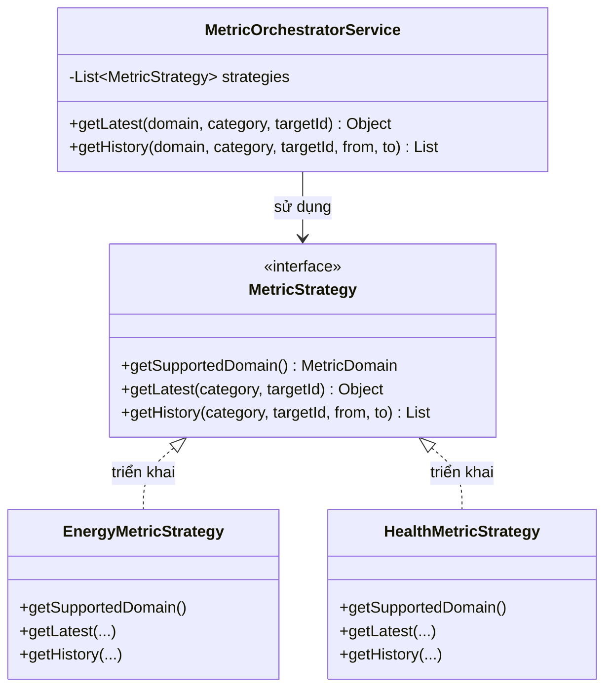
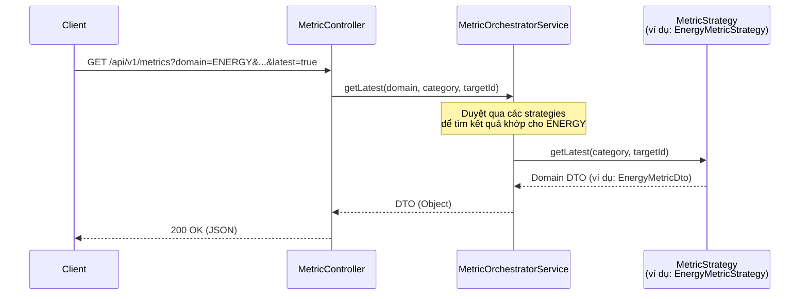

# Smart Room IoT Server - Kiến trúc Hệ thống Metric

## 1. Tổng quan
Hệ thống Metric được thiết kế để thống nhất cách thức truy vấn và cung cấp các loại metric hệ thống khác nhau (Năng lượng, Sức khỏe thiết bị, Môi trường, v.v.) cho các client. Nó đóng vai trò như một facade chuẩn hóa để tổng hợp và điều hướng các yêu cầu đến các dịch vụ cụ thể của từng domain bằng cách sử dụng **Strategy Pattern** (Mẫu Chiến lược).

Kiến trúc này giải quyết vấn đề phân mảnh endpoint, nơi mà trước đây mỗi domain yêu cầu các controller endpoint riêng (ví dụ: `/api/v1/energy-metrics/...`, `/api/v1/health-metrics/...`).

## 2. Các Thành phần Chính

### 2.1 API Endpoint (`MetricController`)
Chỉ có một endpoint duy nhất để lấy các metric:
**`GET /api/v1/metrics`**

**Tham số truy vấn (Query Parameters):**
- `domain` (Bắt buộc): Domain của metric (ví dụ: `ENERGY`, `HEALTH`).
- `category` (Bắt buộc): Loại thiết bị (ví dụ: `LIGHT`, `FAN`, `AIR_CONDITION`).
- `targetId` (Bắt buộc): ID cụ thể của thiết bị.
- `latest` (Tùy chọn, Mặc định: `false`): 
  - Nếu là `true`, API trả về một đối tượng duy nhất đại diện cho trạng thái hiện tại/mới nhất của thiết bị (bỏ qua các bộ lọc khoảng thời gian).
  - Nếu là `false`, API mong đợi một khoảng thời gian và trả về danh sách dữ liệu lịch sử.
- `from` (Tùy chọn): Timestamp bắt đầu cho các truy vấn lịch sử (bị bỏ qua nếu `latest=true`).
- `to` (Tùy chọn): Timestamp kết thúc cho các truy vấn lịch sử (bị bỏ qua nếu `latest=true`).

### 2.2 Giao diện Chiến lược (`MetricStrategy`)
Bất kỳ dịch vụ nào cung cấp metric đều phải triển khai giao diện `MetricStrategy`. 
Giao diện này định nghĩa hợp đồng mà bộ điều phối (orchestrator) dựa vào:

```java
public interface MetricStrategy {
    // Định nghĩa domain mà strategy này xử lý
    MetricDomain getSupportedDomain();

    // Trả về trạng thái metric đơn lẻ mới nhất
    Object getLatest(DeviceCategory category, Long targetId);

    // Trả về danh sách các metric cho biểu đồ lịch sử
    List<?> getHistory(DeviceCategory category, Long targetId, Instant from, Instant to);
}
```

### 2.3 Bộ điều phối (`MetricOrchestratorService`)
Đây là dịch vụ điều hướng trung tâm. Nó được inject một danh sách tất cả các bean `MetricStrategy` có sẵn do Spring context cung cấp. 

Khi một yêu cầu đến từ controller, Orchestrator sẽ:
1. Duyệt qua các strategy đã đăng ký.
2. Tìm strategy khớp với `domain` được yêu cầu.
3. Ủy quyền lời gọi `getLatest` hoặc `getHistory` cho strategy cụ thể đó.

## 2.4 Sơ đồ Kiến trúc

### Sơ đồ Lớp (Class Diagram): Strategy Pattern


### Sơ đồ Tuần tự (Sequence Diagram): Luồng Metric Thống nhất


## 3. Cách Mở rộng (Thêm một Domain Mới)

Để thêm một domain metric mới (ví dụ: `HEALTH`), hãy làm theo các bước sau:

### Bước 1: Thêm Domain vào Enum
Thêm domain mới vào `MetricDomain`:
```java
public enum MetricDomain {
    ENERGY,
    HEALTH  // <-- Domain mới
}
```

### Bước 2: Triển khai Strategy
Tạo hoặc sửa đổi service của domain của bạn để triển khai `MetricStrategy`:
```java
@Service
@RequiredArgsConstructor
public class HealthMetricServiceImpl implements HealthMetricService, MetricStrategy {
    
    @Override
    public MetricDomain getSupportedDomain() {
        return MetricDomain.HEALTH;
    }

    @Override
    public Object getLatest(DeviceCategory category, Long targetId) {
        // Truy vấn cơ sở dữ liệu/cache để lấy trạng thái sức khỏe mới nhất
        return new HealthCheckResponseDto(...);
    }

    @Override
    public List<?> getHistory(DeviceCategory category, Long targetId, Instant from, Instant to) {
        // Truy vấn lịch sử
        return healthRepository.findHistory(...);
    }
}
```

### Bước 3: Hoàn tất!
Không cần thay đổi gì trong `MetricController` hay `MetricOrchestratorService`. Spring application context sẽ tự động inject strategy mới của bạn vào Orchestrator, và endpoint thống nhất sẽ ngay lập tức hỗ trợ các truy vấn với `?domain=HEALTH`.

## 4. Quyết định Thiết kế & Đánh đổi

- **Trả về `Object` / `List<?>`:** Vì các domain khác nhau có cấu trúc DTO hoàn toàn khác nhau (ví dụ: `EnergyMetricDto` so với `HealthDto`), giao diện Strategy dựa trên việc trả về `Object` generic. Lớp Spring Web vốn dĩ sẽ serialize bất kỳ Object nào được trả về thành JSON, cho phép Controller giữ được tính generic hoàn toàn.
- **Nút bật tắt `latest`:** Các tính năng biểu đồ yêu cầu mảng dữ liệu lịch sử, trong khi các widget trạng thái trên dashboard yêu cầu một kết quả đọc mới nhất duy nhất. Việc sử dụng tham số truy vấn bật tắt (`latest=true/false`) giúp tránh việc cần hai đường dẫn API riêng biệt, đơn giản hóa việc tích hợp cho client.

## 5. Kiến trúc Lập lịch Công việc (Job Scheduler Architecture)

Hệ thống Metric bao gồm một framework Lập lịch Công việc (Job Scheduler) tự động dựa trên Quartz. Điều này đảm bảo rằng bất kỳ tác vụ chạy ngầm nào được yêu cầu bởi một domain metric (ví dụ: lấy dữ liệu telemetry mỗi 5 phút, reset hàng ngày) đều được khởi tạo tự động.

### 5.1 MetricJobRegistration
Mỗi domain có thể tùy chọn cung cấp một danh sách các công việc (job) cần chạy. Domain thực hiện việc này bằng cách tạo một class triển khai `MetricJobProvider` và trả về một danh sách các đối tượng `MetricJobRegistration`, định nghĩa:
- `name` và `group` (để Quartz định danh)
- `jobClass` (logic thực tế của công việc)
- `intervalSeconds` (để thực thi theo tốc độ cố định) HOẶC `cronExpression` (để lập lịch chính xác)

### 5.2 MetricSystemInitializer
`MetricSystemInitializer` trung tâm lắng nghe sự kiện `ContextRefreshedEvent` của Spring. Nó duyệt qua tất cả các triển khai `MetricJobProvider` đã đăng ký, gọi `getMetricJobs()`, và lập lịch cho chúng một cách tự động.

**Lợi ích:** Bằng cách giữ `MetricJobProvider` trong package domain của `schedule`, service nghiệp vụ (`MetricStrategy`) vẫn giữ được sự sạch sẽ và hoàn toàn tách biệt khỏi logic lập lịch Quartz. Khi thêm một domain mới như `HEALTH`, bạn chỉ cần tạo một `HealthMetricJobProvider` trong package `schedule/metric/health`. Hệ thống cốt lõi sẽ xử lý phần còn lại.
