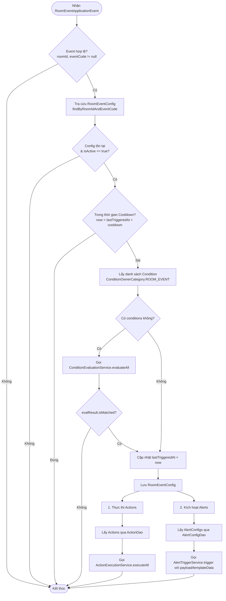

# Hoàn Thiện Room Event Handler

## Mục tiêu
Hiện thực hóa module **`RoomEventHandler`** (Bộ xử lý sự kiện phòng dựa trên cấu hình tự động hóa, điều kiện, hành động và cảnh báo).

> [!IMPORTANT]
> **Tài liệu tham chiếu cốt lõi:** Chi tiết toàn bộ luồng nghiệp vụ tổng quan từ thiết bị cảm biến đến gửi thông báo được mô tả chi tiết tại [Tài liệu Luồng Nghiệp vụ Hệ thống (flow.md)](./flow.md). Đăng cần đọc kỹ tài liệu này để nắm rõ bối cảnh hệ thống.

---

## 1. Bối cảnh & Mục tiêu

Hệ thống IoT tiếp nhận các sự kiện telemetry từ cảm biến (VD: chuyển động `MOTION_DETECTED`). Chi tiết quy trình xử lý 3 giai đoạn đã được định nghĩa trong [flow.md](./flow.md):
- **Giai đoạn 1 (Đồng bộ)**: Nhận & định tuyến sự kiện cảm biến → cập nhật metric → commit transaction và phát sự kiện.
- **Giai đoạn 2 (Bất đồng bộ - Trọng tâm tài liệu này)**: Xử lý sự kiện phòng qua `RoomEventHandler`.
- **Giai đoạn 3 (Bất đồng bộ)**: Gửi thông báo (FCM) sau khi cảnh báo được kích hoạt.

Nhiệm vụ của Đăng là xây dựng **`RoomEventHandler`** để:
1. Lắng nghe bất đồng bộ sau commit (`@Async` + `@TransactionalEventListener(phase = AFTER_COMMIT)`).
2. Tra cứu cấu hình `RoomEventConfig` tương ứng với `roomId` và `eventCode`.
3. Kiểm tra tính hợp lệ của cấu hình (`isActive`, `cooldownSeconds`, `lastTriggeredAt`).
4. **Đánh giá điều kiện (Conditions)**: Nếu có cấu hình điều kiện, chỉ thực thi tiếp khi thỏa mãn.
5. **Thực thi hành động (Actions)**: Gọi điều khiển các thiết bị liên quan.
6. **Kích hoạt cảnh báo (Alerts)**: Kích hoạt alert và bắn thông báo (FCM) theo cấu hình.

---

## 2. Bản đồ các Service

> [!IMPORTANT]
> **Đăng KHÔNG tự viết lại logic đánh giá điều kiện, thực thi điều khiển thiết bị hay kích hoạt cảnh báo.**
> Hệ thống đã có sẵn các Core Strategy Service và DAO chuyên trách. Đăng chỉ cần tích hợp và gọi đúng contract.

| Thành phần | Class / Interface có sẵn | Trách nhiệm & Cách Dev sử dụng |
| :--- | :--- | :--- |
| **Đánh giá Điều kiện** | `ConditionEvaluationService` `ConditionDao` | - Inject `ConditionDao` để query: `conditionDao.findByOwner(ConditionOwnerCategory.ROOM_EVENT, String.valueOf(configId))` - Inject `ConditionEvaluationService` và gọi: `conditionEvaluationService.evaluateAll(conditions, contextId)` - Kiểm tra `evalResult.isMatched()`. Nếu `false` thì dừng flow. |
| **Thực thi Hành động** | `ActionExecutionService` `ActionDao` | - Inject `ActionDao` để query: `actionDao.findByOwner(ActionOwnerCategory.ROOM_EVENT, String.valueOf(configId))` - Inject `ActionExecutionService` và gọi: `actionExecutionService.executeAll(actions)` *(service này đã tự lo việc chạy song song, dispatch theo Device Type/Strategy, trả về `List<ActionResult>`)*. |
| **Kích hoạt Cảnh báo** | `AlertTriggerService` `AlertConfigDao` | - Inject `AlertConfigDao` để query: `alertConfigDao.findAllByNamespaceAndSourceId(AlertNamespace.ROOM_EVENT, String.valueOf(configId))` - Inject `AlertTriggerService` và gọi `alertTriggerService.trigger(AlertTriggerRequestDto)` *(service này tự lo cooldown cảnh báo, sinh incident, ghi log và phát `AlertNotificationEvent` để bắn FCM)*. |
| **Tra cứu Cấu hình** | `RoomEventConfigDao` | - Query: `roomEventConfigDao.findByRoomIdAndEventCode(roomId, eventCode)` - Cập nhật `config.setLastTriggeredAt(Instant.now())` sau khi pass điều kiện/cooldown. |

---

## 3. Kiến trúc Luồng Xử lý (Flow Step-by-Step)

---

## 4. Chi tiết Nghiệp vụ & Dữ liệu Cần Xử lý

### Bước 1: Lắng nghe Event
- Annotation: `@Async` + `@TransactionalEventListener(phase = TransactionPhase.AFTER_COMMIT)`.
- Input: `RoomEventApplicationEvent event`.
- Guard Clause: Bỏ qua nếu `event == null`, `event.getRoomId() == null`, hoặc `event.getEventCode() == null`.

### Bước 2: Kiểm tra Cấu hình & Cooldown
- Tra cứu: `RoomEventConfig config = roomEventConfigDao.findByRoomIdAndEventCode(roomId, eventCode)`.
- Bỏ qua nếu:
  - `config == null` hoặc `Boolean.FALSE.equals(config.getIsActive())`.
  - `cooldownSeconds > 0` và `lastTriggeredAt != null` và `Instant.now().isBefore(lastTriggeredAt.plusSeconds(cooldownSeconds))`.

### Bước 3: Đánh giá Điều kiện (Conditions)
- Bổ sung `ROOM_EVENT` vào `ConditionOwnerCategory` (nếu chưa có).
- Lấy conditions: `conditionDao.findByOwner(ConditionOwnerCategory.ROOM_EVENT, String.valueOf(config.getId()))`.
- Nếu có conditions:
  - Gọi `EvaluationResult evalResult = conditionEvaluationService.evaluateAll(conditions, config.getRoom().getId())`.
  - Nếu `!evalResult.isMatched()`, kết thúc xử lý.

### Bước 4: Cập nhật Thời điểm Kích hoạt
- `config.setLastTriggeredAt(Instant.now())`
- `roomEventConfigDao.save(config)`

### Bước 5: Thực thi Hành động (Actions)
- Lấy danh sách actions: `actionDao.findByOwner(ActionOwnerCategory.ROOM_EVENT, String.valueOf(config.getId()))`.
- Nếu danh sách không rỗng:
  - Gọi `actionExecutionService.executeAll(actions)`.

### Bước 6: Kích hoạt Cảnh báo (Alerts)
- Lấy danh sách config cảnh báo: `alertConfigDao.findAllByNamespaceAndSourceId(AlertNamespace.ROOM_EVENT, String.valueOf(config.getId()))`.
- Với mỗi `AlertConfig`, chuẩn bị `AlertTriggerRequestDto`:
  - `alertConfig`: entity tìm được
  - `alertConfigId`: `config.getId()`
  - `actionType`: `AlertActionType.TRIGGERED`
  - `actorType`: `AlertActorType.ROOM_EVENT`
  - `actorId`: `event.getRoomId().toString()`
  - `templateData`: Map chứa `room_id`, `event_code`, `timestamp`, ...
  - `payload`: `event.getPayload()`
- Gọi `alertTriggerService.trigger(request)`.

---

## 5. Checklist Thực hiện cho Đăng (Implementation Steps)

- [ ] **Check 1**: Kiểm tra enum `ConditionOwnerCategory` đã có giá trị `ROOM_EVENT` chưa (nếu chưa thì bổ sung).
- [ ] **Check 2**: Khai báo các Dependencies cần inject vào `RoomEventHandler`:
  - `RoomEventConfigDao`
  - `ConditionDao`
  - `ConditionEvaluationService`
  - `ActionDao`
  - `ActionExecutionService`
  - `AlertConfigDao`
  - `AlertTriggerService`
- [ ] **Check 3**: Cài đặt method `handleRoomEvent(RoomEventApplicationEvent event)` theo flow chuẩn.
- [ ] **Check 4**: Viết Unit Test / Mock Test cho `RoomEventHandler`:
  - Test case: Event null / config không tồn tại / isActive = false → Không làm gì.
  - Test case: Config trong thời gian cooldown → Không kích hoạt action/alert.
  - Test case: Điều kiện không thỏa mãn (`evalResult.isMatched() == false`) → Không kích hoạt.
  - Test case: Điều kiện thỏa mãn / không có điều kiện → Thực thi action, kích hoạt alert, cập nhật `lastTriggeredAt`.
