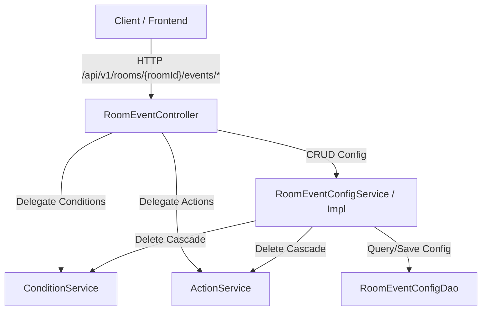

# CRUD Room Event Config & Tích Hợp Condition / Action

## Mục tiêu
Hiện thực hóa tầng **Service** (`RoomEventConfigService`) và **Controller** (`RoomEventController`) để quản lý cấu hình sự kiện phòng (`RoomEventConfig`), đồng thời tích hợp các API sub-resource cho **Conditions** và **Actions**.

> [!IMPORTANT]
> **Tài liệu tham chiếu cốt lõi:**
> - Chi tiết luồng xử lý sự kiện bất đồng bộ liên quan: [Tài liệu TASK 1 - Room Event Handler](./TASK1.md).
> - Mô hình chuẩn tích hợp Sub-resource (Condition / Action): Tham khảo trực tiếp từ `RuleController`, `ConditionController`, `ActionController`.

---

## 1. Bối cảnh & Mục tiêu

Mặc định, một phòng (`Room`) không có bất kỳ cấu hình sự kiện nào (`RoomEventConfig`). Khi người dùng muốn thiết lập tự động hóa hoặc cảnh báo cho phòng (ví dụ: phát hiện chuyển động thì bật đèn hoặc gửi cảnh báo), người dùng sẽ tạo một `RoomEventConfig`.

Nhiệm vụ của Đăng là xây dựng tầng API & Service để:
1. Cung cấp API base: `/api/v1/rooms/{roomId}/events`.
2. Hỗ trợ CRUD cấu hình sự kiện phòng (`RoomEventConfig`).
3. Kiểm tra tính toàn vẹn: Mỗi phòng chỉ có tối đa một cấu hình cho mỗi loại mã sự kiện (`RoomEventCode`).
4. Cung cấp các Sub-resource endpoints để thêm/sửa/xem danh sách **Conditions** và **Actions** gắn với `RoomEventConfig`.
5. **Xử lý xóa Cascade**: Khi xóa `RoomEventConfig`, tự động xóa sạch các Condition và Action liên quan.

---

## 2. Bản đồ các Service

> [!IMPORTANT]
> **Đăng KHÔNG tự viết lại logic quản lý Condition hay Action.**
> Hệ thống đã có sẵn `ConditionService` và `ActionService`. Đăng chỉ cần gọi ủy quyền (delegate) với đúng `ownerCategory` và `ownerId`.

| Thành phần | Class / Interface có sẵn | Trách nhiệm & Cách Đăng sử dụng |
| :--- | :--- | :--- |
| **Quản lý Điều kiện** | `ConditionService`<br/>`ConditionDao` | - Inject `ConditionService`.<br/>- Gọi `conditionService.findByOwner(ConditionOwnerCategory.ROOM_EVENT, configId)` để lấy danh sách.<br/>- Gọi `conditionService.create(...)` và `conditionService.replaceByOwner(...)` để thêm/sửa conditions.<br/>- Gọi `conditionService.deleteByOwner(ConditionOwnerCategory.ROOM_EVENT, String.valueOf(configId))` khi xóa config. |
| **Quản lý Hành động** | `ActionService`<br/>`ActionDao` | - Inject `ActionService`.<br/>- Gọi `actionService.findByOwner(ActionOwnerCategory.ROOM_EVENT, configId)` để lấy danh sách.<br/>- Gọi `actionService.create(...)` và `actionService.replaceByOwner(...)` để thêm/sửa actions.<br/>- Gọi `actionService.deleteByOwner(ActionOwnerCategory.ROOM_EVENT, String.valueOf(configId))` khi xóa config. |
| **Quản lý Cấu hình** | `RoomEventConfigDao`<br/>`RoomDao`<br/>`RoomEventDao` | - Inject vào `RoomEventConfigServiceImpl` để validate sự tồn tại của `Room`, `RoomEvent`, và thực hiện CRUD trên bảng `room_event_config`. |

### Quy ước Định danh Owner
- **`ConditionOwnerCategory`**: `ConditionOwnerCategory.ROOM_EVENT`
- **`ActionOwnerCategory`**: `ActionOwnerCategory.ROOM_EVENT`
- **`ownerId`**: Luôn là chuỗi String biểu diễn `configId` (ID của bản ghi `RoomEventConfig`), ví dụ: `String.valueOf(configId)`.

---

## 3. Kiến trúc Tích hợp (Sub-Resource Pattern)



---

## 4. Đặc tả API Endpoints

**Base Path**: `/api/v1/rooms/{roomId}/events`  
**Security / Phân quyền**: `@PreAuthorize("hasAnyAuthority('F_MANAGE_ALL', 'F_MANAGE_ROOM')")` cho toàn bộ các API.

### 4.1. Quản lý Cấu hình Sự kiện (Room Event Config)

| Method | Endpoint | Mô tả | Request Body | Response Body |
| :--- | :--- | :--- | :--- | :--- |
| **POST** | `/api/v1/rooms/{roomId}/events` | Tạo mới cấu hình sự kiện cho phòng | `CreateRoomEventConfigDto` | `ApiResponse<RoomEventConfigDto>` (201 Created) |
| **GET** | `/api/v1/rooms/{roomId}/events` | Lấy danh sách toàn bộ event configs của phòng | Không | `ApiResponse<List<RoomEventConfigDto>>` (200 OK) |
| **GET** | `/api/v1/rooms/{roomId}/events/{configId}` | Lấy chi tiết một cấu hình sự kiện | Không | `ApiResponse<RoomEventConfigDto>` (200 OK) |
| **PUT** | `/api/v1/rooms/{roomId}/events/{configId}` | Cập nhật cấu hình sự kiện (chỉ cho phép sửa `isActive`, `cooldownSeconds`) | `UpdateRoomEventConfigDto` | `ApiResponse<RoomEventConfigDto>` (200 OK) |
| **DELETE** | `/api/v1/rooms/{roomId}/events/{configId}` | Xóa cấu hình sự kiện (**xóa sạch Condition & Action liên quan**) | Không | `ApiResponse<Void>` (204 No Content) |

### 4.2. Quản lý Điều kiện (Conditions Sub-Resource)

| Method | Endpoint | Mô tả | Request Body | Response Body |
| :--- | :--- | :--- | :--- | :--- |
| **GET** | `/api/v1/rooms/{roomId}/events/{configId}/conditions` | Lấy danh sách conditions của config | Không | `ApiResponse<List<ConditionDto>>` |
| **POST** | `/api/v1/rooms/{roomId}/events/{configId}/conditions` | Thêm 1 condition vào config | `CreateConditionDto` | `ApiResponse<ConditionDto>` (201 Created) |
| **PUT** | `/api/v1/rooms/{roomId}/events/{configId}/conditions` | Thay thế toàn bộ conditions của config | `List<ReplaceConditionDto>` | `ApiResponse<List<ConditionDto>>` |

### 4.3. Quản lý Hành động (Actions Sub-Resource)

| Method | Endpoint | Mô tả | Request Body | Response Body |
| :--- | :--- | :--- | :--- | :--- |
| **GET** | `/api/v1/rooms/{roomId}/events/{configId}/actions` | Lấy danh sách actions của config | Không | `ApiResponse<List<ActionDto>>` |
| **POST** | `/api/v1/rooms/{roomId}/events/{configId}/actions` | Thêm 1 action vào config | `CreateActionDto` | `ApiResponse<ActionDto>` (201 Created) |
| **PUT** | `/api/v1/rooms/{roomId}/events/{configId}/actions` | Thay thế toàn bộ actions của config | `List<ReplaceActionDto>` | `ApiResponse<List<ActionDto>>` |

---

## 5. Chi tiết DTO & Contract Nghiệp vụ

### 5.1. `CreateRoomEventConfigDto`
```java
package com.iviet.ivshs.dto;

import com.iviet.ivshs.shared.enumeration.RoomEventCode;
import jakarta.validation.constraints.Min;
import jakarta.validation.constraints.NotNull;
import lombok.Builder;

@Builder
public record CreateRoomEventConfigDto(
    @NotNull(message = "Event code cannot be null")
    RoomEventCode eventCode,

    Boolean isActive,

    @Min(value = 0, message = "Cooldown seconds must be greater than or equal to 0")
    Integer cooldownSeconds
) {}
```

### 5.2. `UpdateRoomEventConfigDto`
> [!IMPORTANT]
> Sử dụng HTTP **PUT**. Tuyệt đối không cho phép đổi `eventCode` hoặc `roomId` qua API update. Nếu trường nào `null` thì giữ nguyên giá trị cũ, nếu khác `null` thì override.

```java
package com.iviet.ivshs.dto;

import jakarta.validation.constraints.Min;
import lombok.Builder;

@Builder
public record UpdateRoomEventConfigDto(
    Boolean isActive,

    @Min(value = 0, message = "Cooldown seconds must be greater than or equal to 0")
    Integer cooldownSeconds
) {}
```

### 5.3. `RoomEventConfigDto`
```java
package com.iviet.ivshs.dto;

import com.iviet.ivshs.entities.RoomEventConfig;
import com.iviet.ivshs.shared.enumeration.RoomEventCode;
import java.time.Instant;
import lombok.Builder;

@Builder
public record RoomEventConfigDto(
    Long id,
    Long roomId,
    String roomName,
    Long roomEventId,
    RoomEventCode eventCode,
    String eventDescription,
    Boolean isActive,
    Integer cooldownSeconds,
    Instant lastTriggeredAt,
    Instant createdAt,
    Instant updatedAt
) {
    public static RoomEventConfigDto fromEntity(RoomEventConfig entity) {
        if (entity == null) return null;
        return RoomEventConfigDto.builder()
            .id(entity.getId())
            .roomId(entity.getRoom() != null ? entity.getRoom().getId() : null)
            .roomName(entity.getRoom() != null ? entity.getRoom().getName() : null)
            .roomEventId(entity.getRoomEvent() != null ? entity.getRoomEvent().getId() : null)
            .eventCode(entity.getRoomEvent() != null ? entity.getRoomEvent().getCode() : null)
            .eventDescription(entity.getRoomEvent() != null ? entity.getRoomEvent().getDescription() : null)
            .isActive(entity.getIsActive())
            .cooldownSeconds(entity.getCooldownSeconds())
            .lastTriggeredAt(entity.getLastTriggeredAt())
            .createdAt(entity.getCreatedAt())
            .updatedAt(entity.getUpdatedAt())
            .build();
    }
}
```

### 5.4. Interface `RoomEventConfigService`
```java
package com.iviet.ivshs.service;

import com.iviet.ivshs.dto.CreateRoomEventConfigDto;
import com.iviet.ivshs.dto.RoomEventConfigDto;
import com.iviet.ivshs.dto.UpdateRoomEventConfigDto;
import java.util.List;

public interface RoomEventConfigService {
    RoomEventConfigDto create(Long roomId, CreateRoomEventConfigDto dto);
    RoomEventConfigDto update(Long roomId, Long configId, UpdateRoomEventConfigDto dto);
    void delete(Long roomId, Long configId);
    RoomEventConfigDto getById(Long roomId, Long configId);
    List<RoomEventConfigDto> getAllByRoomId(Long roomId);
}
```

---

## 6. Template Controller Mẫu (`RoomEventController`)

```java
package com.iviet.ivshs.controller.api.v1;

import com.iviet.ivshs.dto.*;
import com.iviet.ivshs.service.ActionService;
import com.iviet.ivshs.service.ConditionService;
import com.iviet.ivshs.service.RoomEventConfigService;
import com.iviet.ivshs.shared.enumeration.ActionOwnerCategory;
import com.iviet.ivshs.shared.enumeration.ConditionOwnerCategory;
import jakarta.validation.Valid;
import java.util.List;
import lombok.RequiredArgsConstructor;
import org.springframework.http.HttpStatus;
import org.springframework.http.ResponseEntity;
import org.springframework.security.access.prepost.PreAuthorize;
import org.springframework.web.bind.annotation.*;

@RestController
@RequiredArgsConstructor
@RequestMapping("/api/v1/rooms/{roomId}/events")
public class RoomEventController {

  private final RoomEventConfigService roomEventConfigService;
  private final ConditionService conditionService;
  private final ActionService actionService;

  // --- CRUD Config ---

  @PostMapping
  @PreAuthorize("hasAnyAuthority('F_MANAGE_ALL', 'F_MANAGE_ROOM')")
  public ResponseEntity<ApiResponse<RoomEventConfigDto>> create(
      @PathVariable(name = "roomId") Long roomId,
      @RequestBody @Valid CreateRoomEventConfigDto request) {
    return ResponseEntity.status(HttpStatus.CREATED)
        .body(ApiResponse.created(roomEventConfigService.create(roomId, request)));
  }

  @GetMapping
  @PreAuthorize("hasAnyAuthority('F_MANAGE_ALL', 'F_MANAGE_ROOM')")
  public ResponseEntity<ApiResponse<List<RoomEventConfigDto>>> getAll(
      @PathVariable(name = "roomId") Long roomId) {
    return ResponseEntity.ok(ApiResponse.ok(roomEventConfigService.getAllByRoomId(roomId)));
  }

  @GetMapping("/{configId}")
  @PreAuthorize("hasAnyAuthority('F_MANAGE_ALL', 'F_MANAGE_ROOM')")
  public ResponseEntity<ApiResponse<RoomEventConfigDto>> getById(
      @PathVariable(name = "roomId") Long roomId,
      @PathVariable(name = "configId") Long configId) {
    return ResponseEntity.ok(ApiResponse.ok(roomEventConfigService.getById(roomId, configId)));
  }

  @PutMapping("/{configId}")
  @PreAuthorize("hasAnyAuthority('F_MANAGE_ALL', 'F_MANAGE_ROOM')")
  public ResponseEntity<ApiResponse<RoomEventConfigDto>> update(
      @PathVariable(name = "roomId") Long roomId,
      @PathVariable(name = "configId") Long configId,
      @RequestBody @Valid UpdateRoomEventConfigDto request) {
    return ResponseEntity.ok(ApiResponse.ok(roomEventConfigService.update(roomId, configId, request)));
  }

  @DeleteMapping("/{configId}")
  @PreAuthorize("hasAnyAuthority('F_MANAGE_ALL', 'F_MANAGE_ROOM')")
  public ResponseEntity<ApiResponse<Void>> delete(
      @PathVariable(name = "roomId") Long roomId,
      @PathVariable(name = "configId") Long configId) {
    roomEventConfigService.delete(roomId, configId);
    return ResponseEntity.status(HttpStatus.NO_CONTENT)
        .body(ApiResponse.success(HttpStatus.NO_CONTENT, null, "Room event config deleted successfully"));
  }

  // --- Condition Helpers ---

  @GetMapping("/{configId}/conditions")
  @PreAuthorize("hasAnyAuthority('F_MANAGE_ALL', 'F_MANAGE_ROOM')")
  public ResponseEntity<ApiResponse<List<ConditionDto>>> getConditions(
      @PathVariable(name = "roomId") Long roomId,
      @PathVariable(name = "configId") Long configId) {
    roomEventConfigService.getById(roomId, configId);
    return ResponseEntity.ok(
        ApiResponse.ok(conditionService.findByOwner(ConditionOwnerCategory.ROOM_EVENT, configId)));
  }

  @PostMapping("/{configId}/conditions")
  @PreAuthorize("hasAnyAuthority('F_MANAGE_ALL', 'F_MANAGE_ROOM')")
  public ResponseEntity<ApiResponse<ConditionDto>> addCondition(
      @PathVariable(name = "roomId") Long roomId,
      @PathVariable(name = "configId") Long configId,
      @RequestBody @Valid CreateConditionDto request) {
    roomEventConfigService.getById(roomId, configId);
    CreateConditionDto scopedDto = CreateConditionDto.builder()
        .ownerCategory(ConditionOwnerCategory.ROOM_EVENT)
        .ownerId(String.valueOf(configId))
        .sourceCategory(request.sourceCategory())
        .sourceTargetId(request.sourceTargetId())
        .sourceTargetType(request.sourceTargetType())
        .property(request.property())
        .operator(request.operator())
        .value(request.value())
        .extraParams(request.extraParams())
        .sortOrder(request.sortOrder())
        .nextLogic(request.nextLogic())
        .build();
    return ResponseEntity.status(HttpStatus.CREATED)
        .body(ApiResponse.created(conditionService.create(scopedDto)));
  }

  @PutMapping("/{configId}/conditions")
  @PreAuthorize("hasAnyAuthority('F_MANAGE_ALL', 'F_MANAGE_ROOM')")
  public ResponseEntity<ApiResponse<List<ConditionDto>>> replaceConditions(
      @PathVariable(name = "roomId") Long roomId,
      @PathVariable(name = "configId") Long configId,
      @RequestBody @Valid List<ReplaceConditionDto> request) {
    roomEventConfigService.getById(roomId, configId);
    return ResponseEntity.ok(
        ApiResponse.ok(conditionService.replaceByOwner(ConditionOwnerCategory.ROOM_EVENT, configId, request)));
  }

  // --- Action Helpers ---

  @GetMapping("/{configId}/actions")
  @PreAuthorize("hasAnyAuthority('F_MANAGE_ALL', 'F_MANAGE_ROOM')")
  public ResponseEntity<ApiResponse<List<ActionDto>>> getActions(
      @PathVariable(name = "roomId") Long roomId,
      @PathVariable(name = "configId") Long configId) {
    roomEventConfigService.getById(roomId, configId);
    return ResponseEntity.ok(
        ApiResponse.ok(actionService.findByOwner(ActionOwnerCategory.ROOM_EVENT, configId)));
  }

  @PostMapping("/{configId}/actions")
  @PreAuthorize("hasAnyAuthority('F_MANAGE_ALL', 'F_MANAGE_ROOM')")
  public ResponseEntity<ApiResponse<ActionDto>> addAction(
      @PathVariable(name = "roomId") Long roomId,
      @PathVariable(name = "configId") Long configId,
      @RequestBody @Valid CreateActionDto request) {
    roomEventConfigService.getById(roomId, configId);
    CreateActionDto scopedDto = CreateActionDto.builder()
        .ownerCategory(ActionOwnerCategory.ROOM_EVENT)
        .ownerId(String.valueOf(configId))
        .targetCategory(request.targetCategory())
        .targetId(request.targetId())
        .params(request.params())
        .executionOrder(request.executionOrder())
        .build();
    return ResponseEntity.status(HttpStatus.CREATED)
        .body(ApiResponse.created(actionService.create(scopedDto)));
  }

  @PutMapping("/{configId}/actions")
  @PreAuthorize("hasAnyAuthority('F_MANAGE_ALL', 'F_MANAGE_ROOM')")
  public ResponseEntity<ApiResponse<List<ActionDto>>> replaceActions(
      @PathVariable(name = "roomId") Long roomId,
      @PathVariable(name = "configId") Long configId,
      @RequestBody @Valid List<ReplaceActionDto> request) {
    roomEventConfigService.getById(roomId, configId);
    return ResponseEntity.ok(
        ApiResponse.ok(actionService.replaceByOwner(ActionOwnerCategory.ROOM_EVENT, configId, request)));
  }
}
```

---

## 7. Checklist Thực hiện cho Đăng (Implementation Steps)

- [ ] **Check 1: DTO Creation**
  - [ ] `CreateRoomEventConfigDto.java`
  - [ ] `UpdateRoomEventConfigDto.java`
  - [ ] `RoomEventConfigDto.java`
- [ ] **Check 2: Service Layer**
  - [ ] Tạo interface `RoomEventConfigService.java`
  - [ ] Cài đặt `RoomEventConfigServiceImpl.java` với các validate:
    - Kiểm tra `Room` tồn tại qua `RoomDao`.
    - Kiểm tra `RoomEvent` tồn tại qua `RoomEventDao.findByCode(...)`.
    - Kiểm tra chống trùng cặp `(roomId, eventCode)` qua `roomEventConfigDao.findByRoomIdAndEventCode(...)`.
    - Đảm bảo hàm `delete()` gọi cascade `conditionService.deleteByOwner` và `actionService.deleteByOwner`.
- [ ] **Check 3: Controller Layer**
  - [ ] Tạo `RoomEventController.java` tại package `com.iviet.ivshs.controller.api.v1`.
  - [ ] Cấu hình Route base `/api/v1/rooms/{roomId}/events` và security `@PreAuthorize("hasAnyAuthority('F_MANAGE_ALL', 'F_MANAGE_ROOM')")`.
- [ ] **Check 4: Viết Unit Test / Mock Test**
  - [ ] Unit Test `RoomEventConfigServiceImpl`: Test Create (Thành công & Trùng lặp), Update (PUT override), Delete (Verify gọi xóa cascade condition & action).
  - [ ] Controller Test / MockMvc: Test toàn bộ CRUD và các sub-resource endpoints (Conditions & Actions).
