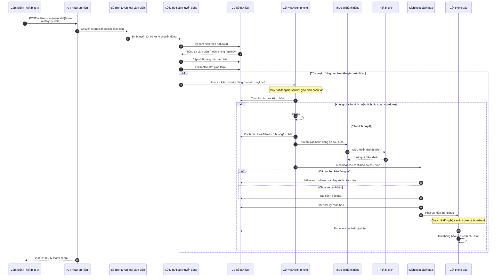

## Tổng quan luồng

1. **Nhận & định tuyến sự kiện**: `POST` event → định tuyến theo category qua [Event Telemetry Strategy](../../src/main/java/com/iviet/ivshs/service/registry/EventTelemetryStrategyRegistry.java) → validate + cập nhật sensor → ghi metric [Motion Detect Metric Service](../../src/main/java/com/iviet/ivshs/service/impl/MotionMetricServiceImpl.java).
2. **Phát sự kiện nội bộ**: Publish `RoomMotionDetectedEvent` *(trong transaction)*.
3. **Kiểm tra cấu hình phòng**: Sau `COMMIT` → tìm config (`roomId` + `eventCode`) → kiểm tra `active` / `cooldown`. __ TODO
4. **Thực thi hành động**: Đánh dấu `lastTriggeredAt` → thực thi actions *(điều khiển thiết bị song song)*. __ TODO
5. **Kích hoạt cảnh báo**: Kích hoạt alerts → publish `AlertNotificationEvent`. __ TODO
6. **Gửi thông báo**: Sau `COMMIT` → gửi FCM notification tới các thiết bị nhận. __ TODO

## Sequence diagram

## Flow chi tiết (nghiệp vụ, input → output)

**Giai đoạn 1 — Nhận & xử lý sự kiện cảm biến (đồng bộ, trong 1 transaction)**

| # | Bước | Input | Output |
|---|---|---|---|
| 1 | Nhận sự kiện từ cảm biến | `naturalId` (mã cảm biến), body `{category, data}` | Request hợp lệ, nếu thiếu category/data → lỗi 400 |
| 2 | Định tuyến theo loại cảm biến | `category` | Tìm được bộ xử lý tương ứng; loại không hỗ trợ → lỗi |
| 3 | Kiểm tra dữ liệu payload | `data` (JSON) | Trường `motion_detected` phải là boolean, sai format → lỗi |
| 4 | Tìm cảm biến | `naturalId` | Thông tin cảm biến; không tồn tại → lỗi 404 |
| 5 | Cập nhật trạng thái cảm biến | Trạng thái chuyển động mới, thời điểm | Cảm biến đã lưu (currentMotion, lastEventAt) |
| 6 | Ghi metric thời gian thực | Id cảm biến, trạng thái, thời điểm | Bản ghi `MotionMetric` |
| 7 | Phát sự kiện phòng | `roomId`, `naturalId`, payload, timestamp | Sự kiện chuyển động được phát **chỉ khi** có chuyển động **và** cảm biến gắn với phòng |

**Giai đoạn 2 — Xử lý sự kiện phòng (bất đồng bộ, sau COMMIT)**

| # | Bước | Input | Output |
|---|---|---|---|
| 8 | Tìm cấu hình sự kiện | `roomId` + mã sự kiện (MOTION_DETECTED) | Cấu hình sự kiện phòng; không có → dừng |
| 9 | Kiểm tra trạng thái & cooldown | `isActive`, `cooldownSeconds`, `lastTriggeredAt` | Quyết định xử lý tiếp hoặc bỏ qua |
| 10 | Đánh dấu đã kích hoạt | Cấu hình sự kiện | `lastTriggeredAt` = thời điểm hiện tại |
| 11 | Thực thi các hành động | Id cấu hình sự kiện | Danh sách hành động, sắp xếp theo thứ tự, chạy song song → điều khiển thiết bị đích, trả về kết quả từng hành động |
| 12 | Kích hoạt các cảnh báo | Id cấu hình sự kiện + dữ liệu sự kiện (room, eventCode, timestamp, payload) | Cảnh báo mới (hoặc tăng số lần kích hoạt nếu đang mở, sau khi qua cooldown), ghi nhật ký incident |

**Giai đoạn 3 — Gửi thông báo (bất đồng bộ, sau COMMIT)**

| # | Bước | Input | Output |
|---|---|---|---|
| 13 | Tìm người nhận | Id cảnh báo | Nhóm nhận → các thiết bị (client) thuộc nhóm |
| 14 | Gửi thông báo | Thiết bị nhận, kênh cấu hình, tiêu đề/nội dung, dữ liệu FCM | Thông báo FCM đến các thiết bị (kèm deepLink tới màn hình chi tiết alert) |

**Điểm cần lưu ý:** Controller trả `200 OK` ngay sau khi transaction của giai đoạn 1 commit, **không chờ** giai đoạn 2-3 — các listener dùng `@Async` + `@TransactionalEventListener