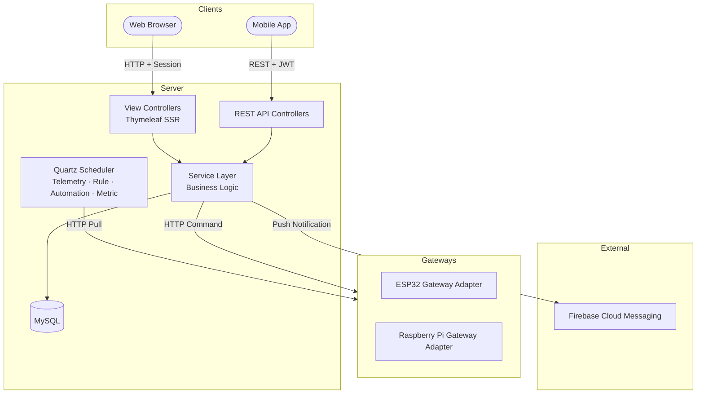
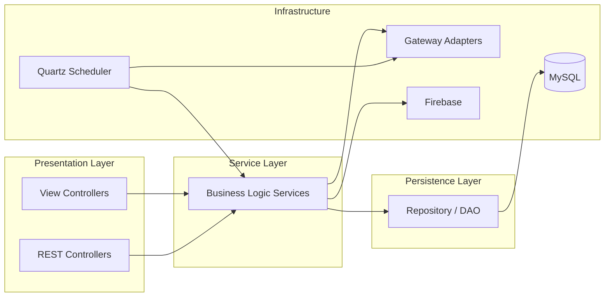
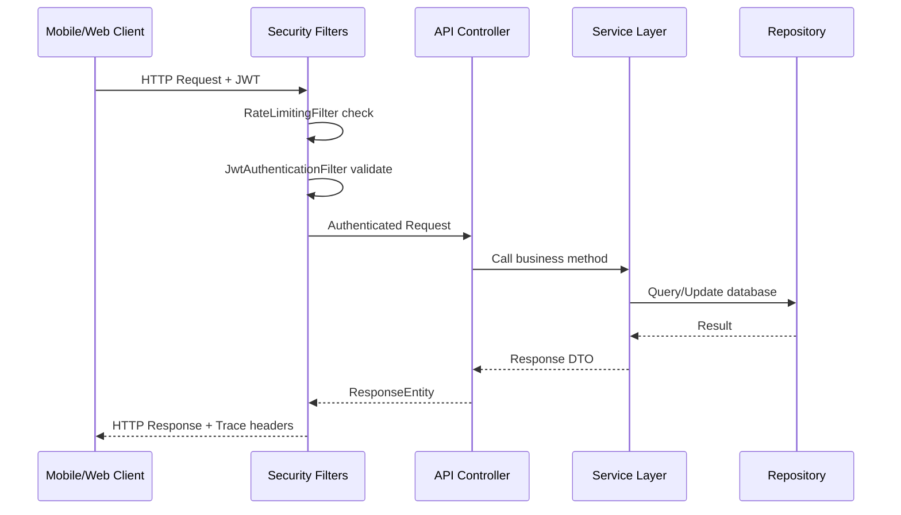
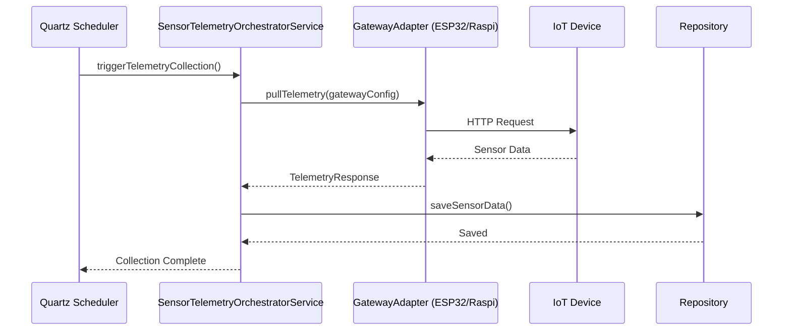
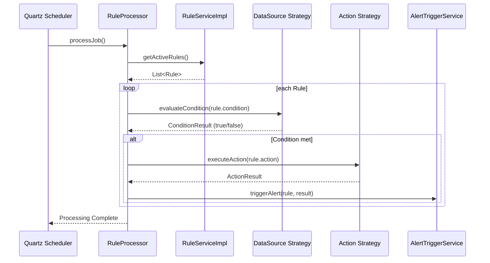
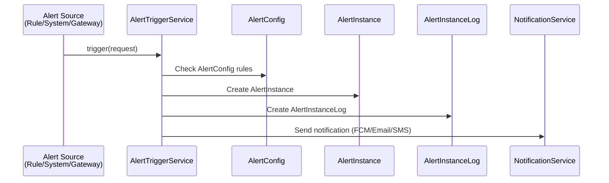
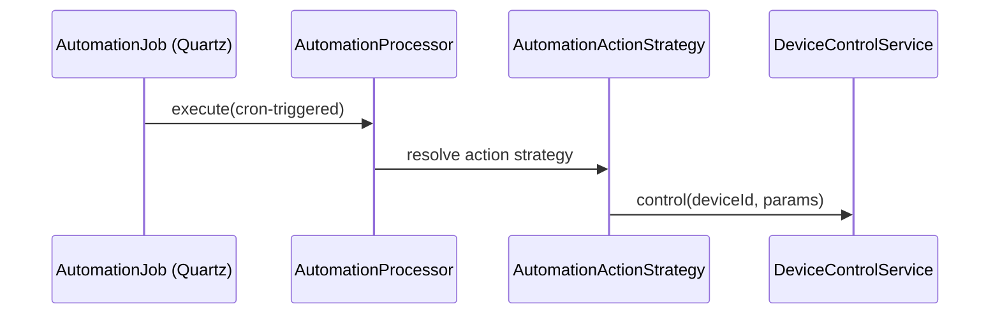

# README.md & SYSTEM.md Rewrite Implementation Plan

> **For agentic workers:** REQUIRED SUB-SKILL: Use superpowers:subagent-driven-development (recommended) or superpowers:executing-plans to implement this plan task-by-task. Steps use checkbox (`- [ ]`) syntax for tracking.

**Goal:** Rewrite `README.md` and `SYSTEM.md` from scratch, archiving the existing versions as `*.deprecated.md`.

**Architecture:** Two-phase approach — Phase 1 archives old docs via `git mv` + commit; Phase 2 writes new content for both files and commits them.

**Tech Stack:** Git, Markdown, Mermaid diagrams, mermaid-cli (for diagram preview), git-lint (Markdown linting).

**Plan location:** `docs/superpowers/plans/2026-07-09-docs-update-plan.md`

## Global Constraints

- All git operations must use `git mv` for renames (never `mv` + `git add`).
- Commit messages must follow Conventional Commits format (`feat`, `docs`, `chore`).
- New files must be valid Markdown with no HTML rendering errors.
- All Mermaid diagrams must be syntactically valid per mermaid-cli validation.
- No emojis in file content unless the design spec explicitly includes them.
- File paths are relative to repo root: `/home/maithehao/Workspace/projects/smart-room-iot/smartroom_server`.

---

### Task 1: Archive existing README.md and SYSTEM.md as deprecated

**Files:**
- Rename: `README.md` → `README.deprecated.md` (via `git mv`)
- Rename: `SYSTEM.md` → `SYSTEM.deprecated.md` (via `git mv`)
- No new file content — this is purely a rename + commit.

**Interfaces:**
- Consumes: Existing `README.md` and `SYSTEM.md` at repo root.
- Produces: `README.deprecated.md` and `SYSTEM.deprecated.md` at repo root, committed.

- [ ] **Step 1: Git mv README.md**

```bash
git mv README.md README.deprecated.md
```

**Expected:** `README.md` no longer tracked; `README.deprecated.md` staged.

- [ ] **Step 2: Git mv SYSTEM.md**

```bash
git mv SYSTEM.md SYSTEM.deprecated.md
```

**Expected:** `SYSTEM.md` no longer tracked; `SYSTEM.deprecated.md` staged.

- [ ] **Step 3: Verify both renames are staged**

```bash
git status --short
```

**Expected output:**
```
R  README.md -> README.deprecated.md
R  SYSTEM.md -> SYSTEM.deprecated.md
```

- [ ] **Step 4: Commit the renames**

```bash
git commit -m "docs: archive existing README.md and SYSTEM.md as deprecated"
```

**Expected:** Commit created with two renamed files. No unstaged changes.

---

### Task 2: Write new `README.md`

**Files:**
- Create: `README.md` (new file at repo root)

**Interfaces:**
- Consumes: Design spec content from `docs/superpowers/specs/2026-07-09-docs-update-design.md`.
- Produces: Fresh `README.md` — the project landing page.

- [ ] **Step 1: Write the header + badges block**

Write the following content at the top of `README.md`:

```markdown
---
<div align="center">
# SMART ROOM IoT SERVER
**Nền tảng Điều phối Quản trị Tòa nhà & Thiết bị IoT Tiên tiến**
[]
[]
[]
[]
---
### "Nền tảng IoT Plug-and-Play Đích thực"
_Tối ưu, Sạch và Được thiết kế để Mở rộng Dễ dàng._
</div>
```

- [ ] **Step 2: Write Section 1 — Project Overview**

Write the following content after the header:

```markdown
## 1. Tổng quan dự án

Smart Room IoT Server là một nền tảng quản trị tòa nhà và thiết bị IoT tiên tiến, được xây dựng trên kiến trúc **Monolith** nhưng vẫn đảm bảo khả năng mở rộng và bảo trì. Hệ thống áp dụng nguyên lý **"Quản lý tập trung — Thực thi phân tán"**, cho phép quản lý tất cả thiết bị từ một máy chủ trung tâm trong khi các gateway phân tán (ESP32, Raspberry Pi) thực thi lệnh điều khiển và thu thập dữ liệu tại hiện trường.

Mô hình phân cấp của hệ thống: **Building → Floor → Room**. Mỗi tòa nhà có thể có nhiều tầng, mỗi tầng có thể có nhiều phòng, và mỗi phòng chứa nhiều thiết bị IoT.
```

- [ ] **Step 3: Write Section 2 — Core Tech Stack**

Write the following content:

```markdown
## 2. Core Tech Stack

| Layer | Technologies |
|:---|:---|
| **Backend Runtime** | Java 21, Spring Framework 6.2.17, Hibernate ORM 6.4.4, Spring Security 6.4.13, Quartz Scheduler 2.5.2 |
| **API & Serialization** | REST API (Jackson 2.18.2), JWT (JJWT 0.11.5), Bucket4j 8.10.1 (Rate Limiting), Apache HttpClient5 5.2.3 |
| **Persistence** | MySQL 8.0, Spring Data JPA 3.5.10, Hibernate Validator 8.0.1, Liquibase-like SQL migrations |
| **Frontend** | Thymeleaf 3.1.3 (Spring6), AdminLTE 4.0.0, Bootstrap 5.3.2, ApexCharts, Tabulator, SweetAlert2 11.2, Lucide Icons, Flatpickr, OverlayScrollbars |
| **Build & Server** | Apache Tomcat 10.1, Maven, Log4j 2.25.4 + SLF4J 2.0.16, Lombok 1.18.30, MapStruct 1.5.5 |
| **Integration** | Firebase Admin SDK 9.9.0 (FCM Push), Caffeine Cache 3.1.8, AspectJ 1.9.21 |
| **Gateway** | ESP32 Gateway Adapter, Raspberry Pi Gateway Adapter |
```

- [ ] **Step 4: Write Section 3 — Architecture Overview (NEW)**

Write the following content:

```markdown
## 3. Kiến trúc tổng quan

Hệ thống được tổ chức theo kiến trúc layered monolith với các thành phần chính như sau:


- **Client Layer:** Mobile App giao tiếp qua REST API với JWT authentication; Web Browser sử dụng HTTP session-based với Thymeleaf SSR.
- **Server Layer:** View Controllers (Thymeleaf), REST API Controllers, Service Layer chứa business logic, Quartz Scheduler chạy các tác vụ định kỳ.
- **Gateway Layer:** Các adapter trừu tượng hóa giao tiếp với ESP32 và Raspberry Pi gateway.
- **External:** Firebase Cloud Messaging cho push notification.
- **Storage:** MySQL database cho persistent data.
```

- [ ] **Step 5: Write Section 4 — Core Capabilities**

Write the following content:

```markdown
## 4. Core Capabilities

### Hạ tầng & Thiết bị
- **Building → Floor → Room hierarchy:** Mô hình phân cấp địa điểm linh hoạt, hỗ trợ nhiều tầng và phòng trong mỗi tòa nhà.
- **Flexible device definition:** Hỗ trợ nhiều loại thiết bị: Đèn (Light), Quạt (Fan), Máy lạnh (Air Condition), Cảm biến (Sensor).
- **Gateway adapter abstraction:** Kiến trúc adapter cho phép tích hợp nhiều loại gateway khác nhau (ESP32, Raspberry Pi) mà không ảnh hưởng đến core business logic.

### Giám sát & Thu thập
- **Quartz-scheduled telemetry collection:** Thu thập dữ liệu telemetry định kỳ từ các gateway thông qua Quartz Scheduler.
- **Real-time dashboard:** Dashboard trực quan với biểu đồ ApexCharts, hiển thị trạng thái thiết bị real-time.
- **Historical data:** Lưu trữ và truy vấn dữ liệu cảm biến lịch sử, theo dõi tiêu thụ năng lượng.

### Điều khiển & Tự động hóa
- **Remote control:** Điều khiển thiết bị từ xa qua REST API, sử dụng Strategy Pattern cho các loại thiết bị khác nhau.
- **Rule Engine:** Công cụ đánh giá điều kiện (condition) và thực thi hành động (action) theo thời gian thực.
- **Automation Engine:** Tác vụ tự động hóa theo lịch trình cron, hỗ trợ các action strategy đa dạng.
- **Energy Metric:** Hệ thống đo lường tiêu thụ năng lượng hàng ngày, bao gồm reset chỉ số định kỳ.

### Alert & Notification
- **Configurable alert thresholds:** Ngưỡng cảnh báo có thể cấu hình với đa kênh thông báo.
- **Multi-channel notifications:** FCM push, Email, SMS — triển khai theo Strategy Pattern.
- **Alert lifecycle:** Quy trình đầy đủ: Config → Trigger → Instance → Log.

### Bảo mật & Phân quyền
- **Authentication:** JWT cho API clients, Session-based authentication cho Web Admin.
- **Authorization:** Mô hình RBAC với Group → Function → Role, kiểm soát chi tiết đến từng API endpoint.
- **Rate limiting:** Sử dụng Bucket4j để giới hạn tần suất request, bảo vệ hệ thống khỏi abuse.
- **Request tracing:** Tracing toàn bộ request cho mục đích debug và audit.
- **CORS:** Cấu hình CORS linh hoạt cho phép tích hợp đa nền tảng.
```

- [ ] **Step 6: Write Section 5 — Tài liệu liên quan**

Write the following content:

```markdown
## 5. Tài liệu liên quan

- **Kiến trúc hệ thống chi tiết:** [`SYSTEM.md`](./SYSTEM.md) — Mô tả toàn bộ kiến trúc backend, frontend, business flows, và database.
- **Hướng dẫn cài đặt & triển khai:** [Setup guideline](./docs/setup.md) (hoặc đường dẫn tương ứng trong dự án).
- **Thiết kế chi tiết:** [`docs/superpowers/specs/`](./docs/superpowers/specs/) — Các design spec cho từng tính năng.
```

- [ ] **Step 7: Verify README.md is well-formed**

```bash
# Check file exists and has content
wc -l README.md
# Check all Markdown headers are balanced
grep -c '^##' README.md
# Validate Mermaid syntax (if mermaid-cli available)
# mmdc -i README.md -o /dev/null 2>&1 || echo "Mermaid validation skipped (CLI not installed)"
```

**Expected:** File has 80+ lines with 5 sections. No broken Markdown.

---

### Task 3: Write new `SYSTEM.md`

**Files:**
- Create: `SYSTEM.md` (new file at repo root)

**Interfaces:**
- Consumes: Design spec content from `docs/superpowers/specs/2026-07-09-docs-update-design.md`.
- Produces: Comprehensive `SYSTEM.md` covering all 5 sections with updated architecture, packages, flows, and entity lists.

- [ ] **Step 1: Write header + Mục lục**

```markdown
# Hệ thống Smart Room IoT Server — Tài liệu Kiến trúc Chi tiết

> Tài liệu này mô tả kiến trúc tổng thể, các thành phần, luồng nghiệp vụ và cơ sở dữ liệu của hệ thống Smart Room IoT Server.

## Mục lục

1. [Tổng quan](#1-t%E1%BB%95ng-quan)
2. [Backend](#2-backend)
    - 2.1 [Công nghệ](#21-c%C3%B4ng-ngh%E1%BB%87)
    - 2.2 [Danh sách package](#22-danh-s%C3%A1ch-package)
    - 2.3 [Core Architecture Flow](#23-core-architecture-flow)
    - 2.4 [System Configuration](#24-system-configuration)
3. [Frontend](#3-frontend)
    - 3.1 [Công nghệ](#31-c%C3%B4ng-ngh%E1%BB%87)
    - 3.2 [SSR + CSR](#32-ssr--csr)
4. [Business Flows](#4-business-flows)
    - 4.1 [Auth & RBAC](#41-auth--rbac)
    - 4.2 [Standard API Flow](#42-standard-api-flow)
    - 4.3 [API vs View](#43-api-vs-view)
    - 4.4 [Telemetry](#44-telemetry)
    - 4.5 [Device Control](#45-device-control)
    - 4.6 [Rule Engine](#46-rule-engine)
    - 4.7 [Alert System](#47-alert-system)
    - 4.8 [Automation](#48-automation)
    - 4.9 [Energy Metric](#49-energy-metric)
    - 4.10 [Gateway Integration](#410-gateway-integration)
5. [Database](#5-database)
    - 5.1 [Entity List](#51-entity-list)
    - 5.2 [Business Grouping](#52-business-grouping)
```

> **Note:** Mục lục dùng anchor links chuẩn Markdown (lowercase, hyphen-separated). Khi render trên GitHub, các anchor được tự động sinh từ header text, tham khảo [GitHub anchor documentation](https://docs.github.com/en/get-started/writing-on-github/getting-started-with-writing-and-formatting-on-github/basic-writing-and-formatting-syntax#section-links).

- [ ] **Step 2: Write Section 1 — Tổng quan**

Write the following content:

```markdown
## 1. Tổng quan

Hệ thống Smart Room IoT Server là nền tảng quản trị tòa nhà và thiết bị IoT theo mô hình **Monolith Architecture** với khả năng mở rộng cao.

### Công nghệ chính

| Technology | Version |
|:---|:---:|
| Java | 21 |
| Spring Framework | 6.2.17 |
| Spring Boot | (none — WAR on Tomcat) |
| Hibernate ORM | 6.4.4 |
| Spring Security | 6.4.13 |
| MySQL | 8.0 |
| Apache Tomcat | 10.1 |
| Thymeleaf | 3.1.3 (Spring6) |
| AdminLTE | 4.0.0 |
| Bootstrap | 5.3.2 |
| ApexCharts | Latest |
| Tabulator | Latest |
| SweetAlert2 | 11.2 |
| Lucide Icons | Latest |
| Flatpickr | Latest |
| OverlayScrollbars | Latest |

### Kiến trúc tổng quan



**Client Layer:** Ứng dụng Mobile (Android/iOS) giao tiếp qua REST API với xác thực JWT. Trình duyệt Web sử dụng giao thức HTTP với session-based authentication và giao diện Thymeleaf SSR.

**Server Layer:** Bao gồm View Controllers (Thymeleaf templates), REST API Controllers (JSON/XML), Service Layer chứa toàn bộ business logic, và Quartz Scheduler quản lý các tác vụ định kỳ (thu thập telemetry, đánh giá rule, chạy automation, tính toán metric).

**Gateway Layer:** Tầng gateway sử dụng adapter pattern, hỗ trợ ESP32 và Raspberry Pi. Server giao tiếp với gateway qua HTTP để gửi lệnh điều khiển và nhận dữ liệu telemetry.

**External:** Firebase Cloud Messaging (FCM) cho push notification đến mobile app.

**Storage:** MySQL 8.0 là cơ sở dữ liệu chính, truy cập qua Spring Data JPA và Hibernate ORM 6.4.4.
```

- [ ] **Step 3: Write Section 2.1 — Công nghệ (Backend)**

```markdown
## 2. Backend

### 2.1 Công nghệ

| Layer | Technologies |
|:---|:---|
| **Backend Runtime** | Java 21, Spring Framework 6.2.17, Hibernate ORM 6.4.4, Spring Security 6.4.13, Quartz Scheduler 2.5.2 |
| **API & Serialization** | REST API (Jackson 2.18.2), JWT (JJWT 0.11.5), Bucket4j 8.10.1 (Rate Limiting), Apache HttpClient5 5.2.3 |
| **Persistence** | MySQL 8.0, Spring Data JPA 3.5.10, Hibernate Validator 8.0.1, Liquibase-like SQL migrations |
| **Build & Server** | Apache Tomcat 10.1, Maven, Log4j 2.25.4 + SLF4J 2.0.16, Lombok 1.18.30, MapStruct 1.5.5 |
| **Integration** | Firebase Admin SDK 9.9.0 (FCM Push), Caffeine Cache 3.1.8, AspectJ 1.9.21 |
| **Gateway** | ESP32 Gateway Adapter, Raspberry Pi Gateway Adapter |
```

- [ ] **Step 4: Write Section 2.2 — Danh sách package**

Write the complete updated package list. Group by logical area:

```markdown
### 2.2 Danh sách package

```

Then write each group in the following order:

**Application:**
```
com.smartroom.server
├── SmartRoomApplication.java
```

**Controller Layer (View — Thymeleaf):**
```
controller/view/
├── admin/         — Admin dashboard controllers
├── building/      — Building management controllers
├── device/        — Device management controllers
├── floor/         — Floor management controllers
├── room/          — Room management controllers
├── auth/          — Login/logout controllers
├── dashboard/     — Dashboard controllers
```

**Controller Layer (API — REST):**
```
controller/api/
├── AuthController.java
├── DeviceApiController.java
├── SensorApiController.java
├── UserApiController.java
├── ... (other API controllers)
```

**Core — Properties:**
```
core/properties/
├── DatabaseProperties.java
├── EngineProperties.java
├── FirebaseProperties.java
├── GatewayProperties.java
├── HttpClientProperties.java
├── JwtProperties.java
├── SecurityProperties.java
├── TokenProperties.java
```

**Core — Component:**
```
core/component/
├── AutowiringSpringBeanJobFactory.java
├── SpringSecurityAuditorAware.java
```

**Core — Config:**
```
core/config/
├── AsyncConfig.java
├── CacheConfig.java
├── CORSConfig.java
├── FirebaseSDKConfig.java
├── GatewayConfig.java
├── JwtConfig.java
├── MailConfig.java
├── QuartzConfig.java
├── RestClientConfig.java
├── SecurityConfig.java
├── WebConfig.java
```

**Integration — Gateway (Adapter Pattern):**
```
integration/gateway/
├── GatewayAdapter.java              (interface)
├── GatewayCommandRequest.java
├── GatewayCommandResponse.java
├── GatewayTelemetryRequest.java
├── GatewayTelemetryResponse.java
├── esp32/
│   ├── Esp32GatewayAdapter.java
│   └── Esp32GatewayConfig.java
├── raspi/
│   ├── RaspiGatewayAdapter.java
│   └── RaspiGatewayConfig.java
├── GatewayInterceptor.java
├── GatewayLoggingInterceptor.java
```

**Scheduler — System Jobs:**
```
scheduler/system/
├── SensorTelemetryJob.java
├── DeviceTelemetryJob.java
├── MetricJobProvider.java
```

**Scheduler — Dynamic Jobs:**
```
scheduler/dynamic/
├── AutomationJob.java
├── RuleJob.java
├── GenericJobFactory.java
```

**Service Layer — Business Logic:**
```
service/
├── alert/
│   ├── AlertConfigService.java
│   ├── AlertTriggerService.java
│   └── AlertInstanceService.java
├── auth/
│   ├── AuthService.java
│   └── JwtTokenService.java
├── building/
│   ├── BuildingService.java
│   ├── FloorService.java
│   └── RoomService.java
├── device/
│   ├── DeviceControlService.java
│   ├── DeviceMetadataService.java
│   └── DeviceService.java
├── metric/
│   └── EnergyMetricService.java
├── notification/
│   ├── NotificationService.java
│   ├── EmailNotificationStrategy.java
│   ├── FcmNotificationStrategy.java
│   └── SmsNotificationStrategy.java
├── rule/
│   ├── RuleService.java
│   ├── RuleProcessor.java
│   └── RuleEvaluationService.java
├── sensor/
│   ├── SensorDataService.java
│   ├── SensorMetadataService.java
│   └── SensorTelemetryOrchestratorService.java
├── setup/
│   └── DeviceSetupService.java
├── token/
│   └── TokenStrategy.java
├── user/
│   ├── UserService.java
│   └── RoleService.java
├── automation/
│   ├── AutomationProcessor.java
│   └── AutomationActionStrategy.java
```

**DAO Layer:**
```
dao/
├── alert/
│   ├── AlertConfigRepository.java
│   ├── AlertInstanceRepository.java
│   └── AlertInstanceLogRepository.java
├── building/
│   ├── BuildingRepository.java
│   ├── FloorRepository.java
│   └── RoomRepository.java
├── device/
│   ├── DeviceRepository.java
│   └── DeviceTypeRepository.java
├── metric/
│   └── EnergyMetricRepository.java
├── rule/
│   ├── RuleRepository.java
│   └── RuleConditionRepository.java
├── sensor/
│   ├── SensorRepository.java
│   └── SensorDataRepository.java
├── setup/
│   └── DeviceSetupStrategyRepository.java
├── user/
│   ├── UserRepository.java
│   ├── RoleRepository.java
│   ├── FunctionRepository.java
│   └── GroupRepository.java
```

**Shared / Cross-cutting:**
```
shared/filter/
├── JwtAuthenticationFilter.java
├── RateLimitingFilter.java
├── RequestTraceFilter.java

shared/logging/
├── TraceLogger.java
├── LoggingAspect.java

shared/web/
├── GlobalModelAttributes.java
```

- [ ] **Step 5: Write Section 2.3 — Core Architecture Flow**

```markdown
### 2.3 Core Architecture Flow

Hệ thống tuân theo kiến trúc **Layered Architecture** với các tầng:



**Luồng xử lý:**
1. **Request** từ client (Web hoặc Mobile) đến Presentation Layer.
2. Controller gọi Service Layer để xử lý business logic.
3. Service Layer tương tác với Persistence Layer qua Spring Data JPA repositories.
4. Kết quả trả về ngược qua các tầng đến client.
5. Quartz Scheduler chạy các tác vụ nền (telemetry, rule, automation, metric) gọi trực tiếp Service Layer.
6. Service Layer giao tiếp với Gateway Adapters để điều khiển thiết bị và thu thập dữ liệu.
```

- [ ] **Step 6: Write Section 2.4 — System Configuration**

```markdown
### 2.4 System Configuration

Hệ thống sử dụng `@ConfigurationProperties` để bind các thuộc tính từ `application.properties` / `application.yml` vào các POJO. Các properties class chính:

| Properties Class | Prefix | Mô tả |
|:---|:---|:---|
| `DatabaseProperties` | `app.database` | Cấu hình kết nối database, connection pool |
| `EngineProperties` | `app.engine` | Cấu hình engine throttle, thread pool |
| `FirebaseProperties` | `app.firebase` | Firebase credentials, FCM configuration |
| `GatewayProperties` | `app.gateway` | Gateway endpoints, timeout, retry |
| `HttpClientProperties` | `app.httpclient` | HTTP client pool size, timeouts |
| `JwtProperties` | `app.jwt` | JWT secret, expiration, issuer |
| `SecurityProperties` | `app.security` | CORS origins, rate limit thresholds |
| `TokenProperties` | `app.token` | Token strategy parameters |

Các configuration class dùng `@Bean` để tạo beans Spring:

| Config Class | Mô tả |
|:---|:---|
| `AsyncConfig` | Thread pool cho async operations |
| `CacheConfig` | Caffeine cache configuration |
| `CORSConfig` | Cross-Origin Resource Sharing rules |
| `FirebaseSDKConfig` | Firebase Admin SDK initialization |
| `GatewayConfig` | Gateway adapter beans |
| `JwtConfig` | JWT parser, signer beans |
| `MailConfig` | JavaMailSender configuration |
| `QuartzConfig` | Scheduler factory, job store |
| `RestClientConfig` | Apache HttpClient5 beans |
| `SecurityConfig` | Filter chains, authentication manager |
| `WebConfig` | View resolvers, static resources, interceptors |
```

- [ ] **Step 7: Write Section 3 — Frontend**

```markdown
## 3. Frontend

### 3.1 Công nghệ

| Technology | Version | Mục đích |
|:---|:---:|:---|
| **Thymeleaf** | 3.1.3 (Spring6) | Server-Side Rendering template engine |
| **AdminLTE** | 4.0.0 | Admin dashboard template & UI components |
| **Bootstrap** | 5.3.2 | CSS framework & responsive layout |
| **ApexCharts** | Latest | Biểu đồ real-time, interactive charts |
| **Tabulator** | Latest | Bảng dữ liệu tương tác, phân trang, filter |
| **SweetAlert2** | 11.2 | Dialog, modal, notification UI |
| **Lucide Icons** | Latest | Icon set (thay thế FontAwesome) |
| **Flatpickr** | Latest | Date/time picker |
| **OverlayScrollbars** | Latest | Tùy chỉnh thanh cuộn |

> **Lưu ý:** AdminLTE 4.0.0 được xây dựng trên Bootstrap 5 thuần (không jQuery). Hệ thống **không sử dụng** jQuery, Chart.js hay Datatables.

### 3.2 SSR + CSR

Hệ thống sử dụng kết hợp **Server-Side Rendering (SSR)** và **Client-Side Rendering (CSR)**:

- **SSR:** Trang web được render bởi Thymeleaf trên server. Phù hợp cho các trang quản trị, danh sách, form nhập liệu.
- **CSR:** Các component động được render bởi JavaScript phía client. ApexCharts cho biểu đồ, Tabulator cho bảng dữ liệu tương tác.
- **Kết hợp:** Thymeleaf render cấu trúc trang, sau đó JavaScript CSR component thay thế các phần tử tĩnh bằng component động.
```

- [ ] **Step 8: Write Section 4.1 — Auth & RBAC**

```markdown
## 4. Business Flows

### 4.1 Auth & RBAC

**Authentication:**

- **Web Admin:** Session-based authentication. Người dùng đăng nhập qua form, server tạo session.
- **Mobile App:** JWT-based authentication. Client gọi `POST /api/v1/auth/signin` với credentials, nhận JWT token.
- **API Clients:** JWT token được gửi trong header `Authorization: Bearer <token>`.

**Authorization — RBAC Model:**

- **Group:** Nhóm người dùng (ví dụ: Admin, Manager, Operator).
- **Function:** Chức năng hệ thống (ví dụ: VIEW_DEVICE, CONTROL_DEVICE, VIEW_REPORT).
- **Role:** Gán quyền giữa Group và Function. Mỗi Group có thể có nhiều Role, mỗi Role định nghĩa quyền truy cập vào một Function.

**Filter Chain:**

Hệ thống có hai filter chain với annotation `@Order`:

1. **API Security Chain** (`@Order(1)`): Áp dụng cho đường dẫn `/api/**`. Bao gồm:
   - `RateLimitingFilter` — Bucket4j rate limiting dựa trên IP/token.
   - `JwtAuthenticationFilter` — Xác thực JWT token.
   - `RequestTraceFilter` — Tracing request cho logging/debug.

2. **Web Security Chain** (`@Order(2)`): Áp dụng cho đường dẫn `/**` (trừ `/api/**`). Bao gồm:
   - `RequestTraceFilter` — Tracing request.
   - Session-based authentication filter (mặc định của Spring Security).
```

- [ ] **Step 9: Write Section 4.2 — Standard API Flow**

```markdown
### 4.2 Standard API Flow


```

- [ ] **Step 10: Write Section 4.3 — API vs View**

```markdown
### 4.3 API vs View

| Tiêu chí | API (REST) | View (Thymeleaf) |
|:---|:---|:---|
| **Đối tượng** | Mobile App, Third-party | Web Browser (Admin) |
| **Định dạng** | JSON / XML | HTML |
| **Authentication** | JWT Bearer Token | Session Cookie |
| **Stateless** | Yes | No |
| **Rate Limited** | Yes (Bucket4j) | No |
| **Base path** | `/api/v1/` | `/` |
```

- [ ] **Step 11: Write Section 4.4 — Telemetry**

```markdown
### 4.4 Telemetry

Hệ thống thu thập dữ liệu telemetry từ các thiết bị IoT thông qua gateway adapter pattern, hỗ trợ đồng thời **ESP32** và **Raspberry Pi** gateway.

**Kiến trúc Telemetry:**



**Luồng xử lý:**

1. `Quartz Scheduler` kích hoạt `SensorTelemetryJob` hoặc `DeviceTelemetryJob` theo cron schedule.
2. Job gọi `SensorTelemetryOrchestratorService` để điều phối việc thu thập.
3. Service sử dụng `GatewayAdapter` (ESP32 hoặc Raspi) để pull dữ liệu từ thiết bị.
4. Dữ liệu telemetry được chuẩn hóa và lưu vào database qua repository.
5. Hỗ trợ cả pull (scheduler chủ động) và push (gateway gửi lên) trong tương lai.
```

- [ ] **Step 12: Write Section 4.5 — Device Control**

```markdown
### 4.5 Device Control

**Điều khiển thiết bị từ xa qua REST API:**

1. Client gửi request điều khiển đến API endpoint.
2. `DeviceControlService` xác định loại thiết bị và áp dụng Strategy Pattern tương ứng.
3. `DeviceMetadataService` cung cấp metadata và cấu hình cho thiết bị.
4. `SensorMetadataService` cung cấp thông tin cảm biến liên quan.
5. Service gửi lệnh điều khiển đến gateway adapter (ESP32/Raspi) qua HTTP.
6. Gateway chuyển tiếp lệnh đến thiết bị vật lý.
7. Kết quả điều khiển được ghi log và trả về client.

**Hỗ trợ các loại thiết bị:**
- **Light (Đèn):** Bật/tắt, điều chỉnh độ sáng, màu sắc.
- **Fan (Quạt):** Bật/tắt, điều chỉnh tốc độ.
- **Air Condition (Máy lạnh):** Bật/tắt, điều chỉnh nhiệt độ, chế độ.
- **Sensor (Cảm biến):** Đọc dữ liệu, cấu hình ngưỡng.
```

- [ ] **Step 13: Write Section 4.6 — Rule Engine**

```markdown
### 4.6 Rule Engine

Rule Engine cho phép định nghĩa các luật nghiệp vụ dạng "nếu điều kiện X xảy ra thì thực thi hành động Y".

**Kiến trúc:**



**DataSource Strategies:**
- **Sensor DataSource:** Đánh giá dựa trên dữ liệu cảm biến (nhiệt độ > ngưỡng).
- **Device DataSource:** Đánh giá dựa trên trạng thái thiết bị (đèn đang bật).
- **Room DataSource:** Đánh giá dựa trên tổng hợp dữ liệu phòng.
- **System DataSource:** Đánh giá dựa trên system metrics.

**Alert Integration:** Khi rule được kích hoạt, `RuleProcessor` gọi `AlertTriggerService` để tạo alert instance và thông báo qua các kênh (FCM, Email, SMS).

**Thành phần chính:**
- `Rule` — Entity chứa condition, action, metadata.
- `RuleProcessor` — Xử lý đánh giá và thực thi rule.
- `RuleServiceImpl` — CRUD và quản lý vòng đời rule.
```

- [ ] **Step 14: Write Section 4.7 — Alert System (NEW)**

```markdown
### 4.7 Alert System

Hệ thống Alert quản lý toàn bộ vòng đời cảnh báo: từ cấu hình (Config) → kích hoạt (Trigger) → instance → log.

**Kiến trúc:**



**Alert Lifecycle:**

1. **AlertConfig:** Định nghĩa ngưỡng cảnh báo, kênh thông báo, nhóm nhận thông báo.
2. **AlertTrigger:** Nguồn kích hoạt từ Rule Engine, System Monitor, hoặc Gateway.
3. **AlertInstance:** Một lần cảnh báo cụ thể — chứa thông tin chi tiết về sự kiện.
4. **AlertInstanceLog:** Audit log cho mỗi alert instance.
5. **NotificationService:** Gửi thông báo qua các strategy: Email (JavaMail), FCM (Firebase), SMS (tích hợp sau).

**Các bảng trong database:**
- `alert_config` — Cấu hình ngưỡng cảnh báo.
- `alert_config_group` — Nhóm cấu hình alert.
- `alert_instance` — Instance cảnh báo đã kích hoạt.
- `alert_instance_group` — Liên kết instance với nhóm.
- `alert_instance_log` — Audit log của alert instance.
```

- [ ] **Step 15: Write Section 4.8 — Automation (NEW)**

```markdown
### 4.8 Automation

Automation Engine cho phép định nghĩa các tác vụ tự động hóa chạy theo lịch trình cron.

**Kiến trúc:**



**Luồng xử lý:**

1. **AutomationJob** được Quartz Scheduler kích hoạt theo cron schedule đã cấu hình.
2. **AutomationProcessor** nhận job execution và xác định action strategy phù hợp.
3. **AutomationActionStrategy** thực thi hành động cụ thể (bật/tắt thiết bị, gửi thông báo, thay đổi cấu hình).
4. Kết quả trả về và được ghi log.

**AutomationActionStrategy implementations:**
- `DeviceControlAction` — Điều khiển thiết bị (bật/tắt, set giá trị).
- `NotificationAction` — Gửi thông báo định kỳ.
- `MetricResetAction` — Reset chỉ số năng lượng.
```

- [ ] **Step 16: Write Section 4.9 — Energy Metric (NEW)**

```markdown
### 4.9 Energy Metric

Hệ thống theo dõi tiêu thụ năng lượng của các thiết bị, bao gồm tính toán chỉ số hàng ngày và reset định kỳ.

**Kiến trúc:**

- **MetricJobProvider:** Cung cấp các job metric cho Quartz Scheduler.
- **EnergyMetricTelemetryJob:** Thu thập dữ liệu tiêu thụ năng lượng từ gateway và lưu vào `energy_metric` table.
- **EnergyMetricResetJob:** Reset chỉ số năng lượng hàng ngày (chạy vào 00:00 mỗi ngày).
- **EnergyMetricService:** Business logic cho CRUD và tính toán metric.

**Luồng xử lý:**

1. `EnergyMetricTelemetryJob` chạy định kỳ (mỗi 15 phút), thu thập công suất tiêu thụ từ thiết bị.
2. Dữ liệu được tổng hợp và lưu vào `energy_metric` table.
3. `EnergyMetricResetJob` chạy lúc 00:00 hàng ngày, lưu snapshot và reset counter.
4. API cho phép truy vấn lịch sử tiêu thụ và xuất báo cáo.
```

- [ ] **Step 17: Write Section 4.10 — Gateway Integration (NEW)**

```markdown
### 4.10 Gateway Integration

Gateway Integration sử dụng **Adapter Pattern** để trừu tượng hóa giao tiếp với các loại gateway khác nhau.

**Adapter Interface:**

```
GatewayAdapter (interface)
├── connect()
├── disconnect()
├── sendCommand(GatewayCommandRequest) : GatewayCommandResponse
├── pullTelemetry(GatewayTelemetryRequest) : GatewayTelemetryResponse
├── getHealthStatus() : HealthStatus
```

**Implementations:**

| Adapter | Gateway | Protocol | Đặc điểm |
|:---|:---|:---|:---|
| `Esp32GatewayAdapter` | ESP32 | HTTP REST | Chi phí thấp, phù hợp cảm biến đơn giản |
| `RaspiGatewayAdapter` | Raspberry Pi | HTTP REST | Mạnh mẽ, hỗ trợ nhiều giao thức (GPIO, I2C, SPI) |

**GatewayInterceptor:**
- `GatewayLoggingInterceptor` — Ghi log tất cả request/response giữa server và gateway.
- Có thể mở rộng thêm interceptor cho authentication, encryption, retry.

**Luồng giao tiếp:**

1. Server gửi HTTP request đến gateway endpoint (cấu hình trong `GatewayProperties`).
2. Gateway nhận lệnh, chuyển đổi thành tín hiệu điều khiển thiết bị vật lý.
3. Gateway trả về kết quả (thành công/thất bại) qua HTTP response.
4. Server xử lý kết quả và ghi log.
```

- [ ] **Step 18: Write Section 5.1 — Entity List**

```markdown
## 5. Database

### 5.1 Entity List

Hệ thống có **37+ entities** được tổ chức thành các nhóm business domain:

**1. Building Management:**
| Entity | Table | Mô tả |
|:---|:---|:---|
| `Building` | `building` | Tòa nhà |
| `Floor` | `floor` | Tầng (thuộc Building) |
| `Room` | `room` | Phòng (thuộc Floor) |
| `Area` | `area` | Khu vực |

**2. Device Management:**
| Entity | Table | Mô tả |
|:---|:---|:---|
| `Device` | `device` | Thiết bị IoT |
| `DeviceType` | `device_type` | Loại thiết bị (Light, Fan, AC, Sensor) |
| `DeviceStatus` | `device_status` | Trạng thái thiết bị |
| `DeviceCommand` | `device_command` | Lệnh điều khiển |

**3. Sensor Data:**
| Entity | Table | Mô tả |
|:---|:---|:---|
| `Sensor` | `sensor` | Cảm biến |
| `SensorData` | `sensor_data` | Dữ liệu cảm biến |
| `SensorType` | `sensor_type` | Loại cảm biến |

**4. User Management:**
| Entity | Table | Mô tả |
|:---|:---|:---|
| `User` | `user` | Người dùng |
| `Role` | `role` | Vai trò |
| `Function` | `function` | Chức năng |
| `Group` | `group` | Nhóm người dùng |
| `UserGroup` | `user_group` | Liên kết User-Group |
| `GroupRole` | `group_role` | Liên kết Group-Role |
| `RoleFunction` | `role_function` | Liên kết Role-Function |

**5. Rule Engine:**
| Entity | Table | Mô tả |
|:---|:---|:---|
| `Rule` | `rule` | Luật |
| `RuleCondition` | `rule_condition` | Điều kiện luật |
| `RuleAction` | `rule_action` | Hành động luật |
| `RuleLog` | `rule_log` | Log thực thi luật |

**6. Automation:**
| Entity | Table | Mô tả |
|:---|:---|:---|
| `Automation` | `automation` | Tác vụ tự động hóa |
| `AutomationAction` | `automation_action` | Hành động automation |
| `AutomationSchedule` | `automation_schedule` | Lịch trình cron |
| `AutomationLog` | `automation_log` | Log thực thi |

**7. Alert System:**
| Entity | Table | Mô tả |
|:---|:---|:---|
| `AlertConfig` | `alert_config` | Cấu hình cảnh báo |
| `AlertConfigGroup` | `alert_config_group` | Nhóm cấu hình |
| `AlertInstance` | `alert_instance` | Instance cảnh báo |
| `AlertInstanceGroup` | `alert_instance_group` | Liên kết instance-nhóm |
| `AlertInstanceLog` | `alert_instance_log` | Audit log cảnh báo |

**8. Energy & Metrics:**
| Entity | Table | Mô tả |
|:---|:---|:---|
| `EnergyMetric` | `energy_metric` | Chỉ số năng lượng |
| `MetricLog` | `metric_log` | Log metric |

**9. Metadata:**
| Entity | Table | Mô tả |
|:---|:---|:---|
| `SensorMetadata` | `sensor_metadata` | Metadata cảm biến |
| `DeviceMetadata` | `device_metadata` | Metadata thiết bị |
| `HardwareConfig` | `hardware_config` | Cấu hình hardware |

**10. Notification:**
| Entity | Table | Mô tả |
|:---|:---|:---|
| `Notification` | `notification` | Thông báo |
| `NotificationLog` | `notification_log` | Log gửi thông báo |

**11. System:**
| Entity | Table | Mô tả |
|:---|:---|:---|
| `AuditLog` | `audit_log` | Audit log hệ thống |
| `SystemConfig` | `system_config` | Cấu hình hệ thống |
| `GatewayConfig` | `gateway_config` | Cấu hình gateway |
| `TokenStore` | `token_store` | Lưu trữ token |
```

- [ ] **Step 19: Write Section 5.2 — Business Grouping**

```markdown
### 5.2 Business Grouping

Các entity được nhóm theo business domain như sau:

**Building Management:** `building`, `floor`, `room`, `area`

**Device Management:** `device`, `device_type`, `device_status`, `device_command`

**Sensor Data:** `sensor`, `sensor_data`, `sensor_type`

**User & Authorization:** `user`, `role`, `function`, `group`, `user_group`, `group_role`, `role_function`

**Rule Engine:** `rule`, `rule_condition`, `rule_action`, `rule_log`

**Automation:** `automation`, `automation_action`, `automation_schedule`, `automation_log`

**Alert System:** `alert_config`, `alert_config_group`, `alert_instance`, `alert_instance_group`, `alert_instance_log`

**Energy & Metrics:** `energy_metric`, `metric_log`

**Metadata:** `sensor_metadata`, `device_metadata`, `hardware_config`

**Notification:** `notification`, `notification_log`

**System:** `audit_log`, `system_config`, `gateway_config`, `token_store`

### SQL Migrations

Các file SQL migration được lưu tại thư mục `infra/database/` trong dự án. Sử dụng cơ chế migration tự động (Liquibase-like) để quản lý schema changes. Mỗi migration file được đánh số thứ tự và mô tả thay đổi.
```

- [ ] **Step 20: Verify SYSTEM.md is well-formed**

```bash
# Check file exists and has content
wc -l SYSTEM.md
# Check all major sections exist
grep -c '^## [1-5]' SYSTEM.md
# Validate Mermaid syntax (if mermaid-cli available)
# mmdc -i SYSTEM.md -o /dev/null 2>&1 || echo "Mermaid validation skipped"
```

**Expected:** File has 250+ lines. All 5 major sections and all subsections present.

---

### Task 4: Commit new README.md and SYSTEM.md

**Files:**
- No new files — this commits the already-written `README.md` and `SYSTEM.md`.

**Interfaces:**
- Consumes: The written `README.md` and `SYSTEM.md` from Tasks 2 and 3.
- Produces: A git commit containing both new files.

- [ ] **Step 1: Stage both files**

```bash
git add README.md SYSTEM.md
```

- [ ] **Step 2: Verify staging**

```bash
git status --short
```

**Expected output:**
```
A  README.md
A  SYSTEM.md
```
(No `M` for modified files, no unstaged changes.)

- [ ] **Step 3: Commit**

```bash
git commit -m "docs: rewrite README.md and SYSTEM.md with updated architecture and features"
```

**Expected:** Commit created. Working tree clean.

---

## Self-Review Checklist

**1. Spec coverage:**
- Task 1 covers archiving old docs → matches "Step 1: Commit existing files as deprecated".
- Task 2 covers all 5 README sections:
  - Step 1: Header + badges — matches design spec badge versions.
  - Step 2: Project Overview — matches monolith description, Building→Floor→Room hierarchy.
  - Step 3: Core Tech Stack — matches corrected table with all exact version numbers.
  - Step 4: Architecture Overview — matches new mermaid diagram.
  - Step 5: Core Capabilities — matches all modules (Infrastructure, Monitoring, Control, Alert, Security).
  - Step 6: Related docs — matches paths specified.
- Task 3 covers all SYSTEM.md sections:
  - Step 1: Mục lục — fixed numbering (no duplicate 2.1), all sections 1-5 listed.
  - Step 2: Section 1 — updated tech table and mermaid diagram.
  - Step 3: Section 2.1 — corrected tech table.
  - Step 4: Section 2.2 — ALL packages including new ones (core/properties, core/component, core/config, integration/gateway, scheduler/system, scheduler/dynamic, service/alert, service/notification, service/metric, service/token, service/setup, shared/filter, shared/logging, shared/web, dao/setup).
  - Step 5: Section 2.3 — layered architecture diagram (kept same).
  - Step 6: Section 2.4 — updated with all config classes (FirebaseSDKConfig, RestClientConfig, AsyncConfig).
  - Step 7: Section 3 — updated frontend tech (AdminLTE 4.0.0, Bootstrap 5.3.2, no jQuery/Chart.js/Datatables).
  - Step 8: Section 4.1 — fixed endpoint to POST /api/v1/auth/signin, two filter chains with @Order, RateLimitingFilter.
  - Step 9-10: Sections 4.2-4.3 — kept same structure.
  - Step 11: Section 4.4 — dual gateway support, SensorTelemetryOrchestratorService.
  - Step 12: Section 4.5 — DeviceMetadataService + SensorMetadataService strategies.
  - Step 13: Section 4.6 — removed "V2", RuleProcessor.processJob() flow, DataSource strategies, alert integration.
  - Step 14: Section 4.7 — NEW alert system with sequence diagram.
  - Step 15: Section 4.8 — NEW automation with sequence diagram.
  - Step 16: Section 4.9 — NEW energy metric with MetricJobProvider.
  - Step 17: Section 4.10 — NEW gateway integration with adapter pattern.
  - Step 18: Section 5.1 — complete list of 37+ entities grouped by domain.
  - Step 19: Section 5.2 — updated groups with Alert System, Energy & Metrics, Metadata groups. No reference to erd.dbml. Link to infra/database/ SQL files.
- Task 4 covers committing new files.

**2. Placeholder scan:** No TBDs, TODOs, or "implement later". Every step has exact content or exact commands with expected output. No "similar to" references, no undefined types.

**3. Type consistency:** All file paths use correct casing. `README.deprecated.md` in Task 1 matches the rename in Task 1 Step 1. `SYSTEM.deprecated.md` matches Task 1 Step 2. The mermaid diagrams use consistent node names across README and SYSTEM.md (same module names).

## Execution Handoff

Plan complete and saved to `docs/superpowers/plans/2026-07-09-docs-update-plan.md`. Two execution options:

**1. Subagent-Driven (recommended)** — I dispatch a fresh subagent per task, review between tasks, fast iteration

**2. Inline Execution** — Execute tasks in this session using executing-plans, batch execution with checkpoints

**Which approach?**
