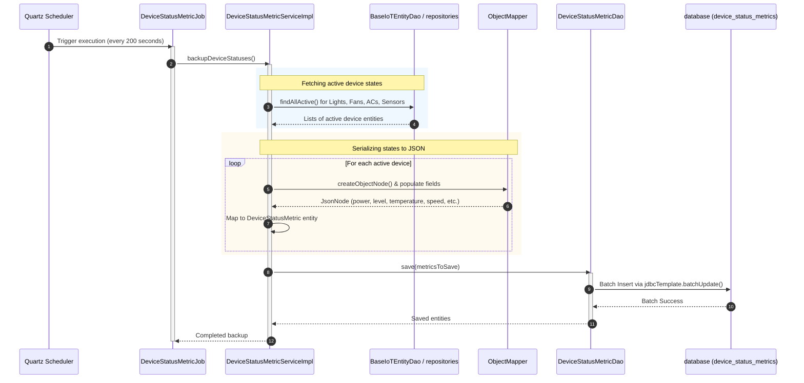
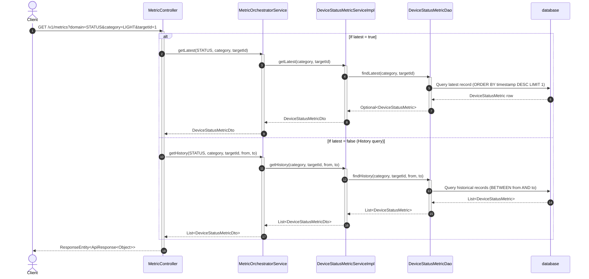

```mermaid
sequenceDiagram
    autonumber
    participant QZ as Quartz Scheduler
    participant Job as DeviceStatusMetricJob
    participant Service as DeviceStatusMetricServiceImpl
    participant Dao as BaseIoTEntityDao / repositories
    participant Mapper as ObjectMapper
    participant StatusDao as DeviceStatusMetricDao
    participant DB as database (device_status_metrics)

    QZ->>Job: Trigger execution (every 200 seconds)
    activate Job
    Job->>Service: backupDeviceStatuses()
    activate Service

    rect rgb(240, 248, 255)
        note over Service, Dao: Fetching active device states
        Service->>Dao: findAllActive() for Lights, Fans, ACs, Sensors
        Dao-->>Service: Lists of active device entities
    end

    rect rgb(255, 250, 240)
        note over Service, Mapper: Serializing states to JSON
        loop For each active device
            Service->>Mapper: createObjectNode() & populate fields
            Mapper-->>Service: JsonNode (power, level, temperature, speed, etc.)
            Service->>Service: Map to DeviceStatusMetric entity
        end
    end

    Service->>StatusDao: save(metricsToSave)
    activate StatusDao
    StatusDao->>DB: Batch Insert via jdbcTemplate.batchUpdate()
    DB-->>StatusDao: Batch Success
    StatusDao-->>Service: Saved entities
    deactivate StatusDao

    Service-->>Job: Completed backup
    deactivate Service
    deactivate Job
```

```mermaid
sequenceDiagram
    autonumber
    actor Client
    participant Controller as MetricController
    participant Orchestrator as MetricOrchestratorService
    participant Service as DeviceStatusMetricServiceImpl
    participant StatusDao as DeviceStatusMetricDao
    participant DB as database

    Client->>Controller: GET /v1/metrics?domain=STATUS&category=LIGHT&targetId=1
    activate Controller
    
    alt If latest = true
        Controller->>Orchestrator: getLatest(STATUS, category, targetId)
        activate Orchestrator
        Orchestrator->>Service: getLatest(category, targetId)
        activate Service
        Service->>StatusDao: findLatest(category, targetId)
        activate StatusDao
        StatusDao->>DB: Query latest record (ORDER BY timestamp DESC LIMIT 1)
        DB-->>StatusDao: DeviceStatusMetric row
        StatusDao-->>Service: Optional<DeviceStatusMetric>
        deactivate StatusDao
        Service-->>Orchestrator: DeviceStatusMetricDto
        deactivate Service
        Orchestrator-->>Controller: DeviceStatusMetricDto
        deactivate Orchestrator
    else If latest = false (History query)
        Controller->>Orchestrator: getHistory(STATUS, category, targetId, from, to)
        activate Orchestrator
        Orchestrator->>Service: getHistory(category, targetId, from, to)
        activate Service
        Service->>StatusDao: findHistory(category, targetId, from, to)
        activate StatusDao
        StatusDao->>DB: Query historical records (BETWEEN from AND to)
        DB-->>StatusDao: List<DeviceStatusMetric>
        StatusDao-->>Service: List<DeviceStatusMetric>
        deactivate StatusDao
        Service-->>Orchestrator: List<DeviceStatusMetricDto>
        deactivate Service
        Orchestrator-->>Controller: List<DeviceStatusMetricDto>
        deactivate Orchestrator
    end

    Controller-->>Client: ResponseEntity<ApiResponse<Object>>
    deactivate Controller
```