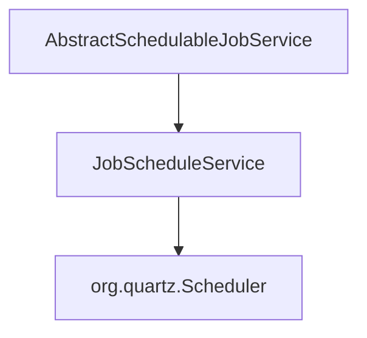

# Design Spec: Refactor Quartz Scheduler Utilities

This specification outlines the design for merging `QuartzUtil` and `ScheduleUtil` into a single, clean service named `JobScheduleService`.

## Problem Statement

The current implementation splits scheduler utility logic into two classes:
1. `QuartzUtil`: A low-level wrapper around Quartz `Scheduler`.
2. `ScheduleUtil`: A utility class transforming entities into job definitions/triggers and invoking `QuartzUtil`.

This results in:
* **Leaky Abstraction**: Low-level Quartz classes like `JobDetail` and `Trigger` are exposed between the two classes.
* **Redundant Boilerplate**: Unnecessary wrapping and catch/log blocks.
* **Scattered Logic**: Logic for job synchronization is split across multiple files.

## Proposed Solution

Consolidate all job scheduling, rescheduling, pausing, resuming, triggering, and deletion operations into a single service: `JobScheduleService` located in `com.iviet.ivshs.service.scheduler`.

### Component Diagram



### Proposed Changes

#### 1. Create `JobScheduleService`
Create `src/main/java/com/iviet/ivshs/service/scheduler/JobScheduleService.java` with the merged logic.

#### 2. Update Consumers
Update `AbstractSchedulableJobService.java` to:
* Use `JobScheduleService` instead of `ScheduleUtil`.
* Inject the bean via Autowired/Constructor injection.

#### 3. Delete Obsolete Classes
Delete `QuartzUtil.java` and `ScheduleUtil.java`.

## Verification Plan

### Automated Verification
* Run Maven compilation to verify no compilation errors:
  ```bash
  mvn clean compile
  ```
