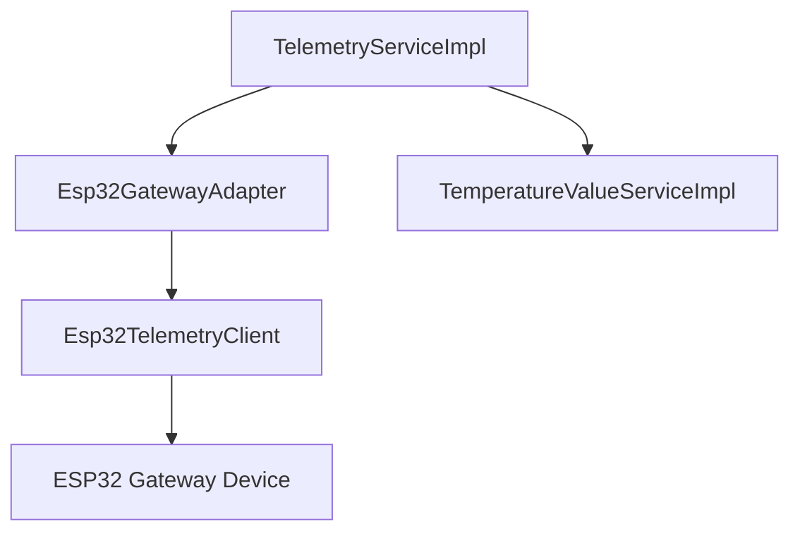

# Design Specification: ESP32 Telemetry Integration

This document specifies the integration of the telemetry and temperature APIs for the ESP32 hardware gateway. It aligns the ESP32 telemetry with the existing Raspberry Pi implementation, handles data representation differences, and documents the new APIs.

---

## 1. Goals & Context

- **Align Integrations**: Integrate telemetry collection for ESP32 gateways similarly to Raspberry Pi gateways.
- **Robust Parsing**: Handle the case where ESP32 gateway encodes numeric temperature values (`tempC`) as strings (e.g. `"25.500"`), ensuring the Java backend parses it correctly and doesn't ignore the telemetry records.
- **Document ESP32 APIs**: Document the new `POST /temperature` API endpoint for ESP32 in the gateway documentation.

---

## 2. Proposed Architecture & Components

We will introduce `Esp32TelemetryClient` and modify existing adapters/services.

### Component Diagram

### Changes in Integration Layer

#### 1. [NEW] `Esp32TelemetryClient`
- **Location**: `src/main/java/com/iviet/ivshs/integration/gateway/impl/esp32/Esp32TelemetryClient.java`
- **Details**:
  - Extends `Esp32BaseClient`.
  - Injects `GatewayTelemetryRestTemplate`.
  - Exposes `fetchGlobalTelemetry(String ip)`: calls `GET /telemetry` returning `ResponseEntity<TelemetryResponseDto>`.
  - Exposes `fetchTemperature(String ip, String naturalId)`: calls `POST /temperature` with payload `{"naturalId": "..."}` returning `ResponseEntity<ApiResponse<JsonNode>>`.

#### 2. [MODIFY] `Esp32GatewayAdapter`
- **Location**: `src/main/java/com/iviet/ivshs/integration/gateway/impl/esp32/Esp32GatewayAdapter.java`
- **Details**:
  - Autowires `Esp32TelemetryClient`.
  - Updates `fetchGlobalTelemetry(String ip)` to call `telemetryClient.fetchGlobalTelemetry(ip)` instead of throwing `notSupported`.

### Changes in Service Layer

#### 3. [MODIFY] `TemperatureValueServiceImpl`
- **Location**: `src/main/java/com/iviet/ivshs/service/impl/TemperatureValueServiceImpl.java`
- **Details**:
  - Enhance parsing logic inside `create(TelemetryResponseDto.DeviceDto data)`.
  - Currently, it only parses if `tempCNode.isNumber()`.
  - Modify to also support `tempCNode.isTextual()` and parse it using `Double.parseDouble(tempCNode.asText())`.

---

## 3. API Documentation Update

#### 4. [NEW] `temperature.md`
- **Location**: `doc/esp32_api_doc/temperature.md`
- **Details**:
  - Document the `POST /temperature` API endpoint (request header, body template, responses 200/400/401/404/500/501).

---

## 4. Verification Plan

### Compilation and Tests
- Run `mvn clean compile` to ensure no syntax/compilation issues.
- Add mock tests for `Esp32TelemetryClient` and `TemperatureValueServiceImpl` to verify that text-based `tempC` fields are parsed correctly.

### Manual Verification
- Verify that documentation is written and structured correctly under `doc/esp32_api_doc/`.
