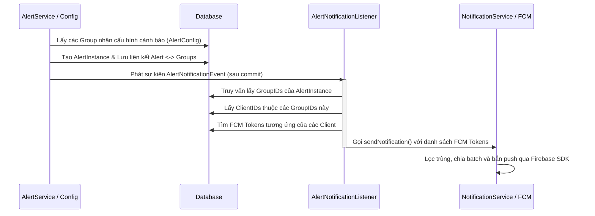

# Phân Tích Quyền Hạn Alert và Cơ Chế FCM

Báo cáo này phân tích chi tiết về vai trò của quyền `F_HANDLE_ALERT`, cơ chế gửi FCM (Firebase Cloud Messaging) và quy trình xử lý phân quyền Alert trong hệ thống Smart Room IoT.

---

## 1. Vai trò của `F_HANDLE_ALERT` trong hệ thống

Quyền `F_HANDLE_ALERT` là quyền chức năng hệ thống cấp cao, được sử dụng để kiểm soát khả năng tương tác và xử lý các cảnh báo (Alert):

* **Tầng Controller:**
  Trong [AlertController.java](./src/main/java/com/iviet/ivshs/controller/api/v1/AlertController.java), các API thay đổi trạng thái Alert bao gồm Acknowledge (Xác nhận) và Resolve (Giải quyết) được bảo vệ bằng chú thích:
  ```java
  @PreAuthorize("hasAnyAuthority('F_MANAGE_ALL', 'F_HANDLE_ALERT')")
  ```
* **Tầng Service:**
  Trong [AlertInstanceServiceImpl.java](./src/main/java/com/iviet/ivshs/service/alert/impl/AlertInstanceServiceImpl.java#L192-L197), phương thức `checkHandleAccess` yêu cầu đồng thời hai điều kiện:
  1. **Quyền chức năng (Global Permission):** Người dùng phải có quyền `F_HANDLE_ALERT` trong Security Context.
  2. **Quyền dữ liệu (Group Scope):** Người dùng phải thuộc ít nhất một nhóm (`SysGroup`) được liên kết trực tiếp với Alert Instance đó qua kiểm tra `isClientInAlertGroups`.

---

## 2. Luồng xác định người nhận FCM khi có Alert

Khi một cảnh báo được kích hoạt, luồng xử lý và gửi thông báo được thực hiện theo sơ đồ sau:



### Các bước thực hiện chi tiết:
1. **Xác định nhóm nhận thông báo:** Hệ thống lấy các nhóm (`SysGroup`) được cấu hình nhận cảnh báo từ cấu hình Alert (`AlertConfig`), sau đó lưu mối quan hệ này vào cơ sở dữ liệu qua bảng liên kết.
2. **Truy vấn người dùng & thiết bị:** Tại [AlertNotificationListener.java](./src/main/java/com/iviet/ivshs/service/alert/AlertNotificationListener.java#L48-L76):
   * Lấy danh sách các nhóm liên kết với Alert Instance.
   * Lấy danh sách Client thuộc các nhóm này qua `sysGroupDao.findClientEntitiesByGroupIds`.
   * Tìm thông tin các thiết bị chứa `fcmToken` hợp lệ của Client qua `clientDao.findAllWithDevicesByIdIn`.
3. **Gửi thông báo Push:** Chiến lược [FcmNotificationStrategy.java](./src/main/java/com/iviet/ivshs/service/notification/strategy/impl/FcmNotificationStrategy.java) lọc trùng token, chia thành các lô (batch) nhỏ tối đa 250 thiết bị và sử dụng Virtual Threads để gửi qua Firebase Cloud Messaging SDK.

---

## 3. Cơ chế kiểm soát Xem và Xử lý Alert

Quyền truy cập của người dùng đối với một cảnh báo cụ thể được kết hợp từ **Quyền chức năng (Global Functions)** và **Phạm vi dữ liệu (Group Assignment)**:

| Hành động | Quyền chức năng tối thiểu | Kiểm tra phạm vi dữ liệu |
| :--- | :--- | :--- |
| **Xem (Read)** | `F_ACCESS_ALERT` | Người dùng phải thuộc ít nhất một nhóm được gán cảnh báo (`isClientInAlertGroups` trả về `true`). |
| **Xử lý (Handle)** | `F_HANDLE_ALERT` | Người dùng phải thuộc ít nhất một nhóm được gán cảnh báo (`isClientInAlertGroups` trả về `true`). |

---

## 4. Rủi ro bảo mật: Phân quyền chéo (Cross-group Privilege Escalation)

Hệ thống hiện tại gộp tất cả các quyền chức năng từ mọi nhóm của người dùng vào Security Context chung tại [UserDetailsServiceImpl.java](./src/main/java/com/iviet/ivshs/service/auth/impl/UserDetailsServiceImpl.java#L46-L55). Điều này dẫn tới rủi ro phân quyền chéo:

### Tình huống giả định:
* Người dùng thuộc hai nhóm:
  * **Group A (Phòng A - ReadOnly):** Chỉ có quyền chức năng `F_ACCESS_ALERT`.
  * **Group B (Phòng B - Read/Write):** Có các quyền `F_ACCESS_ALERT` và `F_HANDLE_ALERT`.

### Cơ chế lỗi hoạt động:
1. **Tích lũy quyền toàn cục:** Khi đăng nhập, người dùng nhận được cả hai quyền `F_ACCESS_ALERT` và `F_HANDLE_ALERT` globally.
2. **Kiểm tra quyền khi xử lý Alert của Phòng A:**
   * Hệ thống kiểm tra xem người dùng có quyền chức năng `F_HANDLE_ALERT` hay không. Kết quả: **Có** (tích lũy từ Group B).
   * Hệ thống kiểm tra xem người dùng có thuộc nhóm nhận Alert của Phòng A hay không. Kết quả: **Có** (thuộc Group A).
   * **Kết quả:** Người dùng có thể **xác nhận hoặc giải quyết** cảnh báo của Phòng A dù Group A là nhóm Read-Only.

> [!WARNING]
> **Khuyến nghị bảo mật:**
> Cần thiết kế lại cơ chế phân quyền dạng Fine-grained RBAC/ACL, liên kết cặp `(Group, Function)` cụ thể thay vì kiểm tra quyền chức năng ở mức độ toàn cục độc lập với phạm vi dữ liệu của thực thể.